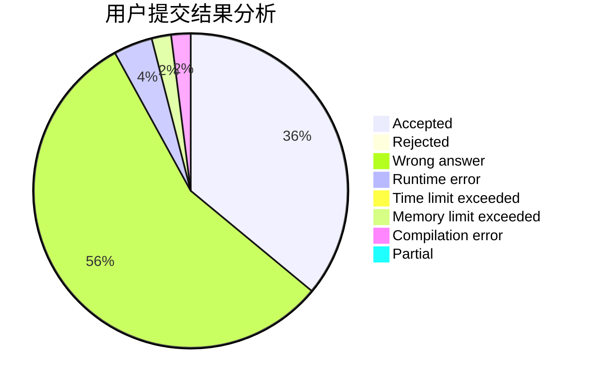
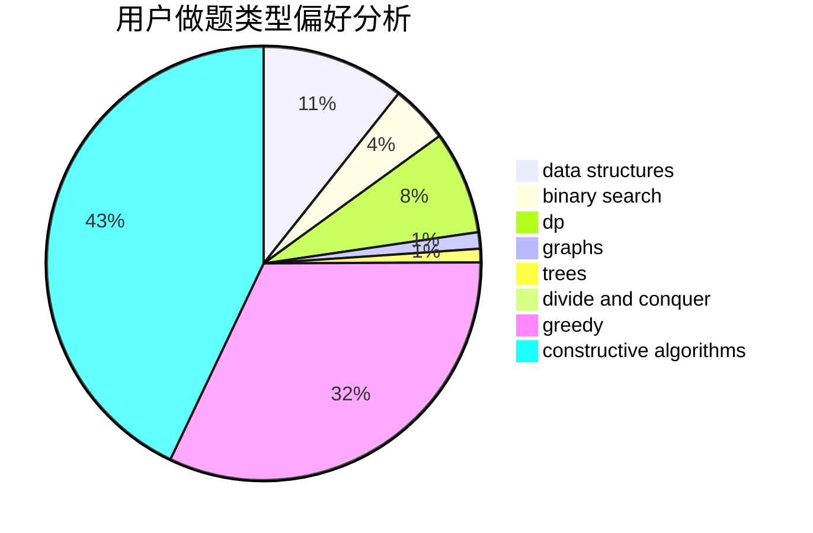

# JJ_camus
<!-- tabs:start -->
#### **用户提交结果分析**

#### **用户做题类型偏好分析**

#### **用户错题知识点分析**

<!-- tabs:end -->
# 推荐题目
[XXXXX](http://codeforces.com/problemset/problem/1364/A)		brute force,
                        data structures,
                        number theory,
                        two pointers		  
[Navigation System](https://codeforces.com/contest/1321/problem/D)		dfs and similar,
                        graphs,
                        shortest paths		  
[Berland Army](http://codeforces.com/problemset/problem/883/B)		constructive algorithms,
                        graphs,
                        greedy		  
[Quarrel](http://codeforces.com/problemset/problem/29/E)		graphs,
                        shortest paths		  
[Card Game](http://codeforces.com/problemset/problem/808/F)		binary search,
                        flows,
                        graphs		  
[``Is the number of ones divisible by 3?'' oracle](http://codeforces.com/problemset/problem/1116/C3)		nan		  
[To Play or not to Play](http://codeforces.com/problemset/problem/856/F)		greedy		  
[Compartments](http://codeforces.com/problemset/problem/356/C)		combinatorics,
                        constructive algorithms,
                        greedy,
                        implementation		  
[Campus](http://codeforces.com/problemset/problem/571/D)		binary search,
                        data structures,
                        dsu,
                        trees		  
[Balanced Domino Placements](http://codeforces.com/problemset/problem/1237/F)		combinatorics,
                        dp		  
<!-- tabs:start -->
#### **data structures**
[XXXXX](http://codeforces.com/problemset/problem/1364/A)		brute force,
                        data structures,
                        number theory,
                        two pointers		  
[Navigation System](http://codeforces.com/problemset/problem/571/D)		binary search,
                        data structures,
                        dsu,
                        trees		  
[Berland Army](http://codeforces.com/problemset/problem/1157/E)		binary search,
                        data structures,
                        greedy		  
[Quarrel](http://codeforces.com/problemset/problem/1493/D)		brute force,
                        data structures,
                        hashing,
                        implementation,
                        math,
                        number theory,
                        sortings,
                        two pointers		  
[Card Game](http://codeforces.com/problemset/problem/1299/C)		data structures,
                        geometry,
                        greedy		  
[``Is the number of ones divisible by 3?'' oracle](http://codeforces.com/problemset/problem/558/E)		data structures,
                        sortings,
                        strings		  
[To Play or not to Play](http://codeforces.com/problemset/problem/1492/C)		binary search,
                        data structures,
                        dp,
                        greedy,
                        two pointers		  
[Compartments](http://codeforces.com/problemset/problem/1490/G)		binary search,
                        data structures,
                        math		  
[Campus](http://codeforces.com/problemset/problem/1479/D)		binary search,
                        bitmasks,
                        brute force,
                        data structures,
                        probabilities,
                        trees		  
[Balanced Domino Placements](http://codeforces.com/problemset/problem/1497/A)		brute force,
                        data structures,
                        greedy,
                        sortings		  
#### **binary search**
[XXXXX](http://codeforces.com/problemset/problem/808/F)		binary search,
                        flows,
                        graphs		  
[Navigation System](http://codeforces.com/problemset/problem/571/D)		binary search,
                        data structures,
                        dsu,
                        trees		  
[Berland Army](https://codeforces.com/contest/807/problem/E)		binary search,
                        constructive algorithms,
                        greedy,
                        math		  
[Quarrel](http://codeforces.com/problemset/problem/1157/E)		binary search,
                        data structures,
                        greedy		  
[Card Game](http://codeforces.com/problemset/problem/1436/D)		binary search,
                        dfs and similar,
                        graphs,
                        greedy,
                        trees		  
[``Is the number of ones divisible by 3?'' oracle](http://codeforces.com/problemset/problem/1326/D2)		binary search,
                        greedy,
                        hashing,
                        string suffix structures,
                        strings		  
[To Play or not to Play](http://codeforces.com/problemset/problem/1492/C)		binary search,
                        data structures,
                        dp,
                        greedy,
                        two pointers		  
[Compartments](http://codeforces.com/problemset/problem/1463/D)		binary search,
                        constructive algorithms,
                        greedy,
                        two pointers		  
[Campus](http://codeforces.com/problemset/problem/1490/G)		binary search,
                        data structures,
                        math		  
[Balanced Domino Placements](http://codeforces.com/problemset/problem/1479/D)		binary search,
                        bitmasks,
                        brute force,
                        data structures,
                        probabilities,
                        trees		  
#### **dp**
[XXXXX](http://codeforces.com/problemset/problem/1237/F)		combinatorics,
                        dp		  
[Navigation System](http://codeforces.com/problemset/problem/264/B)		dp,
                        number theory		  
[Berland Army](http://codeforces.com/problemset/problem/1268/E)		dp		  
[Quarrel](http://codeforces.com/problemset/problem/273/D)		dp		  
[Card Game](http://codeforces.com/problemset/problem/1204/C)		dp,
                        graphs,
                        greedy,
                        shortest paths		  
[``Is the number of ones divisible by 3?'' oracle](http://codeforces.com/problemset/problem/1237/E)		dp,
                        math		  
[To Play or not to Play](http://codeforces.com/problemset/problem/538/B)		constructive algorithms,
                        dp,
                        greedy,
                        implementation		  
[Compartments](http://codeforces.com/problemset/problem/1492/C)		binary search,
                        data structures,
                        dp,
                        greedy,
                        two pointers		  
[Campus](https://codeforces.com/contest/1457/problem/C)		brute force,
                        dp,
                        implementation		  
[Balanced Domino Placements](http://codeforces.com/problemset/problem/1491/C)		brute force,
                        data structures,
                        dp,
                        greedy,
                        implementation		  
#### **graph**
[XXXXX](https://codeforces.com/contest/1321/problem/D)		dfs and similar,
                        graphs,
                        shortest paths		  
[Navigation System](http://codeforces.com/problemset/problem/883/B)		constructive algorithms,
                        graphs,
                        greedy		  
[Berland Army](http://codeforces.com/problemset/problem/29/E)		graphs,
                        shortest paths		  
[Quarrel](http://codeforces.com/problemset/problem/808/F)		binary search,
                        flows,
                        graphs		  
[Card Game](http://codeforces.com/problemset/problem/1167/C)		dfs and similar,
                        dsu,
                        graphs		  
[``Is the number of ones divisible by 3?'' oracle](http://codeforces.com/problemset/problem/388/B)		bitmasks,
                        constructive algorithms,
                        graphs,
                        implementation,
                        math		  
[To Play or not to Play](http://codeforces.com/problemset/problem/1204/C)		dp,
                        graphs,
                        greedy,
                        shortest paths		  
[Compartments](http://codeforces.com/problemset/problem/1436/D)		binary search,
                        dfs and similar,
                        graphs,
                        greedy,
                        trees		  
[Campus](http://codeforces.com/problemset/problem/1487/C)		brute force,
                        constructive algorithms,
                        dfs and similar,
                        graphs,
                        greedy,
                        implementation,
                        math		  
[Balanced Domino Placements](http://codeforces.com/problemset/problem/1437/C)		dp,
                        flows,
                        graph matchings,
                        greedy,
                        math,
                        sortings		  
#### **trees**
[XXXXX](http://codeforces.com/problemset/problem/571/D)		binary search,
                        data structures,
                        dsu,
                        trees		  
[Navigation System](http://codeforces.com/problemset/problem/1436/D)		binary search,
                        dfs and similar,
                        graphs,
                        greedy,
                        trees		  
[Berland Army](http://codeforces.com/problemset/problem/1479/D)		binary search,
                        bitmasks,
                        brute force,
                        data structures,
                        probabilities,
                        trees		  
[Quarrel](http://codeforces.com/problemset/problem/1511/C)		brute force,
                        data structures,
                        implementation,
                        trees		  
[Card Game](http://codeforces.com/problemset/problem/1499/F)		combinatorics,
                        dfs and similar,
                        dp,
                        trees		  
[``Is the number of ones divisible by 3?'' oracle](http://codeforces.com/problemset/problem/1491/E)		brute force,
                        dfs and similar,
                        divide and conquer,
                        number theory,
                        trees		  
[To Play or not to Play](http://codeforces.com/problemset/problem/1466/D)		data structures,
                        greedy,
                        sortings,
                        trees		  
[Compartments](http://codeforces.com/problemset/problem/1495/D)		combinatorics,
                        dfs and similar,
                        graphs,
                        math,
                        shortest paths,
                        trees		  
[Campus](http://codeforces.com/problemset/problem/1303/G)		data structures,
                        divide and conquer,
                        geometry,
                        trees		  
[Balanced Domino Placements](http://codeforces.com/problemset/problem/1454/E)		combinatorics,
                        dfs and similar,
                        graphs,
                        trees		  
#### **divide and conquer**
[XXXXX](http://codeforces.com/problemset/problem/1461/D)		binary search,
                        brute force,
                        data structures,
                        divide and conquer,
                        implementation,
                        sortings		  
[Navigation System](http://codeforces.com/problemset/problem/1466/G)		combinatorics,
                        divide and conquer,
                        hashing,
                        math,
                        string suffix structures,
                        strings		  
[Berland Army](http://codeforces.com/problemset/problem/1490/D)		dfs and similar,
                        divide and conquer,
                        implementation		  
[Quarrel](https://codeforces.com/contest/1483/problem/C)		data structures,
                        divide and conquer,
                        dp		  
[Card Game](http://codeforces.com/problemset/problem/1491/E)		brute force,
                        dfs and similar,
                        divide and conquer,
                        number theory,
                        trees		  
[``Is the number of ones divisible by 3?'' oracle](http://codeforces.com/problemset/problem/1303/G)		data structures,
                        divide and conquer,
                        geometry,
                        trees		  
[To Play or not to Play](http://codeforces.com/problemset/problem/1494/D)		constructive algorithms,
                        data structures,
                        dfs and similar,
                        divide and conquer,
                        dsu,
                        greedy,
                        sortings,
                        trees		  
[Compartments](http://codeforces.com/problemset/problem/1482/E)		data structures,
                        divide and conquer,
                        dp		  
[Campus](http://codeforces.com/problemset/problem/566/C)		dfs and similar,
                        divide and conquer,
                        trees		  
[Balanced Domino Placements](http://codeforces.com/problemset/problem/1428/F)		binary search,
                        data structures,
                        divide and conquer,
                        dp,
                        two pointers		  
#### **greedy**
[XXXXX](http://codeforces.com/problemset/problem/883/B)		constructive algorithms,
                        graphs,
                        greedy		  
[Navigation System](http://codeforces.com/problemset/problem/856/F)		greedy		  
[Berland Army](http://codeforces.com/problemset/problem/356/C)		combinatorics,
                        constructive algorithms,
                        greedy,
                        implementation		  
[Quarrel](https://codeforces.com/contest/807/problem/E)		binary search,
                        constructive algorithms,
                        greedy,
                        math		  
[Card Game](https://codeforces.com/contest/521/problem/B)		games,
                        greedy,
                        implementation		  
[``Is the number of ones divisible by 3?'' oracle](http://codeforces.com/problemset/problem/1157/E)		binary search,
                        data structures,
                        greedy		  
[To Play or not to Play](http://codeforces.com/problemset/problem/1299/C)		data structures,
                        geometry,
                        greedy		  
[Compartments](http://codeforces.com/problemset/problem/1178/A)		greedy		  
[Campus](http://codeforces.com/problemset/problem/1204/C)		dp,
                        graphs,
                        greedy,
                        shortest paths		  
[Balanced Domino Placements](http://codeforces.com/problemset/problem/538/B)		constructive algorithms,
                        dp,
                        greedy,
                        implementation		  
#### **constructive algorithms**
[XXXXX](http://codeforces.com/problemset/problem/883/B)		constructive algorithms,
                        graphs,
                        greedy		  
[Navigation System](http://codeforces.com/problemset/problem/356/C)		combinatorics,
                        constructive algorithms,
                        greedy,
                        implementation		  
[Berland Army](https://codeforces.com/contest/807/problem/E)		binary search,
                        constructive algorithms,
                        greedy,
                        math		  
[Quarrel](http://codeforces.com/problemset/problem/727/C)		constructive algorithms,
                        interactive,
                        math		  
[Card Game](http://codeforces.com/problemset/problem/1375/D)		brute force,
                        constructive algorithms,
                        sortings		  
[``Is the number of ones divisible by 3?'' oracle](http://codeforces.com/problemset/problem/388/B)		bitmasks,
                        constructive algorithms,
                        graphs,
                        implementation,
                        math		  
[To Play or not to Play](http://codeforces.com/problemset/problem/538/B)		constructive algorithms,
                        dp,
                        greedy,
                        implementation		  
[Compartments](http://codeforces.com/problemset/problem/1510/J)		constructive algorithms,
                        math		  
[Campus](http://codeforces.com/problemset/problem/1446/A)		constructive algorithms,
                        greedy,
                        sortings		  
[Balanced Domino Placements](http://codeforces.com/problemset/problem/1493/A)		constructive algorithms,
                        greedy		  
#### **sortings**
[XXXXX](http://codeforces.com/problemset/problem/1493/D)		brute force,
                        data structures,
                        hashing,
                        implementation,
                        math,
                        number theory,
                        sortings,
                        two pointers		  
[Navigation System](http://codeforces.com/problemset/problem/1375/D)		brute force,
                        constructive algorithms,
                        sortings		  
[Berland Army](http://codeforces.com/problemset/problem/558/E)		data structures,
                        sortings,
                        strings		  
[Quarrel](http://codeforces.com/problemset/problem/1446/A)		constructive algorithms,
                        greedy,
                        sortings		  
[Card Game](https://codeforces.com/contest/1496/problem/C)		geometry,
                        greedy,
                        math,
                        sortings		  
[``Is the number of ones divisible by 3?'' oracle](http://codeforces.com/problemset/problem/1495/A)		geometry,
                        greedy,
                        math,
                        sortings		  
[To Play or not to Play](http://codeforces.com/problemset/problem/1497/A)		brute force,
                        data structures,
                        greedy,
                        sortings		  
[Compartments](http://codeforces.com/problemset/problem/1427/A)		math,
                        sortings		  
[Campus](http://codeforces.com/problemset/problem/1461/D)		binary search,
                        brute force,
                        data structures,
                        divide and conquer,
                        implementation,
                        sortings		  
[Balanced Domino Placements](http://codeforces.com/problemset/problem/1437/C)		dp,
                        flows,
                        graph matchings,
                        greedy,
                        math,
                        sortings		  
<!-- tabs:end -->
