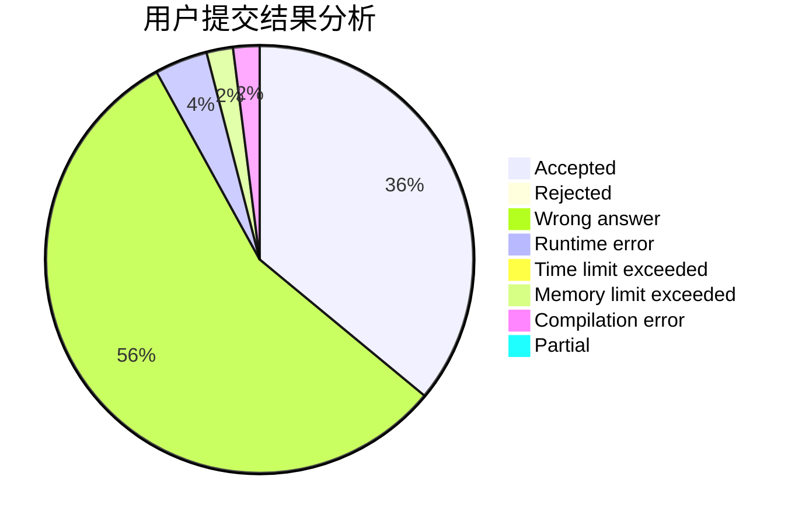
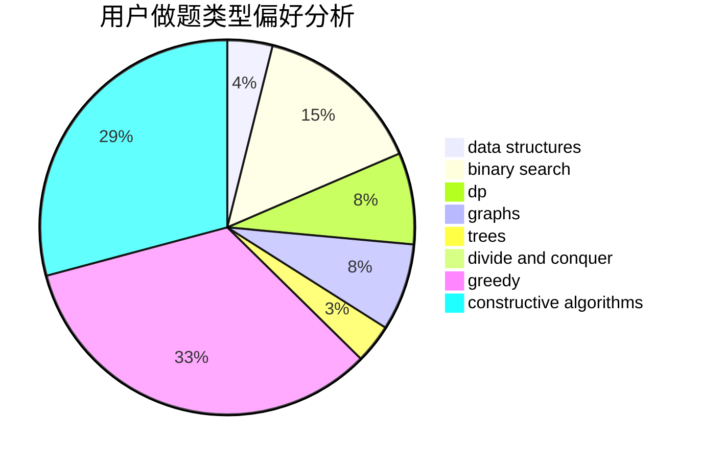

# JJ_camus

<!-- tabs:start -->

#### **用户提交结果分析**

#### **用户做题类型偏好分析**

#### **用户错题知识点分析**

<!-- tabs:end -->
# 推荐题目
[592A](https://codeforces.com/contest/592/problem/A)		implementation		  
[381B](https://codeforces.com/contest/381/problem/B)		greedy,
                        implementation,
                        sortings		  
[825E](https://codeforces.com/contest/825/problem/E)		data structures,
                        dfs and similar,
                        graphs,
                        greedy		  
[1328C](https://codeforces.com/contest/1328/problem/C)		greedy,
                        implementation		  
[875F](https://codeforces.com/contest/875/problem/F)		dsu,
                        graphs,
                        greedy		  
[369C](https://codeforces.com/contest/369/problem/C)		dfs and similar,
                        graphs,
                        trees		  
[317D](https://codeforces.com/contest/317/problem/D)		dp,
                        games		  
[157D](https://codeforces.com/contest/157/problem/D)		dsu,graphs,sortings,trees		  
[616E](https://codeforces.com/contest/616/problem/E)		implementation,
                        math,
                        number theory		  
[280B](https://codeforces.com/contest/280/problem/B)		data structures,
                        implementation,
                        two pointers		  
