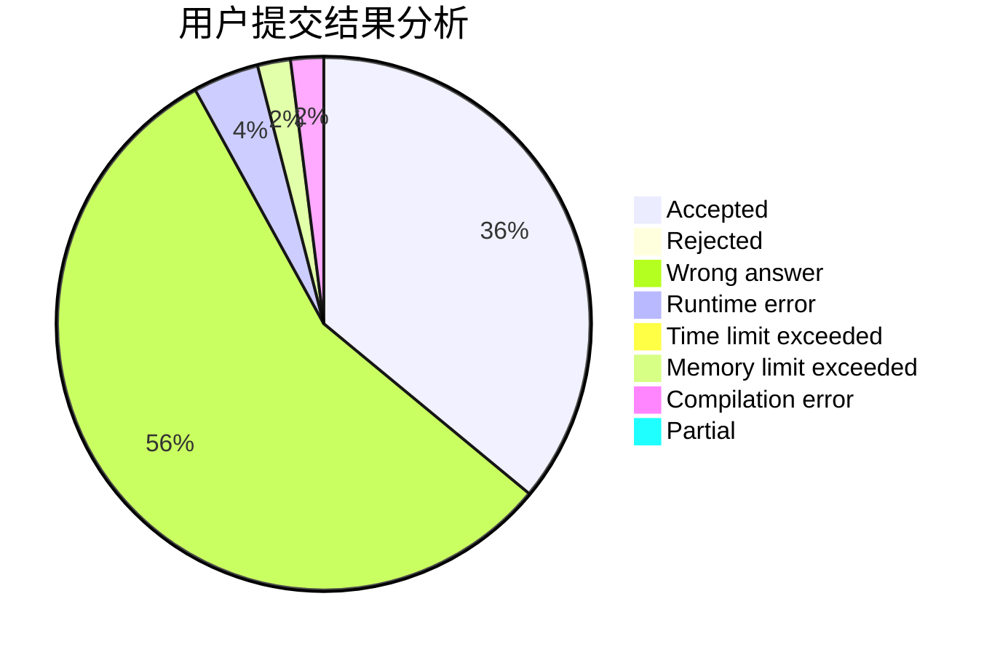
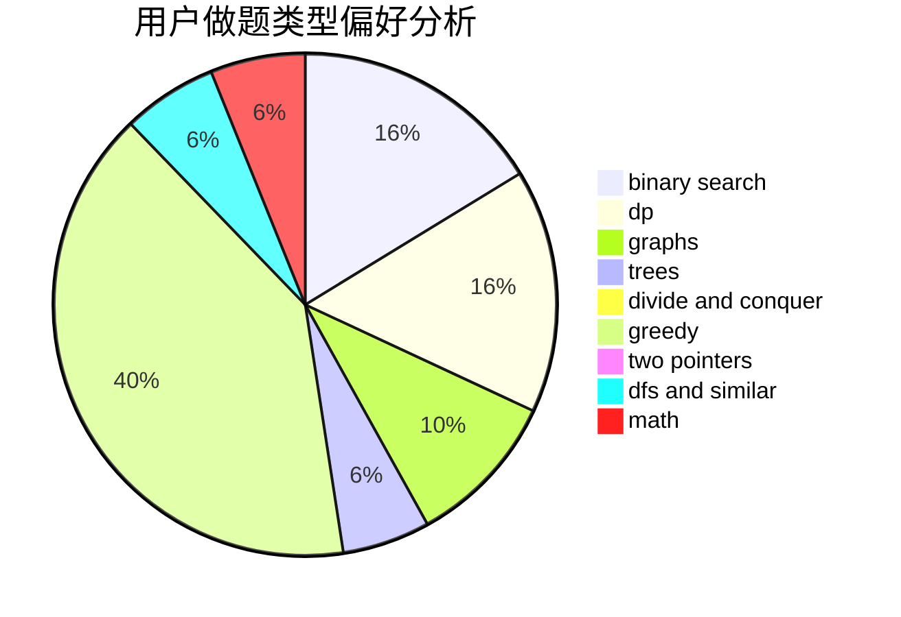

# JJ_camus

<!-- tabs:start -->

#### **用户提交结果分析**

#### **用户做题类型偏好分析**

<!-- tabs:end -->
# 推荐题目
[592A](https://codeforces.com/contest/592/problem/A)
[381B](https://codeforces.com/contest/381/problem/B)
[825E](https://codeforces.com/contest/825/problem/E)
[1328C](https://codeforces.com/contest/1328/problem/C)
[875F](https://codeforces.com/contest/875/problem/F)
[369C](https://codeforces.com/contest/369/problem/C)
[317D](https://codeforces.com/contest/317/problem/D)
[157D](https://codeforces.com/contest/157/problem/D)
[616E](https://codeforces.com/contest/616/problem/E)
[280B](https://codeforces.com/contest/280/problem/B)
