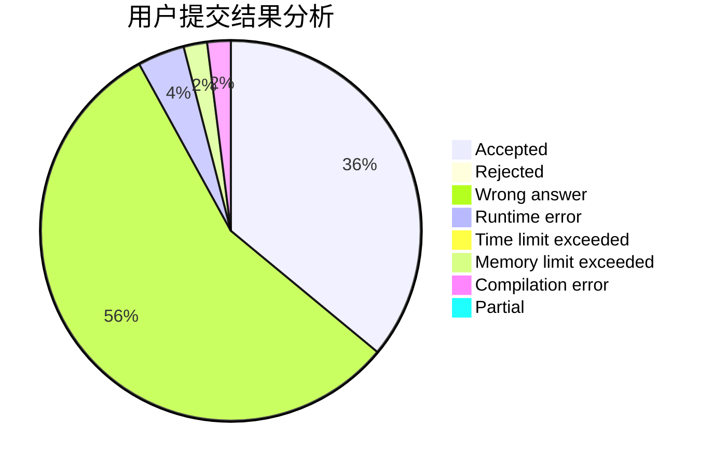
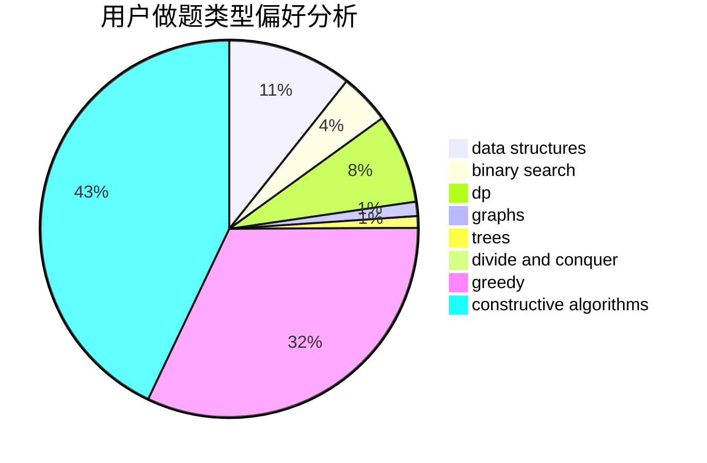

# JJ_camus

<!-- tabs:start -->

#### **用户提交结果分析**

#### **用户做题类型偏好分析**

#### **用户错题知识点分析**

<!-- tabs:end -->
# 推荐题目
[571D](https://codeforces.com/contest/571/problem/D)		binary search,
                        data structures,
                        dsu,
                        trees		  
[356C](https://codeforces.com/contest/356/problem/C)		combinatorics,
                        constructive algorithms,
                        greedy,
                        implementation		  
[808F](https://codeforces.com/contest/808/problem/F)		binary search,
                        flows,
                        graphs		  
[1321D](https://codeforces.com/contest/1321/problem/D)		dsu,graphs,sortings,trees		  
[856F](https://codeforces.com/contest/856/problem/F)		greedy		  
[342C](https://codeforces.com/contest/342/problem/C)		geometry		  
[29E](https://codeforces.com/contest/29/problem/E)		graphs,
                        shortest paths		  
[1506C](https://codeforces.com/contest/1506/problem/C)		brute force,
                        implementation,
                        strings		  
[598F](https://codeforces.com/contest/598/problem/F)		geometry		  
[264B](https://codeforces.com/contest/264/problem/B)		dp,
                        number theory		  
