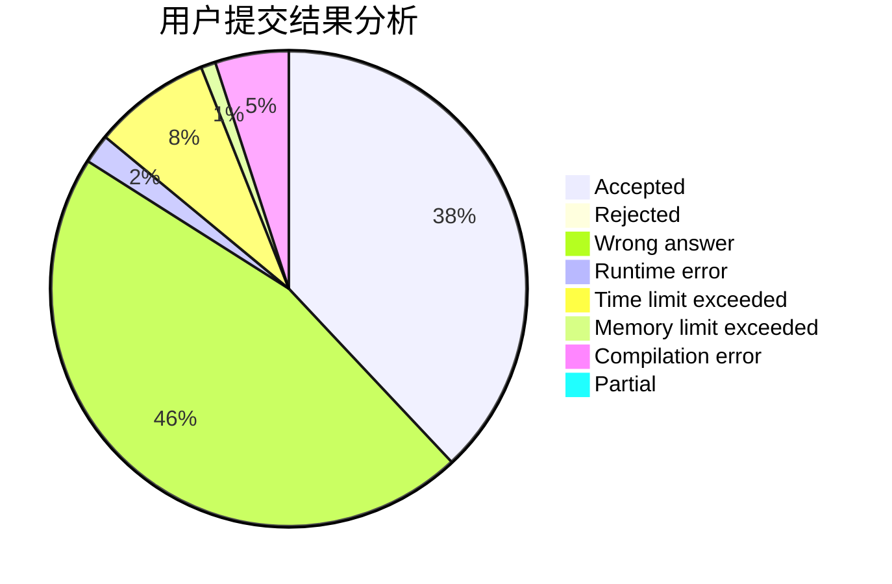
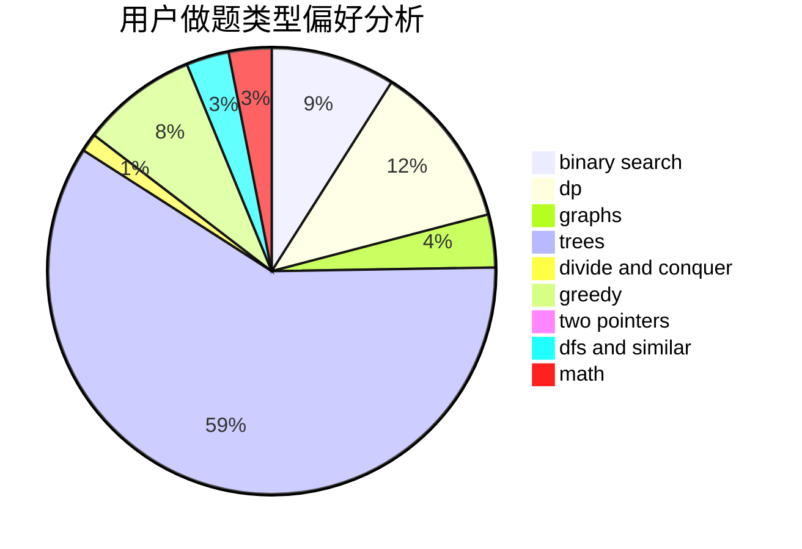

# JLU_GLHF

<!-- tabs:start -->

#### **用户提交结果分析**

#### **用户做题类型偏好分析**

<!-- tabs:end -->
# 推荐题目
[437B](https://codeforces.com/contest/437/problem/B)
[26D](https://codeforces.com/contest/26/problem/D)
[916D](https://codeforces.com/contest/916/problem/D)
[216C](https://codeforces.com/contest/216/problem/C)
[877F](https://codeforces.com/contest/877/problem/F)
[91A](https://codeforces.com/contest/91/problem/A)
[82A](https://codeforces.com/contest/82/problem/A)
[1220A](https://codeforces.com/contest/1220/problem/A)
[275B](https://codeforces.com/contest/275/problem/B)
[381B](https://codeforces.com/contest/381/problem/B)
