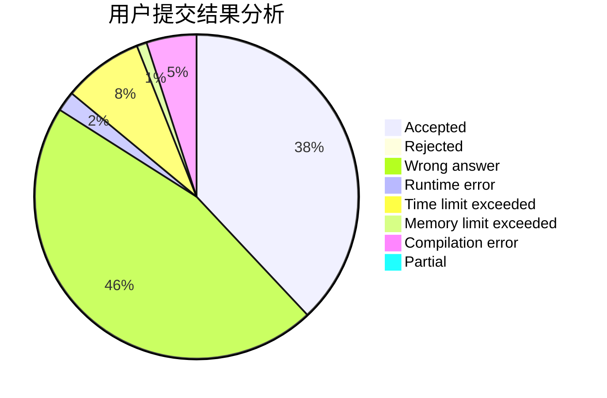
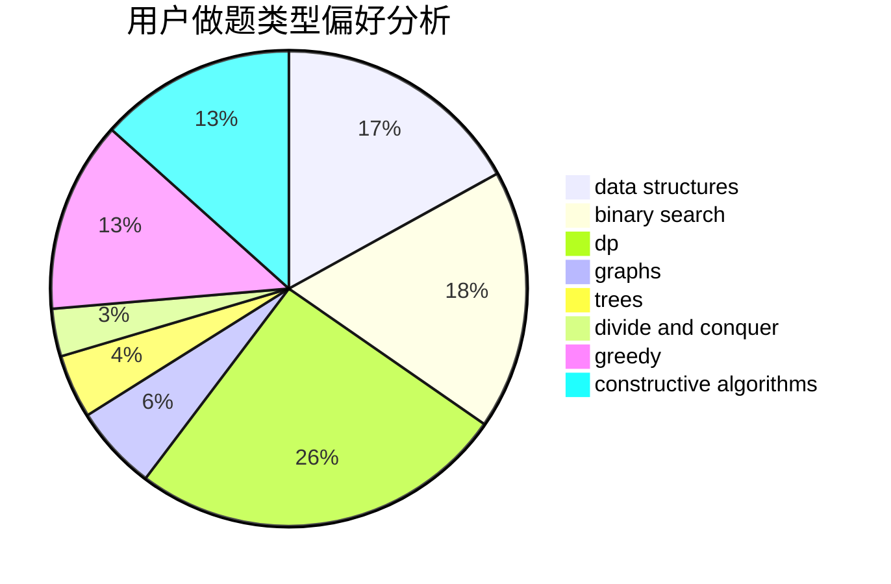

# JLU_GLHF

<!-- tabs:start -->

#### **用户提交结果分析**

#### **用户做题类型偏好分析**

#### **用户错题知识点分析**

<!-- tabs:end -->
# 推荐题目
[437B](https://codeforces.com/contest/437/problem/B)		bitmasks,
                        greedy,
                        implementation,
                        sortings		  
[26D](https://codeforces.com/contest/26/problem/D)		combinatorics,
                        math,
                        probabilities		  
[916D](https://codeforces.com/contest/916/problem/D)		data structures,
                        interactive,
                        trees		  
[216C](https://codeforces.com/contest/216/problem/C)		greedy		  
[877F](https://codeforces.com/contest/877/problem/F)		data structures,
                        flows,
                        hashing		  
[91A](https://codeforces.com/contest/91/problem/A)		greedy,
                        strings		  
[82A](https://codeforces.com/contest/82/problem/A)		implementation,
                        math		  
[1220A](https://codeforces.com/contest/1220/problem/A)		implementation,
                        sortings,
                        strings		  
[275B](https://codeforces.com/contest/275/problem/B)		constructive algorithms,
                        implementation		  
[381B](https://codeforces.com/contest/381/problem/B)		greedy,
                        implementation,
                        sortings		  
