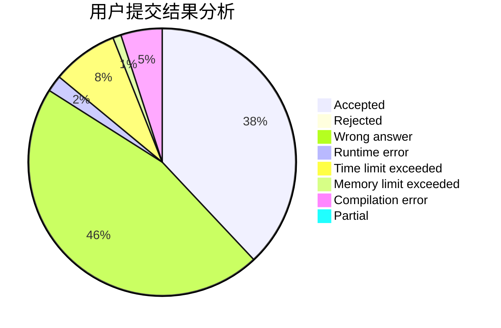
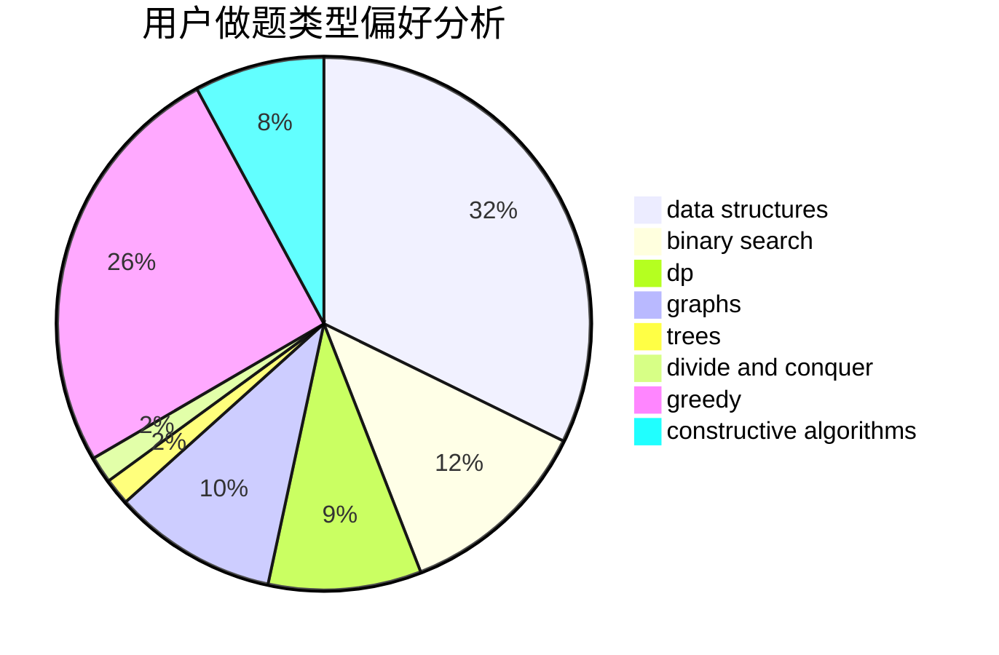
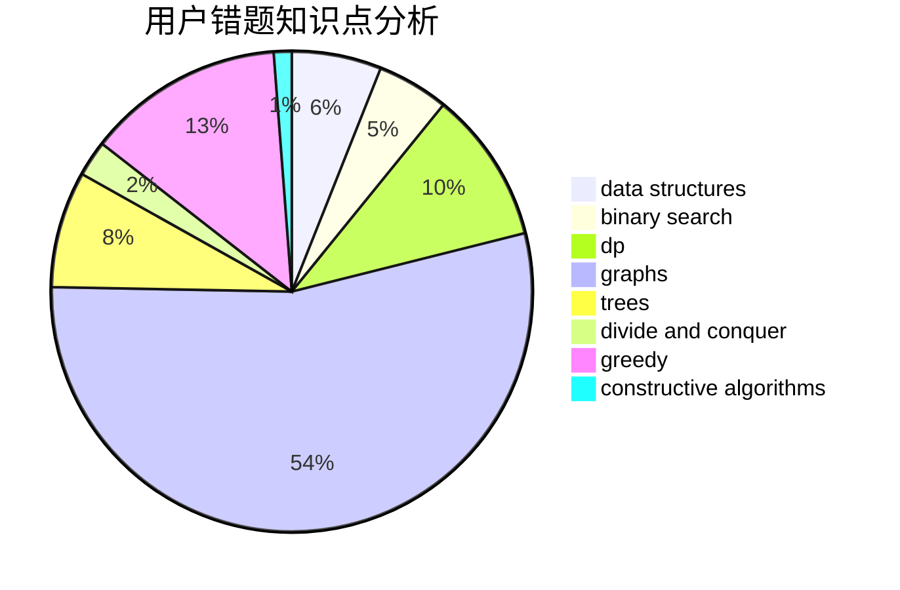

# JLU_GLHF

<!-- tabs:start -->

#### **用户提交结果分析**

#### **用户做题类型偏好分析**

#### **用户错题知识点分析**

<!-- tabs:end -->
# 推荐题目
[409H](https://codeforces.com/contest/409/problem/H)		*special problem,
                        brute force,
                        constructive algorithms,
                        dsu,
                        implementation		  
[253A](https://codeforces.com/contest/253/problem/A)		greedy		  
[900A](https://codeforces.com/contest/900/problem/A)		geometry,
                        implementation		  
[193B](https://codeforces.com/contest/193/problem/B)		brute force		  
[85E](https://codeforces.com/contest/85/problem/E)		binary search,
                        dsu,
                        geometry,
                        graphs,
                        sortings		  
[906A](https://codeforces.com/contest/906/problem/A)		implementation,
                        strings		  
[811A](https://codeforces.com/contest/811/problem/A)		brute force,
                        implementation		  
[1214E](https://codeforces.com/contest/1214/problem/E)		constructive algorithms,
                        graphs,
                        math,
                        sortings,
                        trees		  
[258C](https://codeforces.com/contest/258/problem/C)		binary search,
                        combinatorics,
                        dp,
                        math		  
[356C](https://codeforces.com/contest/356/problem/C)		combinatorics,
                        constructive algorithms,
                        greedy,
                        implementation		  
