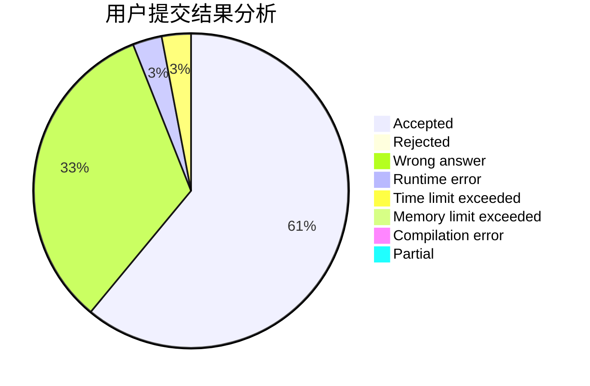
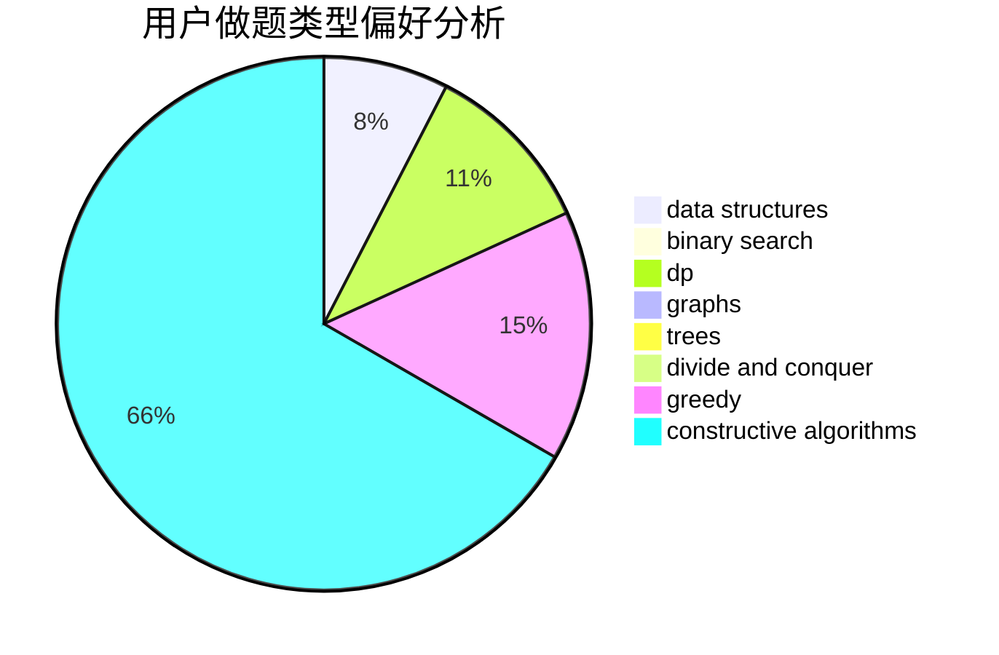
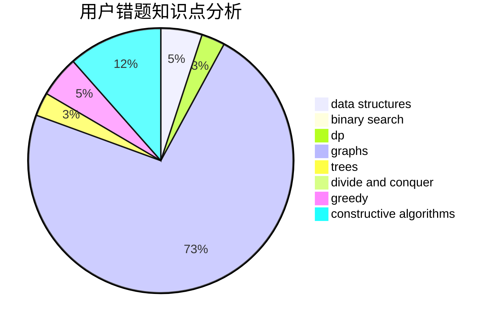

# JOHNKRAM

<!-- tabs:start -->

#### **用户提交结果分析**

#### **用户做题类型偏好分析**

#### **用户错题知识点分析**

<!-- tabs:end -->
# 推荐题目
[835D](https://codeforces.com/contest/835/problem/D)		brute force,
                        dp,
                        hashing,
                        strings		  
[208A](https://codeforces.com/contest/208/problem/A)		strings		  
[939F](https://codeforces.com/contest/939/problem/F)		data structures,
                        dp		  
[916B](https://codeforces.com/contest/916/problem/B)		bitmasks,
                        greedy,
                        math		  
[1147C](https://codeforces.com/contest/1147/problem/C)		games		  
[1106A](https://codeforces.com/contest/1106/problem/A)		implementation		  
[913D](https://codeforces.com/contest/913/problem/D)		binary search,
                        brute force,
                        data structures,
                        greedy,
                        sortings		  
[830A](https://codeforces.com/contest/830/problem/A)		binary search,
                        brute force,
                        dp,
                        greedy,
                        sortings		  
[630I](https://codeforces.com/contest/630/problem/I)		combinatorics,
                        math		  
[476D](https://codeforces.com/contest/476/problem/D)		constructive algorithms,
                        greedy,
                        math		  
