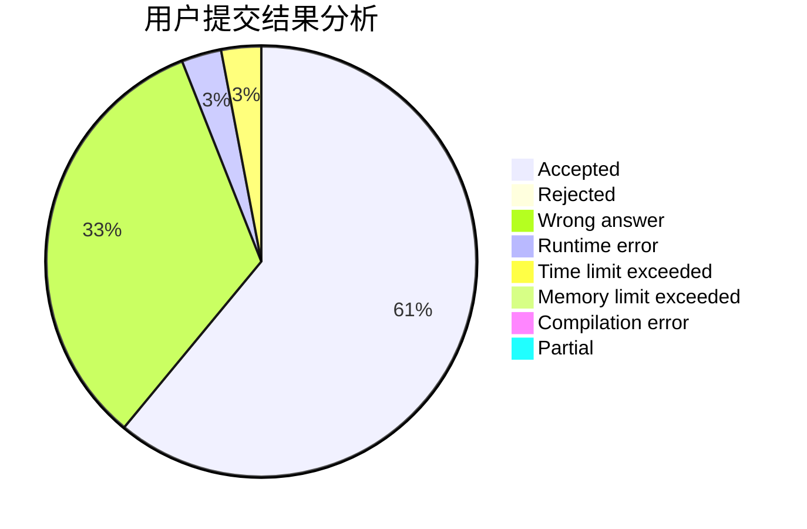
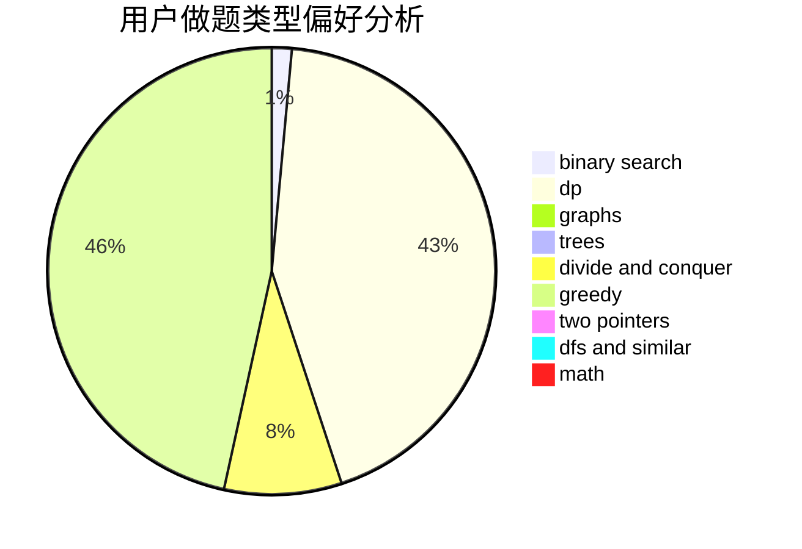

# JOHNKRAM

<!-- tabs:start -->

#### **用户提交结果分析**

#### **用户做题类型偏好分析**

<!-- tabs:end -->
# 推荐题目
[835D](https://codeforces.com/contest/835/problem/D)
[208A](https://codeforces.com/contest/208/problem/A)
[939F](https://codeforces.com/contest/939/problem/F)
[916B](https://codeforces.com/contest/916/problem/B)
[1147C](https://codeforces.com/contest/1147/problem/C)
[1106A](https://codeforces.com/contest/1106/problem/A)
[913D](https://codeforces.com/contest/913/problem/D)
[830A](https://codeforces.com/contest/830/problem/A)
[630I](https://codeforces.com/contest/630/problem/I)
[476D](https://codeforces.com/contest/476/problem/D)
