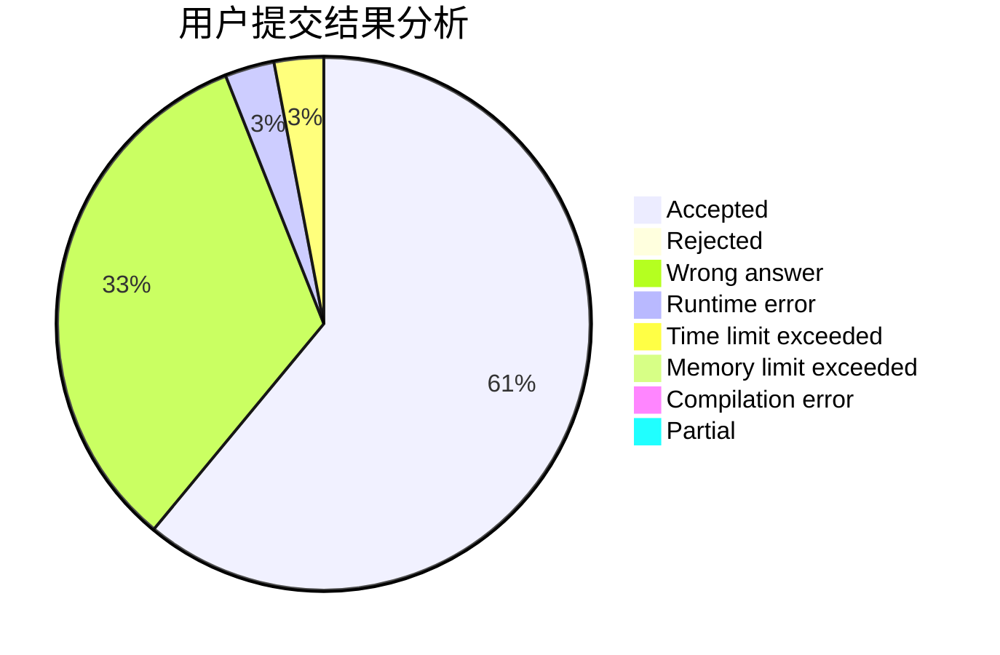
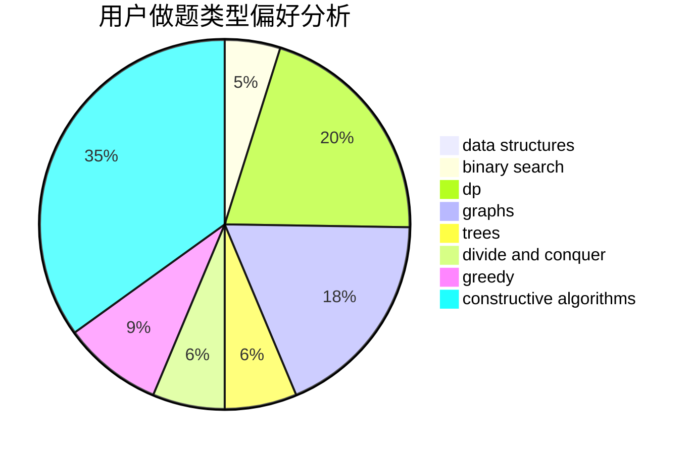
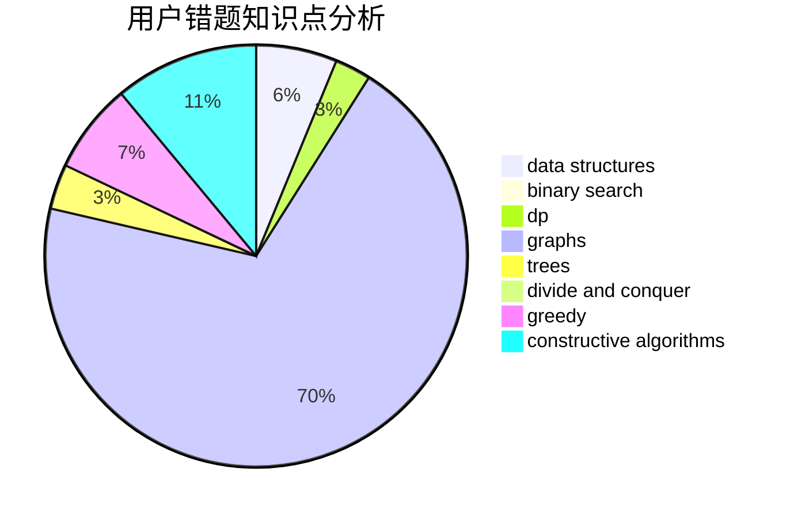

# JOHNKRAM

<!-- tabs:start -->

#### **用户提交结果分析**

#### **用户做题类型偏好分析**

#### **用户错题知识点分析**

<!-- tabs:end -->
# 推荐题目
[816C](https://codeforces.com/contest/816/problem/C)		dsu,graphs,sortings,trees		  
[180D](https://codeforces.com/contest/180/problem/D)		greedy,
                        strings		  
[919E](https://codeforces.com/contest/919/problem/E)		chinese remainder theorem,
                        math,
                        number theory		  
[8D](https://codeforces.com/contest/8/problem/D)		binary search,
                        geometry		  
[1145B](https://codeforces.com/contest/1145/problem/B)		brute force		  
[1105C](https://codeforces.com/contest/1105/problem/C)		combinatorics,
                        dp,
                        math		  
[896A](https://codeforces.com/contest/896/problem/A)		binary search,
                        dfs and similar		  
[811C](https://codeforces.com/contest/811/problem/C)		dp,
                        implementation		  
[611E](https://codeforces.com/contest/611/problem/E)		data structures,
                        greedy,
                        sortings		  
[455C](https://codeforces.com/contest/455/problem/C)		dfs and similar,
                        dp,
                        dsu,
                        ternary search,
                        trees		  
