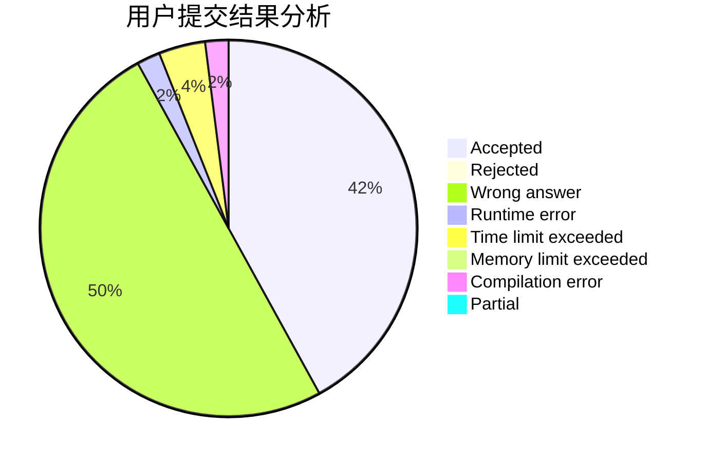
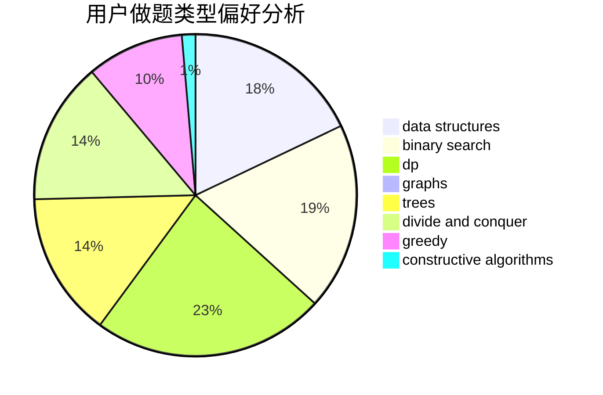
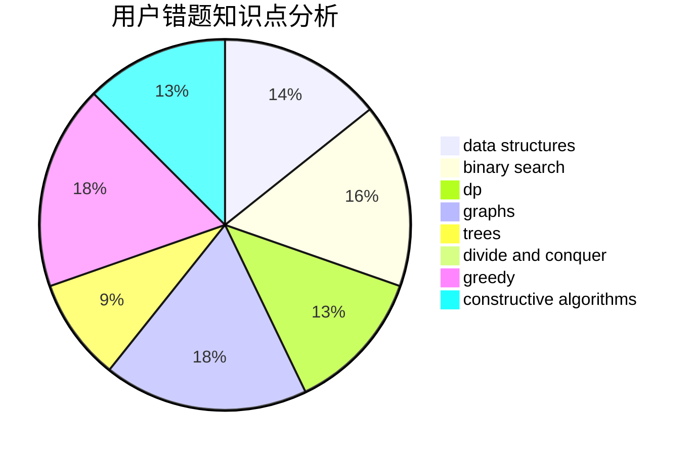

# JSNN

<!-- tabs:start -->

#### **用户提交结果分析**

#### **用户做题类型偏好分析**

#### **用户错题知识点分析**

<!-- tabs:end -->
# 推荐题目
[1250F](https://codeforces.com/contest/1250/problem/F)		brute force,
                        implementation		  
[480B](https://codeforces.com/contest/480/problem/B)		dsu,graphs,sortings,trees		  
[633G](https://codeforces.com/contest/633/problem/G)		bitmasks,
                        data structures,
                        dfs and similar,
                        math,
                        number theory		  
[1145B](https://codeforces.com/contest/1145/problem/B)		brute force		  
[1228C](https://codeforces.com/contest/1228/problem/C)		math,
                        number theory		  
[1434E](https://codeforces.com/contest/1434/problem/E)		dsu,
                        games		  
[1155F](https://codeforces.com/contest/1155/problem/F)		brute force,
                        dp,
                        graphs		  
[1278B](https://codeforces.com/contest/1278/problem/B)		greedy,
                        math		  
[712E](https://codeforces.com/contest/712/problem/E)		data structures,
                        math,
                        probabilities		  
[477C](https://codeforces.com/contest/477/problem/C)		dsu,graphs,sortings,trees		  
