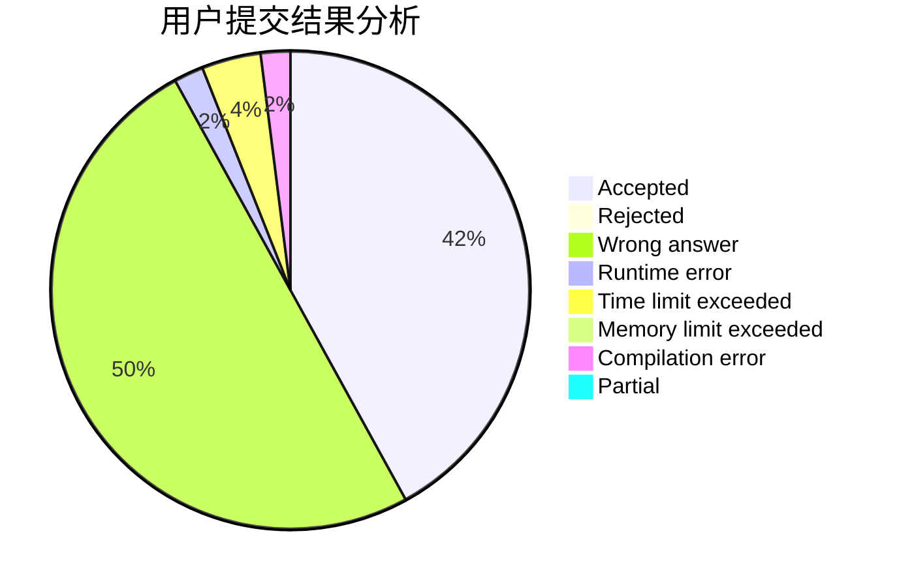
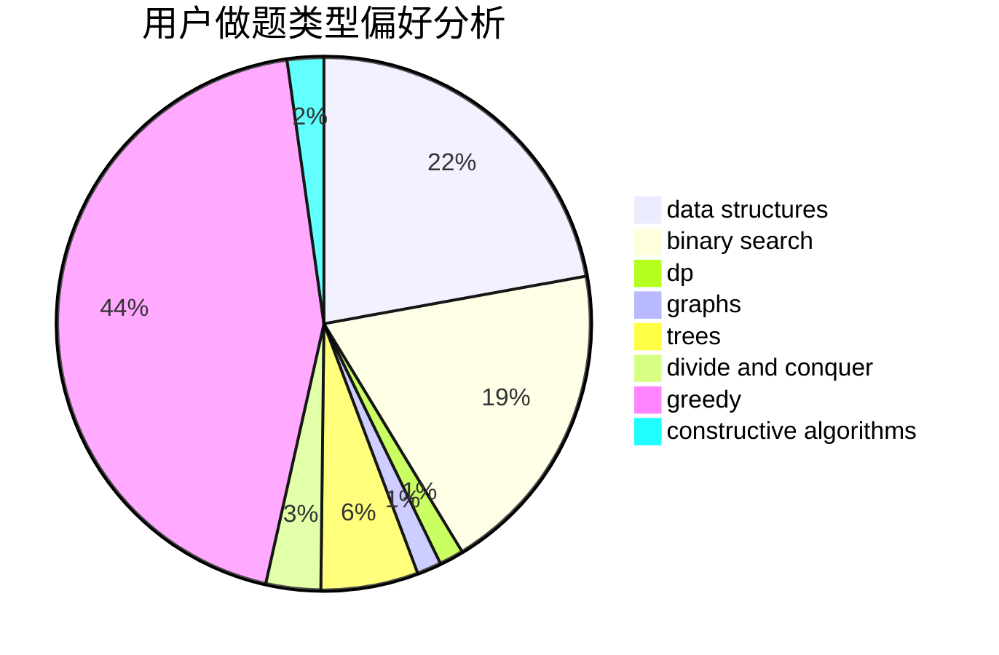
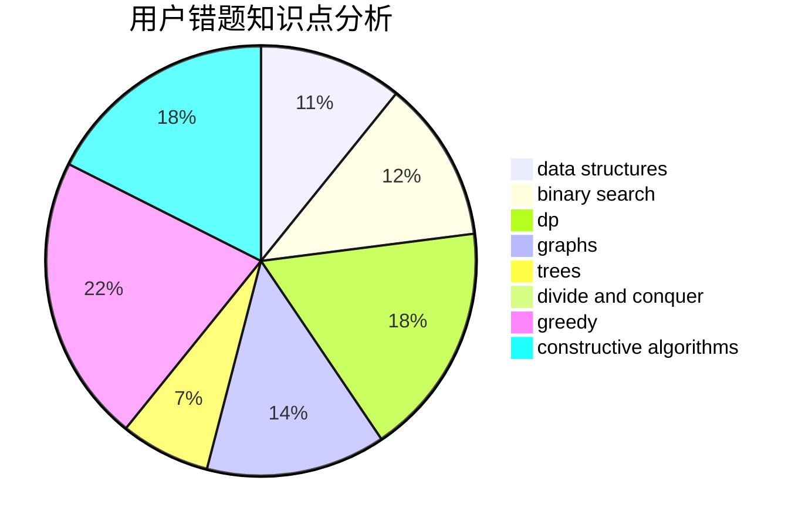

# JSNN

<!-- tabs:start -->

#### **用户提交结果分析**

#### **用户做题类型偏好分析**

#### **用户错题知识点分析**

<!-- tabs:end -->
# 推荐题目
[1245D](https://codeforces.com/contest/1245/problem/D)		dsu,
                        graphs,
                        greedy,
                        shortest paths,
                        trees		  
[461B](https://codeforces.com/contest/461/problem/B)		dfs and similar,
                        dp,
                        trees		  
[616B](https://codeforces.com/contest/616/problem/B)		games,
                        greedy		  
[1143B](https://codeforces.com/contest/1143/problem/B)		brute force,
                        math,
                        number theory		  
[1220C](https://codeforces.com/contest/1220/problem/C)		games,
                        greedy,
                        strings		  
[1426C](https://codeforces.com/contest/1426/problem/C)		binary search,
                        constructive algorithms,
                        math		  
[1153F](https://codeforces.com/contest/1153/problem/F)		combinatorics,
                        dp,
                        math,
                        probabilities		  
[1269B](https://codeforces.com/contest/1269/problem/B)		brute force,
                        sortings		  
[696B](https://codeforces.com/contest/696/problem/B)		dfs and similar,
                        math,
                        probabilities,
                        trees		  
[457C](https://codeforces.com/contest/457/problem/C)		brute force		  
