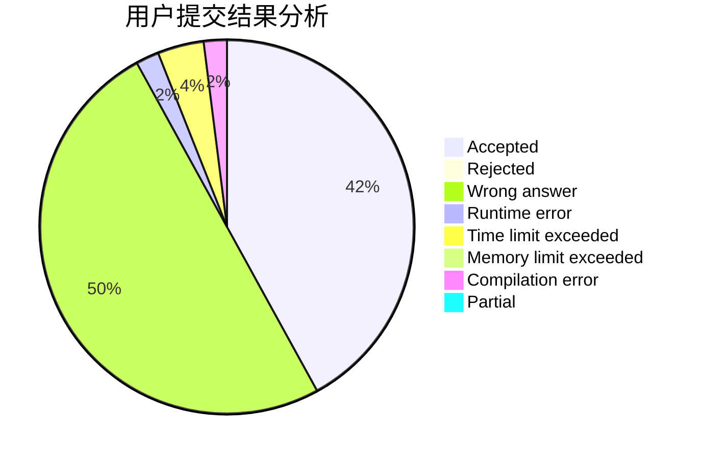
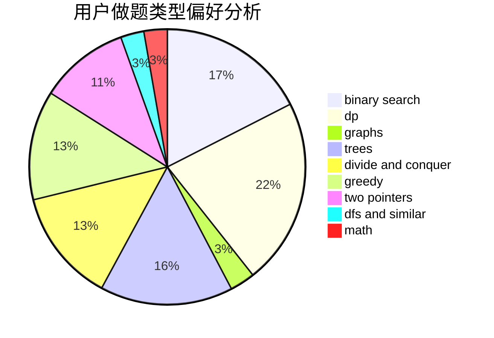

# JSNN

<!-- tabs:start -->

#### **用户提交结果分析**

#### **用户做题类型偏好分析**

<!-- tabs:end -->
# 推荐题目
[1250F](https://codeforces.com/contest/1250/problem/F)
[480B](https://codeforces.com/contest/480/problem/B)
[633G](https://codeforces.com/contest/633/problem/G)
[1145B](https://codeforces.com/contest/1145/problem/B)
[1228C](https://codeforces.com/contest/1228/problem/C)
[1434E](https://codeforces.com/contest/1434/problem/E)
[1155F](https://codeforces.com/contest/1155/problem/F)
[1278B](https://codeforces.com/contest/1278/problem/B)
[712E](https://codeforces.com/contest/712/problem/E)
[477C](https://codeforces.com/contest/477/problem/C)
