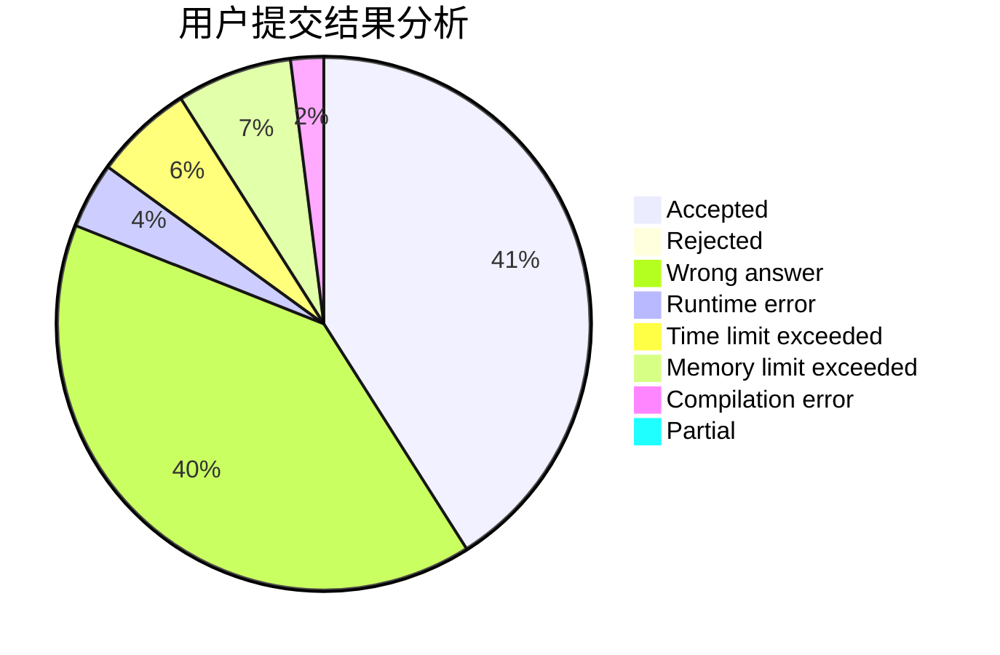
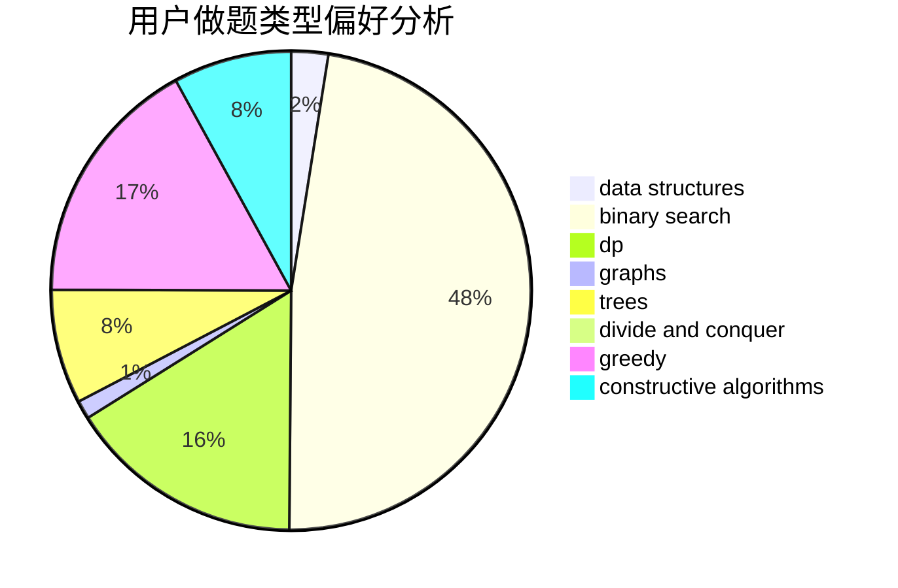
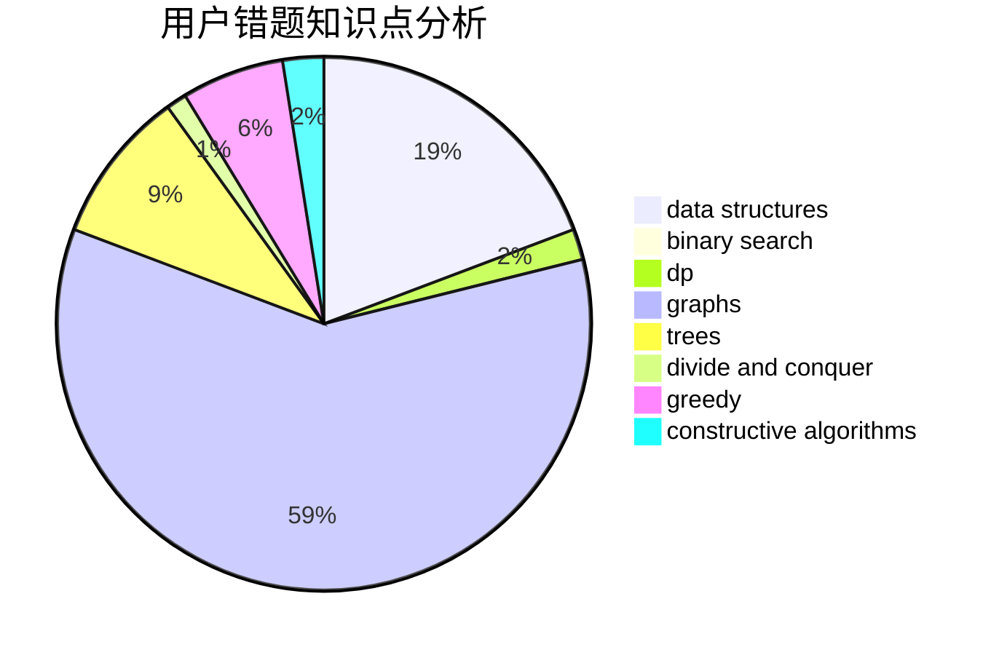

# 3.141592653

<!-- tabs:start -->

#### **用户提交结果分析**

#### **用户做题类型偏好分析**

#### **用户错题知识点分析**

<!-- tabs:end -->
# 推荐题目
[13541](https://codeforces.com/contest/1354/problem/1)		dsu,graphs,sortings,trees		  
[1085G](https://codeforces.com/contest/1085/problem/G)		combinatorics,
                        data structures,
                        dp		  
[1352D](https://codeforces.com/contest/1352/problem/D)		implementation		  
[1353F](https://codeforces.com/contest/1353/problem/F)		brute force,
                        dp		  
[1353C](https://codeforces.com/contest/1353/problem/C)		math		  
[1351B](https://codeforces.com/contest/1351/problem/B)		brute force,
                        implementation,
                        math		  
[103B](https://codeforces.com/contest/103/problem/B)		dfs and similar,
                        dsu,
                        graphs		  
[1146G](https://codeforces.com/contest/1146/problem/G)		dp,
                        flows,
                        graphs		  
[1351A](https://codeforces.com/contest/1351/problem/A)		implementation		  
[1236A](https://codeforces.com/contest/1236/problem/A)		brute force,
                        greedy,
                        math		  
