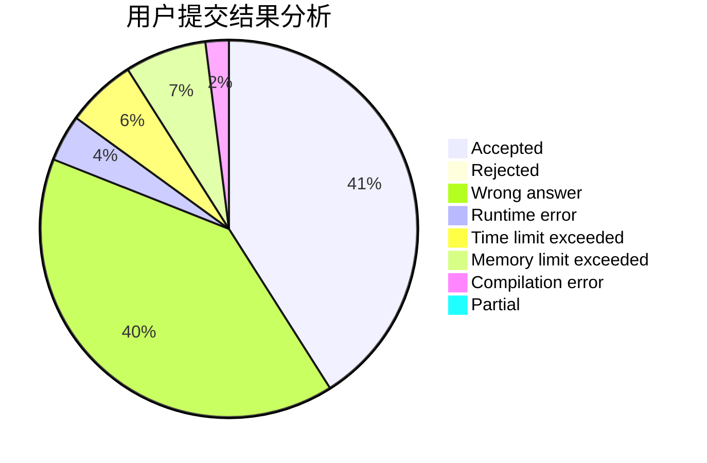
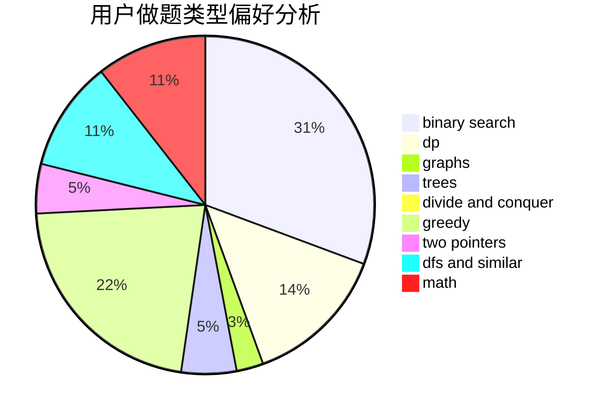

# 3.141592653

<!-- tabs:start -->

#### **用户提交结果分析**

#### **用户做题类型偏好分析**

<!-- tabs:end -->
# 推荐题目
[13541](https://codeforces.com/contest/1354/problem/1)
[1085G](https://codeforces.com/contest/1085/problem/G)
[1352D](https://codeforces.com/contest/1352/problem/D)
[1353F](https://codeforces.com/contest/1353/problem/F)
[1353C](https://codeforces.com/contest/1353/problem/C)
[1351B](https://codeforces.com/contest/1351/problem/B)
[103B](https://codeforces.com/contest/103/problem/B)
[1146G](https://codeforces.com/contest/1146/problem/G)
[1351A](https://codeforces.com/contest/1351/problem/A)
[1236A](https://codeforces.com/contest/1236/problem/A)
