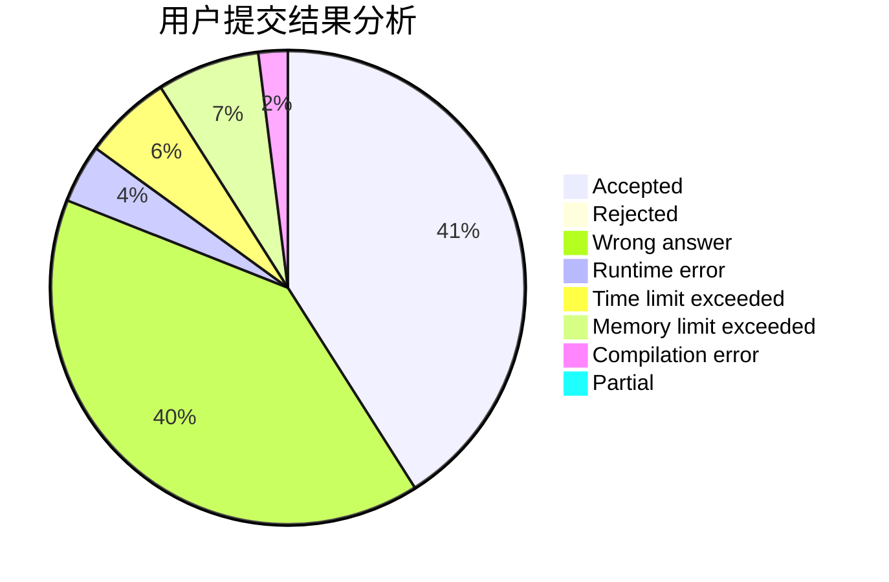
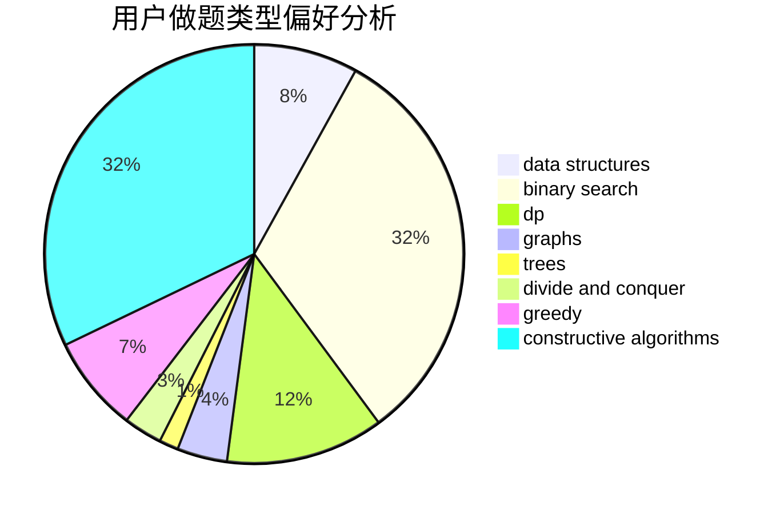
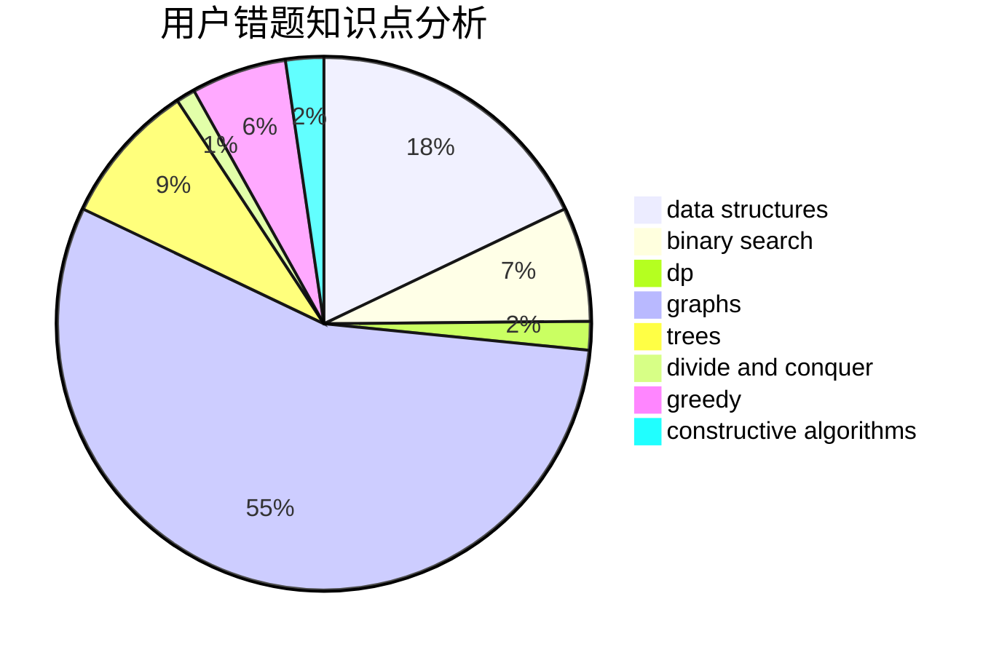

# 3.141592653

<!-- tabs:start -->

#### **用户提交结果分析**

#### **用户做题类型偏好分析**

#### **用户错题知识点分析**

<!-- tabs:end -->
# 推荐题目
[1346F](https://codeforces.com/contest/1346/problem/F)		*special problem,
                        data structures,
                        greedy,
                        math		  
[1085B](https://codeforces.com/contest/1085/problem/B)		math		  
[1345B](https://codeforces.com/contest/1345/problem/B)		binary search,
                        brute force,
                        dp,
                        math		  
[1346E](https://codeforces.com/contest/1346/problem/E)		*special problem,
                        dp,
                        graphs		  
[1346B](https://codeforces.com/contest/1346/problem/B)		*special problem,
                        greedy		  
[1344C](https://codeforces.com/contest/1344/problem/C)		dfs and similar,
                        dp,
                        graphs,
                        math		  
[1039D](https://codeforces.com/contest/1039/problem/D)		data structures,
                        dp,
                        trees		  
[1144F](https://codeforces.com/contest/1144/problem/F)		dfs and similar,
                        graphs		  
[1344B](https://codeforces.com/contest/1344/problem/B)		constructive algorithms,
                        dfs and similar,
                        dsu,
                        graphs		  
[1227D1](https://codeforces.com/contest/1227D/problem/1)		data structures,
                        greedy		  
