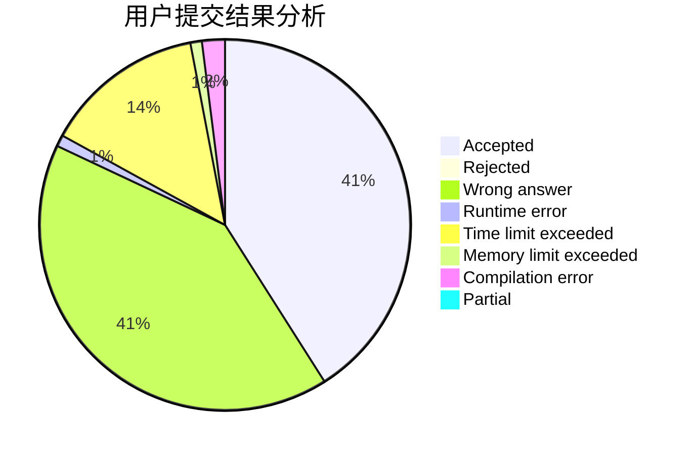
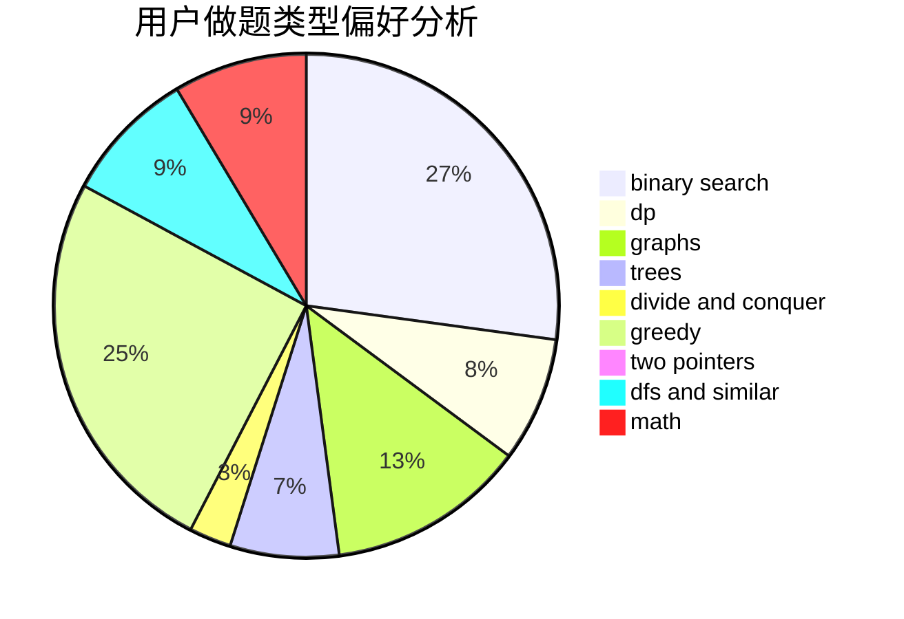

# J_B_Y

<!-- tabs:start -->

#### **用户提交结果分析**

#### **用户做题类型偏好分析**

<!-- tabs:end -->
# 推荐题目
[720D](https://codeforces.com/contest/720/problem/D)
[515A](https://codeforces.com/contest/515/problem/A)
[1771](https://codeforces.com/contest/177/problem/1)
[868D](https://codeforces.com/contest/868/problem/D)
[913G](https://codeforces.com/contest/913/problem/G)
[913H](https://codeforces.com/contest/913/problem/H)
[44G](https://codeforces.com/contest/44/problem/G)
[1288E](https://codeforces.com/contest/1288/problem/E)
[512C](https://codeforces.com/contest/512/problem/C)
[380D](https://codeforces.com/contest/380/problem/D)
