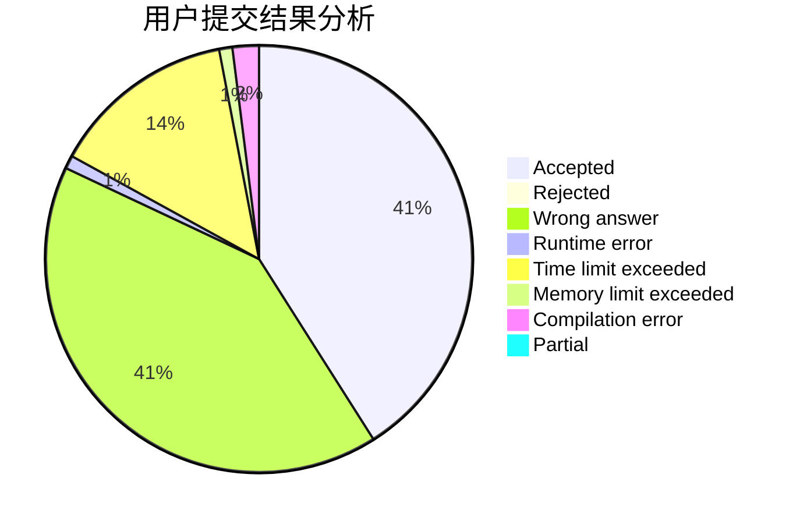
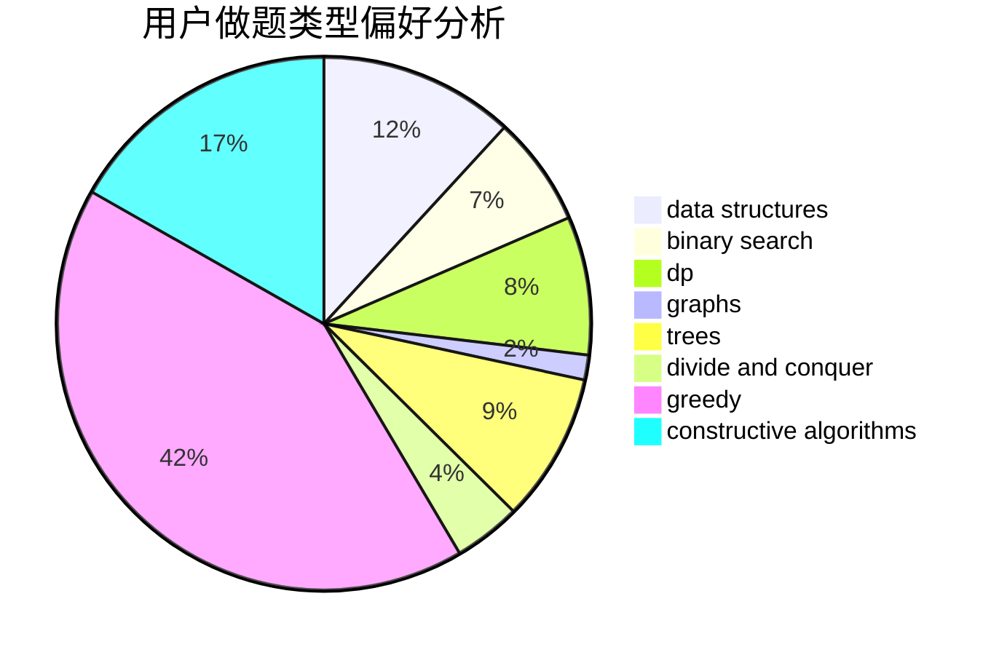
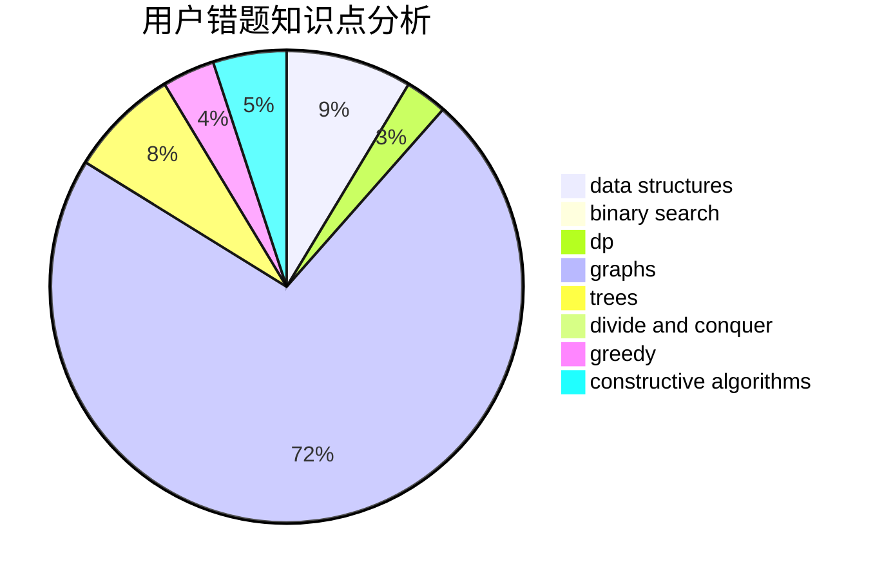

# J_B_Y

<!-- tabs:start -->

#### **用户提交结果分析**

#### **用户做题类型偏好分析**

#### **用户错题知识点分析**

<!-- tabs:end -->
# 推荐题目
[702A](https://codeforces.com/contest/702/problem/A)		dp,
                        greedy,
                        implementation		  
[494E](https://codeforces.com/contest/494/problem/E)		data structures,
                        games		  
[156C](https://codeforces.com/contest/156/problem/C)		combinatorics,
                        dp		  
[849B](https://codeforces.com/contest/849/problem/B)		brute force,
                        geometry		  
[896D](https://codeforces.com/contest/896/problem/D)		chinese remainder theorem,
                        combinatorics,
                        math,
                        number theory		  
[896E](https://codeforces.com/contest/896/problem/E)		data structures,
                        dsu		  
[429B](https://codeforces.com/contest/429/problem/B)		dp		  
[1282B2](https://codeforces.com/contest/1282B/problem/2)		dp,
                        greedy,
                        sortings		  
[492A](https://codeforces.com/contest/492/problem/A)		implementation		  
[354E](https://codeforces.com/contest/354/problem/E)		constructive algorithms,
                        dfs and similar,
                        dp		  
