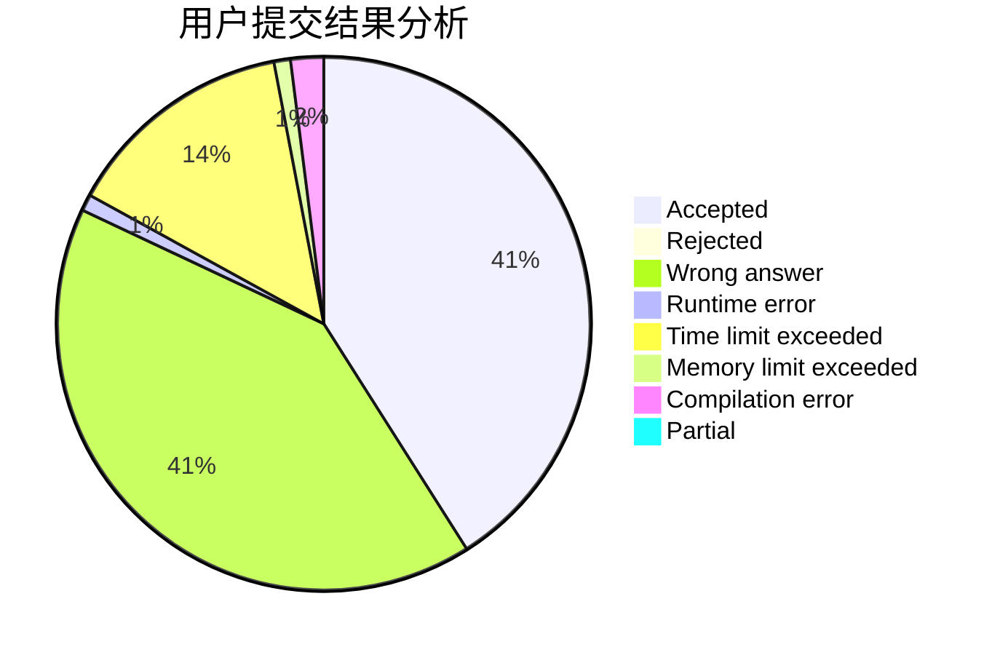
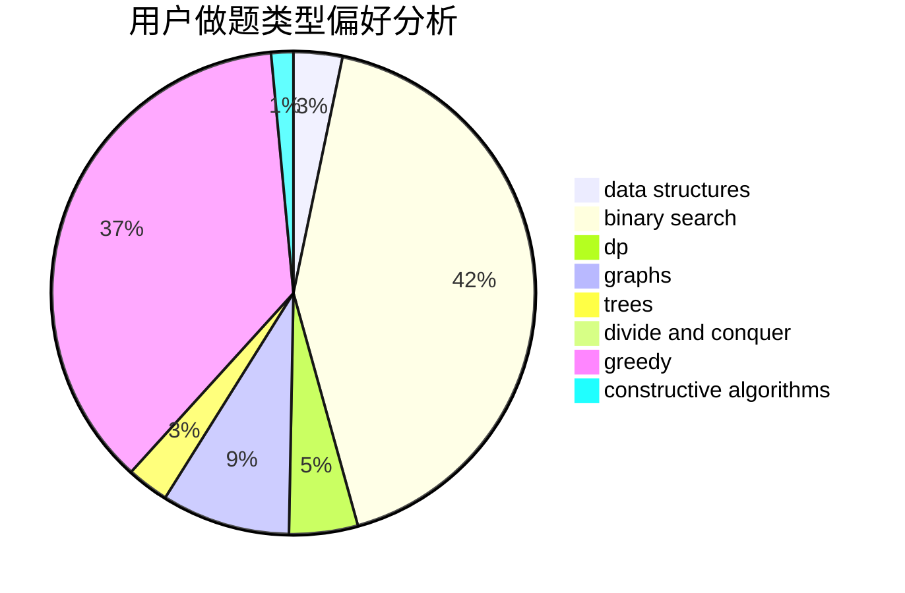
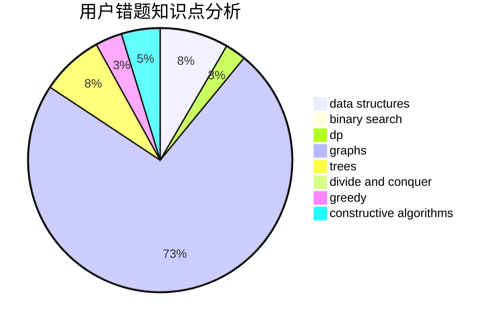

# J_B_Y

<!-- tabs:start -->

#### **用户提交结果分析**

#### **用户做题类型偏好分析**

#### **用户错题知识点分析**

<!-- tabs:end -->
# 推荐题目
[720D](https://codeforces.com/contest/720/problem/D)		data structures,
                        dp,
                        sortings		  
[515A](https://codeforces.com/contest/515/problem/A)		math		  
[1771](https://codeforces.com/contest/177/problem/1)		dsu,graphs,sortings,trees		  
[868D](https://codeforces.com/contest/868/problem/D)		bitmasks,
                        brute force,
                        dp,
                        implementation,
                        strings		  
[913G](https://codeforces.com/contest/913/problem/G)		math,
                        number theory		  
[913H](https://codeforces.com/contest/913/problem/H)		math,
                        probabilities		  
[44G](https://codeforces.com/contest/44/problem/G)		data structures,
                        implementation		  
[1288E](https://codeforces.com/contest/1288/problem/E)		data structures		  
[512C](https://codeforces.com/contest/512/problem/C)		dsu,graphs,sortings,trees		  
[380D](https://codeforces.com/contest/380/problem/D)		combinatorics,
                        math		  
