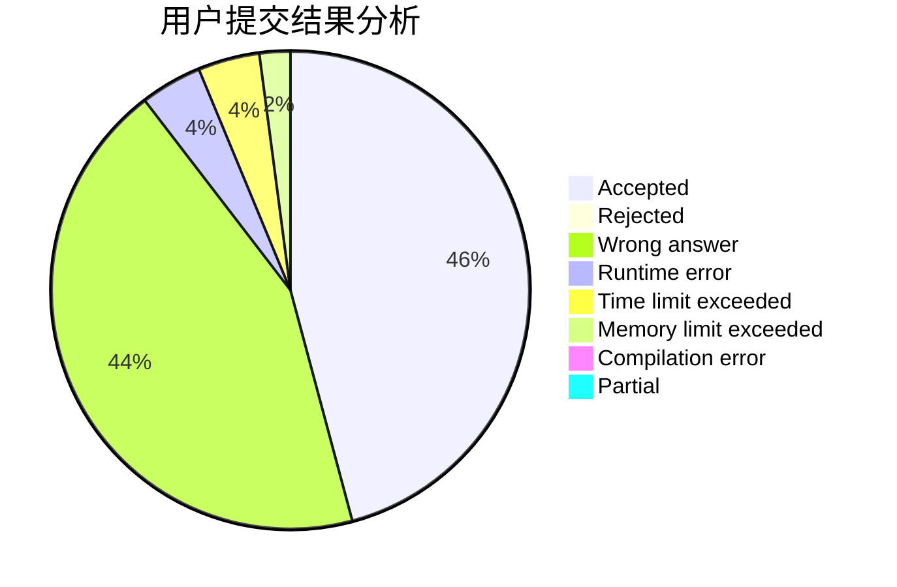
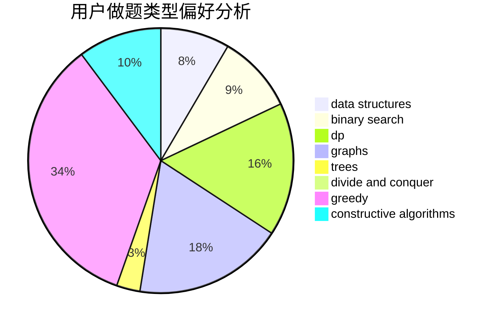
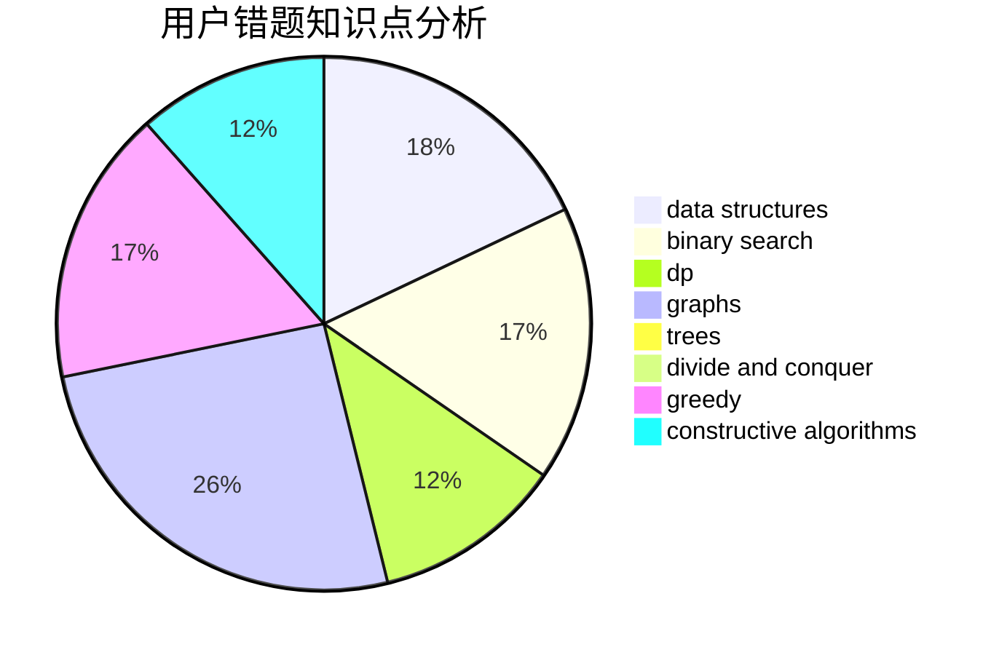

# JackF
<!-- tabs:start -->
#### **用户提交结果分析**

#### **用户做题类型偏好分析**

#### **用户错题知识点分析**

<!-- tabs:end -->
# 推荐题目
[Knights](http://codeforces.com/problemset/problem/1067/C)		constructive algorithms		  
[Diamond Miner](http://codeforces.com/problemset/problem/1495/A)		geometry,
                        greedy,
                        math,
                        sortings		  
[Skyline Photo](https://codeforces.com/contest/1483/problem/C)		data structures,
                        divide and conquer,
                        dp		  
[Array Division](http://codeforces.com/problemset/problem/808/D)		binary search,
                        data structures,
                        implementation		  
[Make Square](http://codeforces.com/problemset/problem/1028/H)		math		  
[Make Them Odd](http://codeforces.com/problemset/problem/1277/B)		greedy,
                        number theory		  
[Uncle Bogdan and Projections](http://codeforces.com/problemset/problem/1388/E)		data structures,
                        geometry,
                        sortings		  
[Long Recovery](http://codeforces.com/problemset/problem/1446/E)		constructive algorithms,
                        dfs and similar		  
[Irrigation](http://codeforces.com/problemset/problem/1181/D)		binary search,
                        data structures,
                        implementation,
                        sortings,
                        trees,
                        two pointers		  
[Alice and the List of Presents](http://codeforces.com/problemset/problem/1236/B)		combinatorics,
                        math		  
<!-- tabs:start -->
#### **data structures**
[Knights](https://codeforces.com/contest/1483/problem/C)		data structures,
                        divide and conquer,
                        dp		  
[Diamond Miner](http://codeforces.com/problemset/problem/808/D)		binary search,
                        data structures,
                        implementation		  
[Skyline Photo](http://codeforces.com/problemset/problem/1388/E)		data structures,
                        geometry,
                        sortings		  
[Array Division](http://codeforces.com/problemset/problem/1181/D)		binary search,
                        data structures,
                        implementation,
                        sortings,
                        trees,
                        two pointers		  
[Make Square](http://codeforces.com/problemset/problem/165/D)		data structures,
                        dsu,
                        trees		  
[Make Them Odd](http://codeforces.com/problemset/problem/1346/F)		*special problem,
                        data structures,
                        greedy,
                        math		  
[Uncle Bogdan and Projections](http://codeforces.com/problemset/problem/484/E)		binary search,
                        constructive algorithms,
                        data structures		  
[Long Recovery](https://codeforces.com/contest/1008/problem/C)		combinatorics,
                        data structures,
                        math,
                        sortings,
                        two pointers		  
[Irrigation](https://codeforces.com/contest/867/problem/E)		constructive algorithms,
                        data structures,
                        greedy		  
[Alice and the List of Presents](http://codeforces.com/problemset/problem/1349/A)		data structures,
                        math,
                        number theory		  
#### **binary search**
[Knights](http://codeforces.com/problemset/problem/808/D)		binary search,
                        data structures,
                        implementation		  
[Diamond Miner](http://codeforces.com/problemset/problem/1181/D)		binary search,
                        data structures,
                        implementation,
                        sortings,
                        trees,
                        two pointers		  
[Skyline Photo](http://codeforces.com/problemset/problem/484/E)		binary search,
                        constructive algorithms,
                        data structures		  
[Array Division](http://codeforces.com/problemset/problem/1453/E)		binary search,
                        dfs and similar,
                        dp,
                        greedy,
                        trees		  
[Make Square](http://codeforces.com/problemset/problem/1366/E)		binary search,
                        brute force,
                        combinatorics,
                        constructive algorithms,
                        dp,
                        two pointers		  
[Make Them Odd](http://codeforces.com/problemset/problem/889/E)		binary search,
                        dp,
                        math		  
[Uncle Bogdan and Projections](http://codeforces.com/problemset/problem/813/E)		binary search,
                        data structures		  
[Long Recovery](http://codeforces.com/problemset/problem/1492/C)		binary search,
                        data structures,
                        dp,
                        greedy,
                        two pointers		  
[Irrigation](http://codeforces.com/problemset/problem/1463/D)		binary search,
                        constructive algorithms,
                        greedy,
                        two pointers		  
[Alice and the List of Presents](http://codeforces.com/problemset/problem/1490/G)		binary search,
                        data structures,
                        math		  
#### **dp**
[Knights](https://codeforces.com/contest/1483/problem/C)		data structures,
                        divide and conquer,
                        dp		  
[Diamond Miner](http://codeforces.com/problemset/problem/1463/F)		bitmasks,
                        dp,
                        math		  
[Skyline Photo](http://codeforces.com/problemset/problem/455/C)		dfs and similar,
                        dp,
                        dsu,
                        ternary search,
                        trees		  
[Array Division](http://codeforces.com/problemset/problem/1140/D)		dp,
                        greedy,
                        math		  
[Make Square](http://codeforces.com/problemset/problem/1444/D)		constructive algorithms,
                        dp,
                        geometry		  
[Make Them Odd](http://codeforces.com/problemset/problem/1453/E)		binary search,
                        dfs and similar,
                        dp,
                        greedy,
                        trees		  
[Uncle Bogdan and Projections](http://codeforces.com/problemset/problem/1366/E)		binary search,
                        brute force,
                        combinatorics,
                        constructive algorithms,
                        dp,
                        two pointers		  
[Long Recovery](http://codeforces.com/problemset/problem/889/E)		binary search,
                        dp,
                        math		  
[Irrigation](http://codeforces.com/problemset/problem/1492/C)		binary search,
                        data structures,
                        dp,
                        greedy,
                        two pointers		  
[Alice and the List of Presents](https://codeforces.com/contest/1457/problem/C)		brute force,
                        dp,
                        implementation		  
#### **graph**
[Knights](http://codeforces.com/problemset/problem/1325/E)		brute force,
                        dfs and similar,
                        graphs,
                        number theory,
                        shortest paths		  
[Diamond Miner](http://codeforces.com/problemset/problem/1406/C)		constructive algorithms,
                        dfs and similar,
                        graphs,
                        trees		  
[Skyline Photo](http://codeforces.com/problemset/problem/427/C)		dfs and similar,
                        graphs,
                        two pointers		  
[Array Division](http://codeforces.com/problemset/problem/1487/C)		brute force,
                        constructive algorithms,
                        dfs and similar,
                        graphs,
                        greedy,
                        implementation,
                        math		  
[Make Square](http://codeforces.com/problemset/problem/1437/C)		dp,
                        flows,
                        graph matchings,
                        greedy,
                        math,
                        sortings		  
[Make Them Odd](http://codeforces.com/problemset/problem/1470/D)		constructive algorithms,
                        dfs and similar,
                        graph matchings,
                        graphs,
                        greedy		  
[Uncle Bogdan and Projections](http://codeforces.com/problemset/problem/1476/C)		dp,
                        graphs,
                        greedy		  
[Long Recovery](http://codeforces.com/problemset/problem/1304/D)		constructive algorithms,
                        graphs,
                        greedy,
                        two pointers		  
[Irrigation](http://codeforces.com/problemset/problem/1475/C)		combinatorics,
                        graphs,
                        math		  
[Alice and the List of Presents](http://codeforces.com/problemset/problem/553/E)		dp,
                        fft,
                        graphs,
                        math,
                        probabilities		  
#### **trees**
[Knights](http://codeforces.com/problemset/problem/1181/D)		binary search,
                        data structures,
                        implementation,
                        sortings,
                        trees,
                        two pointers		  
[Diamond Miner](http://codeforces.com/problemset/problem/165/D)		data structures,
                        dsu,
                        trees		  
[Skyline Photo](http://codeforces.com/problemset/problem/455/C)		dfs and similar,
                        dp,
                        dsu,
                        ternary search,
                        trees		  
[Array Division](http://codeforces.com/problemset/problem/1453/E)		binary search,
                        dfs and similar,
                        dp,
                        greedy,
                        trees		  
[Make Square](http://codeforces.com/problemset/problem/1406/C)		constructive algorithms,
                        dfs and similar,
                        graphs,
                        trees		  
[Make Them Odd](http://codeforces.com/problemset/problem/1479/D)		binary search,
                        bitmasks,
                        brute force,
                        data structures,
                        probabilities,
                        trees		  
[Uncle Bogdan and Projections](http://codeforces.com/problemset/problem/1511/C)		brute force,
                        data structures,
                        implementation,
                        trees		  
[Long Recovery](http://codeforces.com/problemset/problem/1499/F)		combinatorics,
                        dfs and similar,
                        dp,
                        trees		  
[Irrigation](http://codeforces.com/problemset/problem/1491/E)		brute force,
                        dfs and similar,
                        divide and conquer,
                        number theory,
                        trees		  
[Alice and the List of Presents](http://codeforces.com/problemset/problem/1466/D)		data structures,
                        greedy,
                        sortings,
                        trees		  
#### **divide and conquer**
[Knights](https://codeforces.com/contest/1483/problem/C)		data structures,
                        divide and conquer,
                        dp		  
[Diamond Miner](http://codeforces.com/problemset/problem/1461/D)		binary search,
                        brute force,
                        data structures,
                        divide and conquer,
                        implementation,
                        sortings		  
[Skyline Photo](http://codeforces.com/problemset/problem/1466/G)		combinatorics,
                        divide and conquer,
                        hashing,
                        math,
                        string suffix structures,
                        strings		  
[Array Division](http://codeforces.com/problemset/problem/1490/D)		dfs and similar,
                        divide and conquer,
                        implementation		  
[Make Square](https://codeforces.com/contest/1483/problem/C)		data structures,
                        divide and conquer,
                        dp		  
[Make Them Odd](http://codeforces.com/problemset/problem/1491/E)		brute force,
                        dfs and similar,
                        divide and conquer,
                        number theory,
                        trees		  
[Uncle Bogdan and Projections](http://codeforces.com/problemset/problem/1303/G)		data structures,
                        divide and conquer,
                        geometry,
                        trees		  
[Long Recovery](http://codeforces.com/problemset/problem/1494/D)		constructive algorithms,
                        data structures,
                        dfs and similar,
                        divide and conquer,
                        dsu,
                        greedy,
                        sortings,
                        trees		  
[Irrigation](http://codeforces.com/problemset/problem/1482/E)		data structures,
                        divide and conquer,
                        dp		  
[Alice and the List of Presents](http://codeforces.com/problemset/problem/566/C)		dfs and similar,
                        divide and conquer,
                        trees		  
#### **greedy**
[Knights](http://codeforces.com/problemset/problem/1495/A)		geometry,
                        greedy,
                        math,
                        sortings		  
[Diamond Miner](http://codeforces.com/problemset/problem/1277/B)		greedy,
                        number theory		  
[Skyline Photo](http://codeforces.com/problemset/problem/1062/C)		greedy,
                        implementation,
                        math		  
[Array Division](http://codeforces.com/problemset/problem/215/D)		greedy		  
[Make Square](http://codeforces.com/problemset/problem/1346/F)		*special problem,
                        data structures,
                        greedy,
                        math		  
[Make Them Odd](http://codeforces.com/problemset/problem/847/K)		greedy,
                        implementation,
                        sortings		  
[Uncle Bogdan and Projections](http://codeforces.com/problemset/problem/584/C)		constructive algorithms,
                        greedy,
                        strings		  
[Long Recovery](http://codeforces.com/problemset/problem/1140/D)		dp,
                        greedy,
                        math		  
[Irrigation](http://codeforces.com/problemset/problem/1453/E)		binary search,
                        dfs and similar,
                        dp,
                        greedy,
                        trees		  
[Alice and the List of Presents](http://codeforces.com/problemset/problem/389/B)		greedy,
                        implementation		  
#### **constructive algorithms**
[Knights](http://codeforces.com/problemset/problem/1067/C)		constructive algorithms		  
[Diamond Miner](http://codeforces.com/problemset/problem/1446/E)		constructive algorithms,
                        dfs and similar		  
[Skyline Photo](http://codeforces.com/problemset/problem/484/E)		binary search,
                        constructive algorithms,
                        data structures		  
[Array Division](http://codeforces.com/problemset/problem/584/C)		constructive algorithms,
                        greedy,
                        strings		  
[Make Square](http://codeforces.com/problemset/problem/1444/D)		constructive algorithms,
                        dp,
                        geometry		  
[Make Them Odd](http://codeforces.com/problemset/problem/1366/E)		binary search,
                        brute force,
                        combinatorics,
                        constructive algorithms,
                        dp,
                        two pointers		  
[Uncle Bogdan and Projections](http://codeforces.com/problemset/problem/1406/C)		constructive algorithms,
                        dfs and similar,
                        graphs,
                        trees		  
[Long Recovery](http://codeforces.com/problemset/problem/1209/C)		constructive algorithms,
                        greedy,
                        implementation		  
[Irrigation](https://codeforces.com/contest/867/problem/E)		constructive algorithms,
                        data structures,
                        greedy		  
[Alice and the List of Presents](http://codeforces.com/problemset/problem/1266/B)		constructive algorithms,
                        math		  
#### **sortings**
[Knights](http://codeforces.com/problemset/problem/1495/A)		geometry,
                        greedy,
                        math,
                        sortings		  
[Diamond Miner](http://codeforces.com/problemset/problem/1388/E)		data structures,
                        geometry,
                        sortings		  
[Skyline Photo](http://codeforces.com/problemset/problem/1181/D)		binary search,
                        data structures,
                        implementation,
                        sortings,
                        trees,
                        two pointers		  
[Array Division](http://codeforces.com/problemset/problem/847/K)		greedy,
                        implementation,
                        sortings		  
[Make Square](https://codeforces.com/contest/1008/problem/C)		combinatorics,
                        data structures,
                        math,
                        sortings,
                        two pointers		  
[Make Them Odd](https://codeforces.com/contest/1496/problem/C)		geometry,
                        greedy,
                        math,
                        sortings		  
[Uncle Bogdan and Projections](http://codeforces.com/problemset/problem/1495/A)		geometry,
                        greedy,
                        math,
                        sortings		  
[Long Recovery](http://codeforces.com/problemset/problem/1497/A)		brute force,
                        data structures,
                        greedy,
                        sortings		  
[Irrigation](http://codeforces.com/problemset/problem/1427/A)		math,
                        sortings		  
[Alice and the List of Presents](http://codeforces.com/problemset/problem/1461/D)		binary search,
                        brute force,
                        data structures,
                        divide and conquer,
                        implementation,
                        sortings		  
<!-- tabs:end -->
