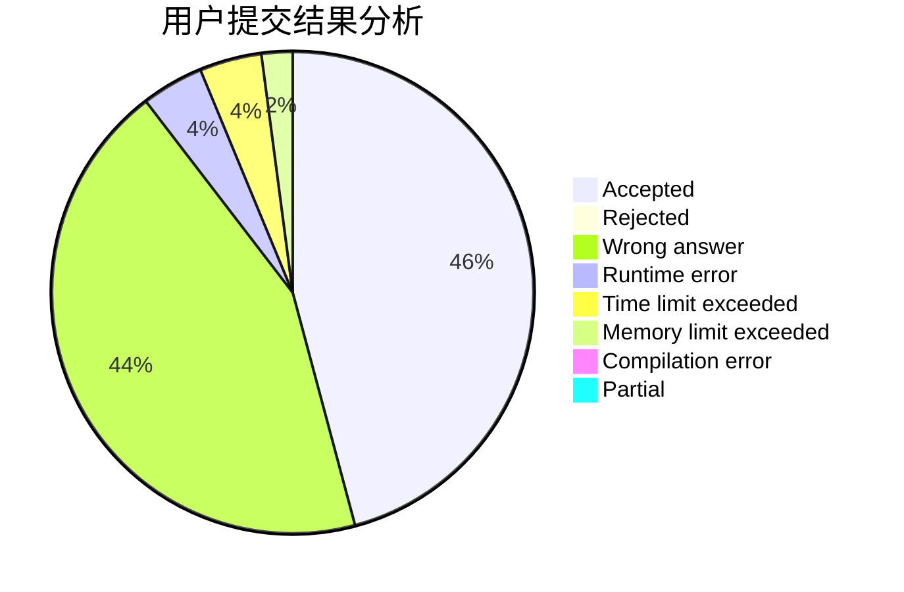
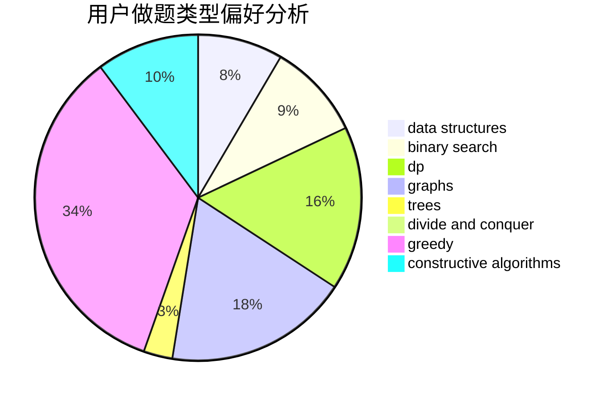
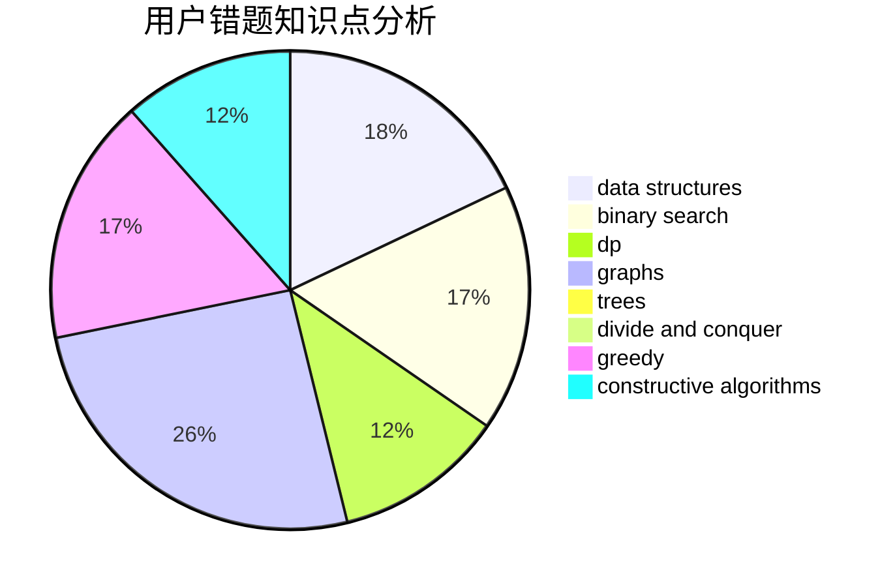

# JackF

<!-- tabs:start -->

#### **用户提交结果分析**

#### **用户做题类型偏好分析**

#### **用户错题知识点分析**

<!-- tabs:end -->
# 推荐题目
[1495A](https://codeforces.com/contest/1495/problem/A)		geometry,
                        greedy,
                        math,
                        sortings		  
[1277B](https://codeforces.com/contest/1277/problem/B)		greedy,
                        number theory		  
[1028H](https://codeforces.com/contest/1028/problem/H)		math		  
[1155C](https://codeforces.com/contest/1155/problem/C)		math,
                        number theory		  
[1325E](https://codeforces.com/contest/1325/problem/E)		brute force,
                        dfs and similar,
                        graphs,
                        number theory,
                        shortest paths		  
[1349A](https://codeforces.com/contest/1349/problem/A)		data structures,
                        math,
                        number theory		  
[165D](https://codeforces.com/contest/165/problem/D)		data structures,
                        dsu,
                        trees		  
[215D](https://codeforces.com/contest/215/problem/D)		greedy		  
[813E](https://codeforces.com/contest/813/problem/E)		binary search,
                        data structures		  
[922C](https://codeforces.com/contest/922/problem/C)		brute force,
                        number theory		  
