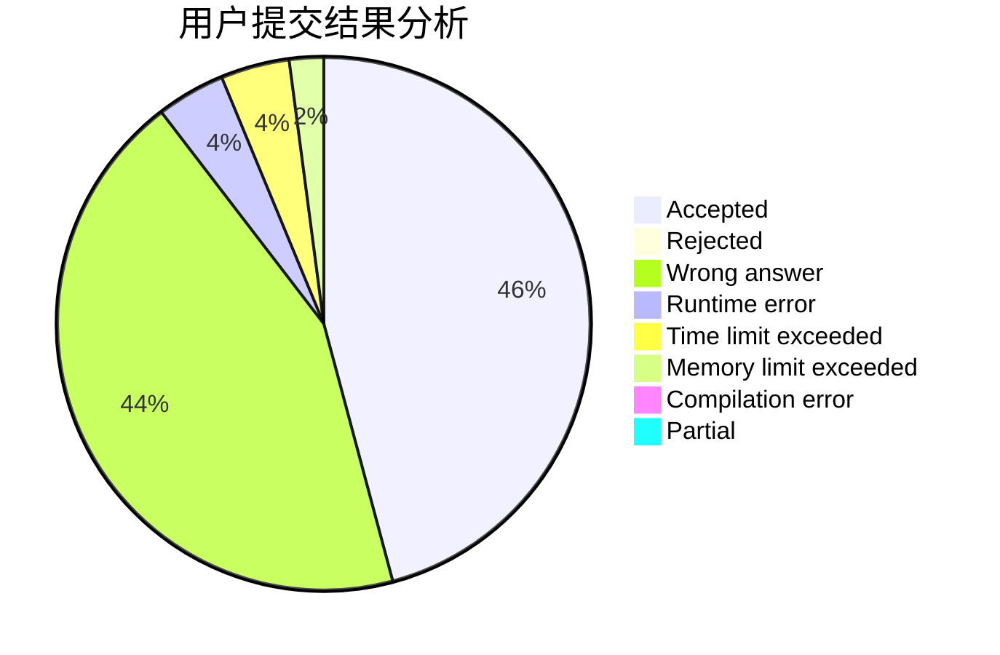
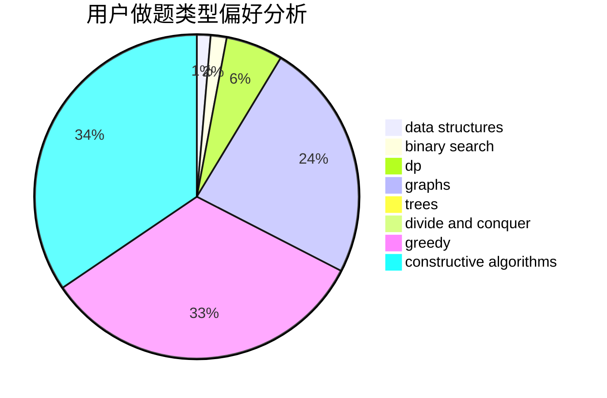
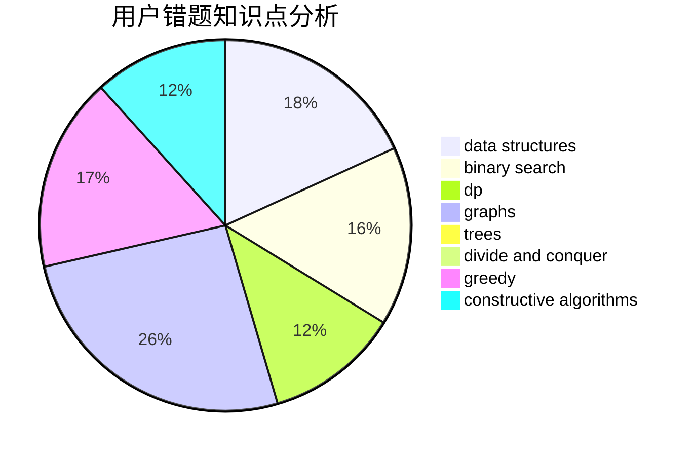

# JackF

<!-- tabs:start -->

#### **用户提交结果分析**

#### **用户做题类型偏好分析**

#### **用户错题知识点分析**

<!-- tabs:end -->
# 推荐题目
[1504A](https://codeforces.com/contest/1504/problem/A)		constructive algorithms,
                        strings		  
[1283D](https://codeforces.com/contest/1283/problem/D)		graphs,
                        greedy,
                        shortest paths		  
[1029C](https://codeforces.com/contest/1029/problem/C)		greedy,
                        math,
                        sortings		  
[1157A](https://codeforces.com/contest/1157/problem/A)		implementation		  
[1332A](https://codeforces.com/contest/1332/problem/A)		greedy,
                        implementation,
                        math		  
[1355E](https://codeforces.com/contest/1355/problem/E)		binary search,
                        greedy,
                        math,
                        sortings,
                        ternary search		  
[190C](https://codeforces.com/contest/190/problem/C)		dfs and similar		  
[235A](https://codeforces.com/contest/235/problem/A)		number theory		  
[832A](https://codeforces.com/contest/832/problem/A)		games,
                        math		  
[946C](https://codeforces.com/contest/946/problem/C)		greedy,
                        strings		  
