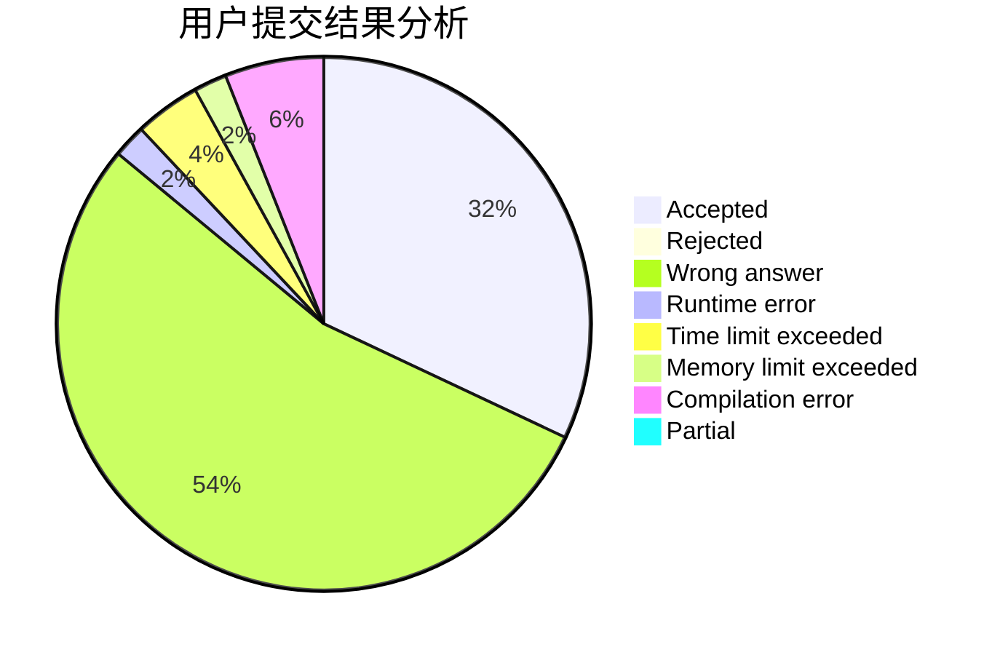
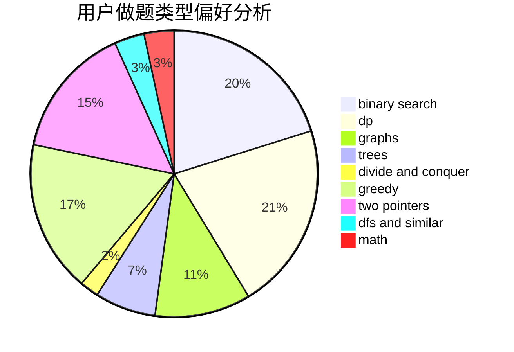

# Jacky_He

<!-- tabs:start -->

#### **用户提交结果分析**

#### **用户做题类型偏好分析**

<!-- tabs:end -->
# 推荐题目
[682D](https://codeforces.com/contest/682/problem/D)
[788B](https://codeforces.com/contest/788/problem/B)
[722C](https://codeforces.com/contest/722/problem/C)
[688D](https://codeforces.com/contest/688/problem/D)
[1178B](https://codeforces.com/contest/1178/problem/B)
[828A](https://codeforces.com/contest/828/problem/A)
[713E](https://codeforces.com/contest/713/problem/E)
[838C](https://codeforces.com/contest/838/problem/C)
[437A](https://codeforces.com/contest/437/problem/A)
[897B](https://codeforces.com/contest/897/problem/B)
