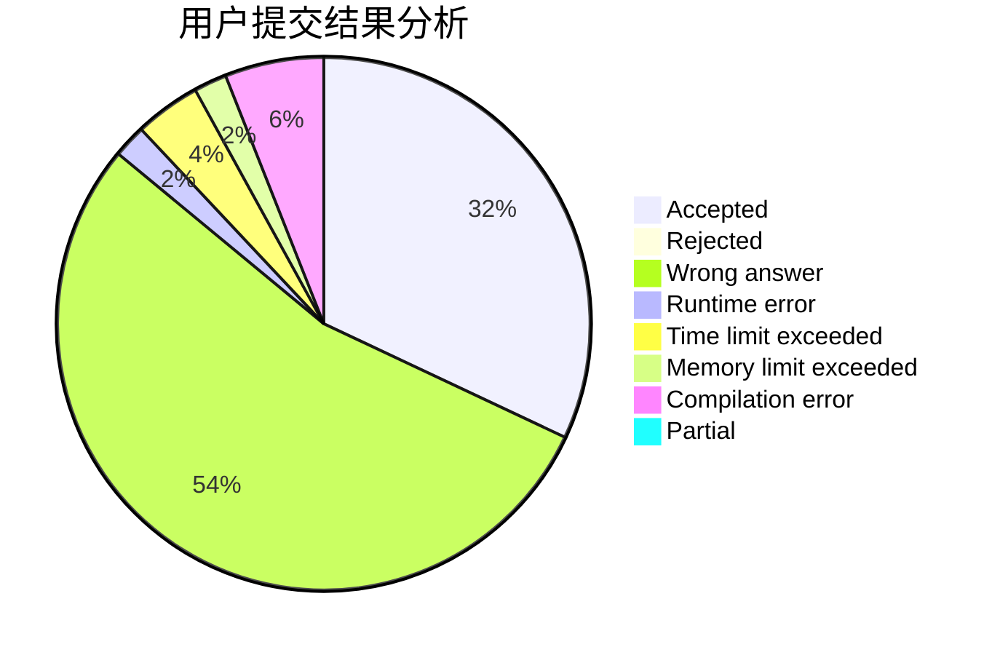
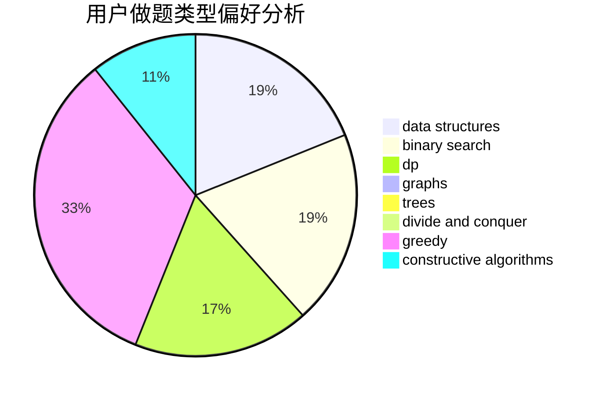

# Jacky_He

<!-- tabs:start -->

#### **用户提交结果分析**

#### **用户做题类型偏好分析**

#### **用户错题知识点分析**

<!-- tabs:end -->
# 推荐题目
[662D](https://codeforces.com/contest/662/problem/D)		constructive algorithms,
                        greedy,
                        implementation,
                        math		  
[768C](https://codeforces.com/contest/768/problem/C)		brute force,
                        dp,
                        implementation,
                        sortings		  
[703B](https://codeforces.com/contest/703/problem/B)		implementation,
                        math		  
[666E](https://codeforces.com/contest/666/problem/E)		data structures,
                        string suffix structures		  
[1175B](https://codeforces.com/contest/1175/problem/B)		data structures,
                        expression parsing,
                        implementation		  
[810A](https://codeforces.com/contest/810/problem/A)		implementation,
                        math		  
[697B](https://codeforces.com/contest/697/problem/B)		brute force,
                        implementation,
                        math,
                        strings		  
[818D](https://codeforces.com/contest/818/problem/D)		data structures,
                        implementation		  
[409G](https://codeforces.com/contest/409/problem/G)		*special problem,
                        geometry		  
[876F](https://codeforces.com/contest/876/problem/F)		dsu,graphs,sortings,trees		  
