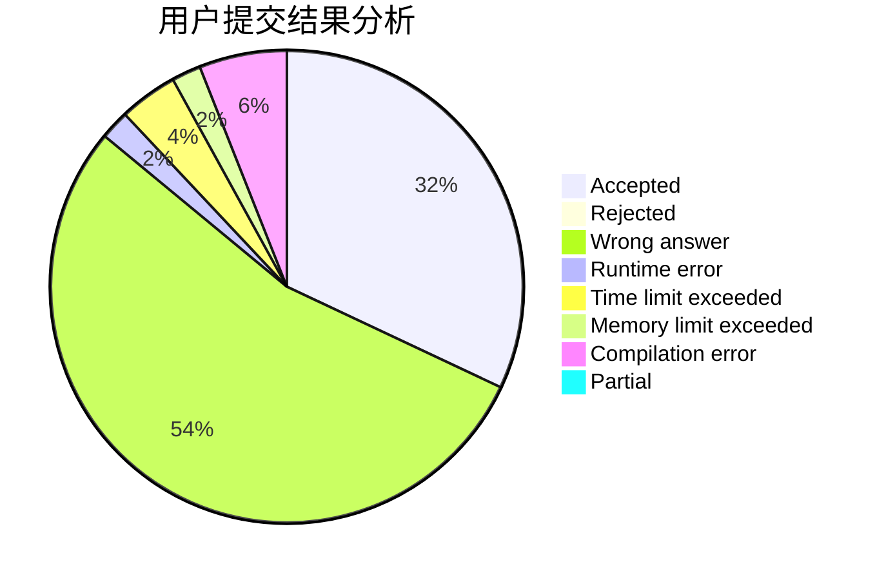
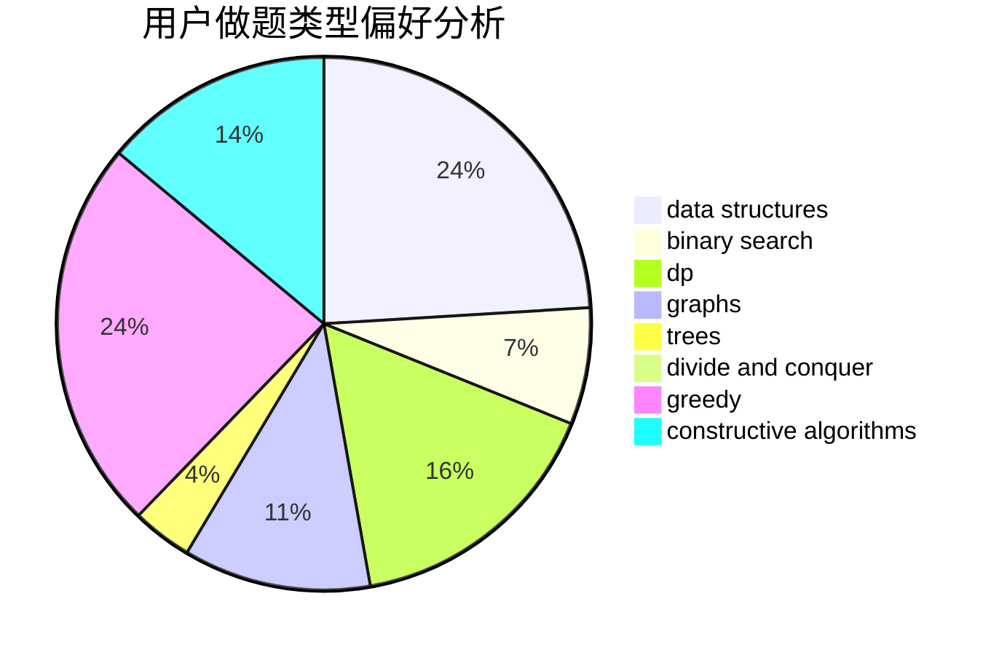

# Jacky_He

<!-- tabs:start -->

#### **用户提交结果分析**

#### **用户做题类型偏好分析**

#### **用户错题知识点分析**

<!-- tabs:end -->
# 推荐题目
[682D](https://codeforces.com/contest/682/problem/D)		dp,
                        strings		  
[788B](https://codeforces.com/contest/788/problem/B)		combinatorics,
                        constructive algorithms,
                        dfs and similar,
                        dsu,
                        graphs		  
[722C](https://codeforces.com/contest/722/problem/C)		data structures,
                        dsu		  
[688D](https://codeforces.com/contest/688/problem/D)		dsu,graphs,sortings,trees		  
[1178B](https://codeforces.com/contest/1178/problem/B)		dp,
                        strings		  
[828A](https://codeforces.com/contest/828/problem/A)		implementation		  
[713E](https://codeforces.com/contest/713/problem/E)		binary search,
                        dp		  
[838C](https://codeforces.com/contest/838/problem/C)		dp,
                        games		  
[437A](https://codeforces.com/contest/437/problem/A)		implementation		  
[897B](https://codeforces.com/contest/897/problem/B)		brute force		  
