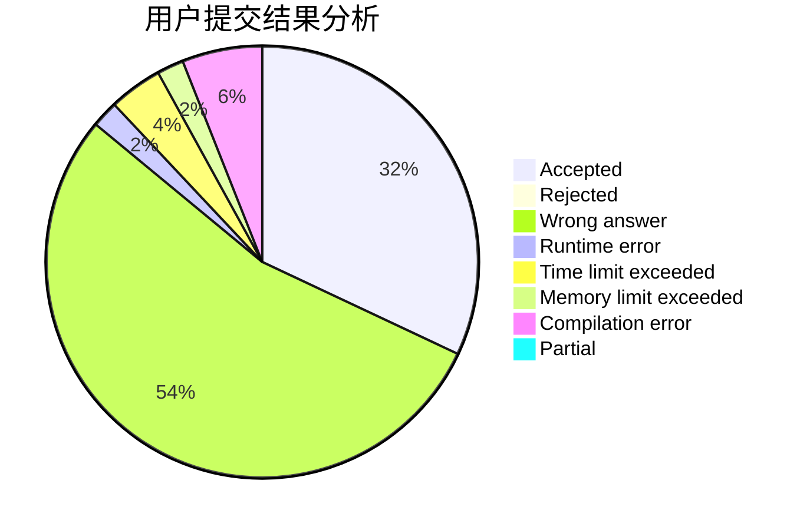
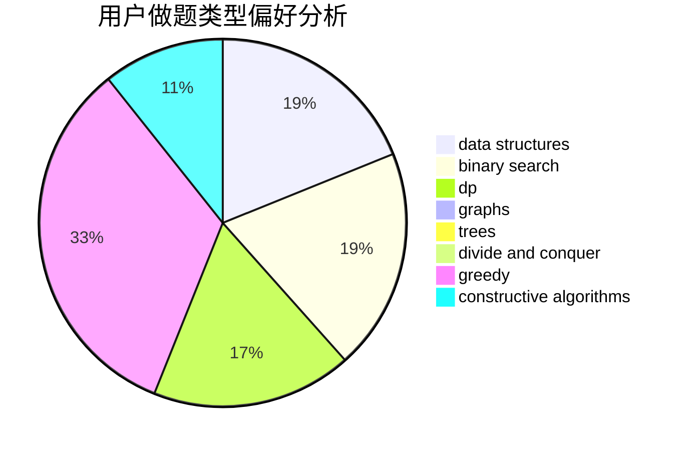

# Jacky_He
<!-- tabs:start -->
#### **用户提交结果分析**

#### **用户做题类型偏好分析**

#### **用户错题知识点分析**

<!-- tabs:end -->
# 推荐题目
[International Olympiad](http://codeforces.com/problemset/problem/662/D)		constructive algorithms,
                        greedy,
                        implementation,
                        math		  
[Jon Snow and his Favourite Number](http://codeforces.com/problemset/problem/768/C)		brute force,
                        dp,
                        implementation,
                        sortings		  
[Robot Vacuum Cleaner](http://codeforces.com/problemset/problem/922/D)		greedy,
                        sortings		  
[Rosetta Problem](http://codeforces.com/problemset/problem/656/D)		*special problem		  
[Ilya and Roads](http://codeforces.com/problemset/problem/313/D)		dp		  
[Analysis of Pathes in Functional Graph](http://codeforces.com/problemset/problem/702/E)		data structures,
                        graphs		  
[File List](http://codeforces.com/problemset/problem/174/B)		dp,
                        greedy,
                        implementation		  
[Birds](http://codeforces.com/problemset/problem/922/E)		dp		  
[Rock-Paper-Scissors Champion](http://codeforces.com/problemset/problem/1085/F)		nan		  
[Mishka and trip](http://codeforces.com/problemset/problem/703/B)		implementation,
                        math		  
<!-- tabs:start -->
#### **data structures**
[International Olympiad](http://codeforces.com/problemset/problem/702/E)		data structures,
                        graphs		  
[Jon Snow and his Favourite Number](http://codeforces.com/problemset/problem/818/D)		data structures,
                        implementation		  
[Robot Vacuum Cleaner](http://codeforces.com/problemset/problem/666/E)		data structures,
                        string suffix structures		  
[Rosetta Problem](http://codeforces.com/problemset/problem/460/C)		binary search,
                        data structures,
                        greedy		  
[Ilya and Roads](https://codeforces.com/contest/876/problem/F)		binary search,
                        bitmasks,
                        combinatorics,
                        data structures,
                        divide and conquer		  
[Analysis of Pathes in Functional Graph](http://codeforces.com/problemset/problem/573/B)		binary search,
                        data structures,
                        dp,
                        math		  
[File List](http://codeforces.com/problemset/problem/815/D)		binary search,
                        combinatorics,
                        data structures,
                        geometry		  
[Birds](http://codeforces.com/problemset/problem/377/D)		data structures		  
[Rock-Paper-Scissors Champion](http://codeforces.com/problemset/problem/750/E)		data structures,
                        divide and conquer,
                        dp,
                        matrices		  
[Mishka and trip](https://codeforces.com/contest/1483/problem/B)		data structures,
                        dsu,
                        implementation,
                        shortest paths		  
#### **binary search**
[International Olympiad](http://codeforces.com/problemset/problem/460/C)		binary search,
                        data structures,
                        greedy		  
[Jon Snow and his Favourite Number](https://codeforces.com/contest/876/problem/F)		binary search,
                        bitmasks,
                        combinatorics,
                        data structures,
                        divide and conquer		  
[Robot Vacuum Cleaner](http://codeforces.com/problemset/problem/573/B)		binary search,
                        data structures,
                        dp,
                        math		  
[Rosetta Problem](http://codeforces.com/problemset/problem/21/C)		binary search,
                        dp,
                        sortings		  
[Ilya and Roads](http://codeforces.com/problemset/problem/815/D)		binary search,
                        combinatorics,
                        data structures,
                        geometry		  
[Analysis of Pathes in Functional Graph](http://codeforces.com/problemset/problem/201/E)		binary search,
                        combinatorics		  
[File List](http://codeforces.com/problemset/problem/1426/C)		binary search,
                        constructive algorithms,
                        math		  
[Birds](http://codeforces.com/problemset/problem/1119/D)		binary search,
                        sortings		  
[Rock-Paper-Scissors Champion](http://codeforces.com/problemset/problem/1201/D)		binary search,
                        dp,
                        greedy,
                        implementation		  
[Mishka and trip](http://codeforces.com/problemset/problem/1324/D)		binary search,
                        data structures,
                        sortings,
                        two pointers		  
#### **dp**
[International Olympiad](http://codeforces.com/problemset/problem/768/C)		brute force,
                        dp,
                        implementation,
                        sortings		  
[Jon Snow and his Favourite Number](http://codeforces.com/problemset/problem/313/D)		dp		  
[Robot Vacuum Cleaner](http://codeforces.com/problemset/problem/174/B)		dp,
                        greedy,
                        implementation		  
[Rosetta Problem](http://codeforces.com/problemset/problem/922/E)		dp		  
[Ilya and Roads](http://codeforces.com/problemset/problem/814/D)		dfs and similar,
                        dp,
                        geometry,
                        greedy,
                        trees		  
[Analysis of Pathes in Functional Graph](http://codeforces.com/problemset/problem/466/D)		combinatorics,
                        dp		  
[File List](http://codeforces.com/problemset/problem/573/B)		binary search,
                        data structures,
                        dp,
                        math		  
[Birds](http://codeforces.com/problemset/problem/21/C)		binary search,
                        dp,
                        sortings		  
[Rock-Paper-Scissors Champion](http://codeforces.com/problemset/problem/750/E)		data structures,
                        divide and conquer,
                        dp,
                        matrices		  
[Mishka and trip](http://codeforces.com/problemset/problem/1250/D)		dp		  
#### **graph**
[International Olympiad](http://codeforces.com/problemset/problem/702/E)		data structures,
                        graphs		  
[Jon Snow and his Favourite Number](http://codeforces.com/problemset/problem/767/C)		dfs and similar,
                        graphs,
                        greedy,
                        trees		  
[Robot Vacuum Cleaner](http://codeforces.com/problemset/problem/545/E)		graphs,
                        greedy,
                        shortest paths		  
[Rosetta Problem](http://codeforces.com/problemset/problem/1198/C)		constructive algorithms,
                        graphs,
                        greedy,
                        sortings		  
[Ilya and Roads](http://codeforces.com/problemset/problem/1209/D)		dfs and similar,
                        dsu,
                        graphs		  
[Analysis of Pathes in Functional Graph](http://codeforces.com/problemset/problem/1487/C)		brute force,
                        constructive algorithms,
                        dfs and similar,
                        graphs,
                        greedy,
                        implementation,
                        math		  
[File List](http://codeforces.com/problemset/problem/1437/C)		dp,
                        flows,
                        graph matchings,
                        greedy,
                        math,
                        sortings		  
[Birds](http://codeforces.com/problemset/problem/1470/D)		constructive algorithms,
                        dfs and similar,
                        graph matchings,
                        graphs,
                        greedy		  
[Rock-Paper-Scissors Champion](http://codeforces.com/problemset/problem/1476/C)		dp,
                        graphs,
                        greedy		  
[Mishka and trip](http://codeforces.com/problemset/problem/1304/D)		constructive algorithms,
                        graphs,
                        greedy,
                        two pointers		  
#### **trees**
[International Olympiad](http://codeforces.com/problemset/problem/814/D)		dfs and similar,
                        dp,
                        geometry,
                        greedy,
                        trees		  
[Jon Snow and his Favourite Number](http://codeforces.com/problemset/problem/767/C)		dfs and similar,
                        graphs,
                        greedy,
                        trees		  
[Robot Vacuum Cleaner](http://codeforces.com/problemset/problem/1479/D)		binary search,
                        bitmasks,
                        brute force,
                        data structures,
                        probabilities,
                        trees		  
[Rosetta Problem](http://codeforces.com/problemset/problem/1511/C)		brute force,
                        data structures,
                        implementation,
                        trees		  
[Ilya and Roads](http://codeforces.com/problemset/problem/1499/F)		combinatorics,
                        dfs and similar,
                        dp,
                        trees		  
[Analysis of Pathes in Functional Graph](http://codeforces.com/problemset/problem/1491/E)		brute force,
                        dfs and similar,
                        divide and conquer,
                        number theory,
                        trees		  
[File List](http://codeforces.com/problemset/problem/1466/D)		data structures,
                        greedy,
                        sortings,
                        trees		  
[Birds](http://codeforces.com/problemset/problem/1495/D)		combinatorics,
                        dfs and similar,
                        graphs,
                        math,
                        shortest paths,
                        trees		  
[Rock-Paper-Scissors Champion](http://codeforces.com/problemset/problem/1303/G)		data structures,
                        divide and conquer,
                        geometry,
                        trees		  
[Mishka and trip](http://codeforces.com/problemset/problem/1454/E)		combinatorics,
                        dfs and similar,
                        graphs,
                        trees		  
#### **divide and conquer**
[International Olympiad](https://codeforces.com/contest/876/problem/F)		binary search,
                        bitmasks,
                        combinatorics,
                        data structures,
                        divide and conquer		  
[Jon Snow and his Favourite Number](http://codeforces.com/problemset/problem/750/E)		data structures,
                        divide and conquer,
                        dp,
                        matrices		  
[Robot Vacuum Cleaner](http://codeforces.com/problemset/problem/1461/D)		binary search,
                        brute force,
                        data structures,
                        divide and conquer,
                        implementation,
                        sortings		  
[Rosetta Problem](http://codeforces.com/problemset/problem/1466/G)		combinatorics,
                        divide and conquer,
                        hashing,
                        math,
                        string suffix structures,
                        strings		  
[Ilya and Roads](http://codeforces.com/problemset/problem/1490/D)		dfs and similar,
                        divide and conquer,
                        implementation		  
[Analysis of Pathes in Functional Graph](https://codeforces.com/contest/1483/problem/C)		data structures,
                        divide and conquer,
                        dp		  
[File List](http://codeforces.com/problemset/problem/1491/E)		brute force,
                        dfs and similar,
                        divide and conquer,
                        number theory,
                        trees		  
[Birds](http://codeforces.com/problemset/problem/1303/G)		data structures,
                        divide and conquer,
                        geometry,
                        trees		  
[Rock-Paper-Scissors Champion](http://codeforces.com/problemset/problem/1494/D)		constructive algorithms,
                        data structures,
                        dfs and similar,
                        divide and conquer,
                        dsu,
                        greedy,
                        sortings,
                        trees		  
[Mishka and trip](http://codeforces.com/problemset/problem/1482/E)		data structures,
                        divide and conquer,
                        dp		  
#### **greedy**
[International Olympiad](http://codeforces.com/problemset/problem/662/D)		constructive algorithms,
                        greedy,
                        implementation,
                        math		  
[Jon Snow and his Favourite Number](http://codeforces.com/problemset/problem/922/D)		greedy,
                        sortings		  
[Robot Vacuum Cleaner](http://codeforces.com/problemset/problem/174/B)		dp,
                        greedy,
                        implementation		  
[Rosetta Problem](http://codeforces.com/problemset/problem/814/D)		dfs and similar,
                        dp,
                        geometry,
                        greedy,
                        trees		  
[Ilya and Roads](https://codeforces.com/contest/1072/problem/D)		greedy		  
[Analysis of Pathes in Functional Graph](http://codeforces.com/problemset/problem/1040/A)		greedy		  
[File List](http://codeforces.com/problemset/problem/460/C)		binary search,
                        data structures,
                        greedy		  
[Birds](http://codeforces.com/problemset/problem/1346/C)		*special problem,
                        greedy,
                        sortings		  
[Rock-Paper-Scissors Champion](http://codeforces.com/problemset/problem/767/C)		dfs and similar,
                        graphs,
                        greedy,
                        trees		  
[Mishka and trip](http://codeforces.com/problemset/problem/545/E)		graphs,
                        greedy,
                        shortest paths		  
#### **constructive algorithms**
[International Olympiad](http://codeforces.com/problemset/problem/662/D)		constructive algorithms,
                        greedy,
                        implementation,
                        math		  
[Jon Snow and his Favourite Number](http://codeforces.com/problemset/problem/732/A)		brute force,
                        constructive algorithms,
                        implementation,
                        math		  
[Robot Vacuum Cleaner](http://codeforces.com/problemset/problem/1157/G)		brute force,
                        constructive algorithms		  
[Rosetta Problem](http://codeforces.com/problemset/problem/1426/C)		binary search,
                        constructive algorithms,
                        math		  
[Ilya and Roads](http://codeforces.com/problemset/problem/1198/C)		constructive algorithms,
                        graphs,
                        greedy,
                        sortings		  
[Analysis of Pathes in Functional Graph](http://codeforces.com/problemset/problem/1401/B)		constructive algorithms,
                        greedy,
                        math		  
[File List](http://codeforces.com/problemset/problem/1437/B)		constructive algorithms,
                        greedy		  
[Birds](http://codeforces.com/problemset/problem/1493/A)		constructive algorithms,
                        greedy		  
[Rock-Paper-Scissors Champion](http://codeforces.com/problemset/problem/1463/D)		binary search,
                        constructive algorithms,
                        greedy,
                        two pointers		  
[Mishka and trip](https://codeforces.com/contest/1456/problem/B)		bitmasks,
                        brute force,
                        constructive algorithms		  
#### **sortings**
[International Olympiad](http://codeforces.com/problemset/problem/768/C)		brute force,
                        dp,
                        implementation,
                        sortings		  
[Jon Snow and his Favourite Number](http://codeforces.com/problemset/problem/922/D)		greedy,
                        sortings		  
[Robot Vacuum Cleaner](http://codeforces.com/problemset/problem/21/C)		binary search,
                        dp,
                        sortings		  
[Rosetta Problem](http://codeforces.com/problemset/problem/1346/C)		*special problem,
                        greedy,
                        sortings		  
[Ilya and Roads](http://codeforces.com/problemset/problem/1119/D)		binary search,
                        sortings		  
[Analysis of Pathes in Functional Graph](http://codeforces.com/problemset/problem/1374/D)		math,
                        sortings,
                        two pointers		  
[File List](http://codeforces.com/problemset/problem/1324/D)		binary search,
                        data structures,
                        sortings,
                        two pointers		  
[Birds](http://codeforces.com/problemset/problem/1198/C)		constructive algorithms,
                        graphs,
                        greedy,
                        sortings		  
[Rock-Paper-Scissors Champion](http://codeforces.com/problemset/problem/1106/C)		greedy,
                        implementation,
                        math,
                        sortings		  
[Mishka and trip](https://codeforces.com/contest/1496/problem/C)		geometry,
                        greedy,
                        math,
                        sortings		  
<!-- tabs:end -->
