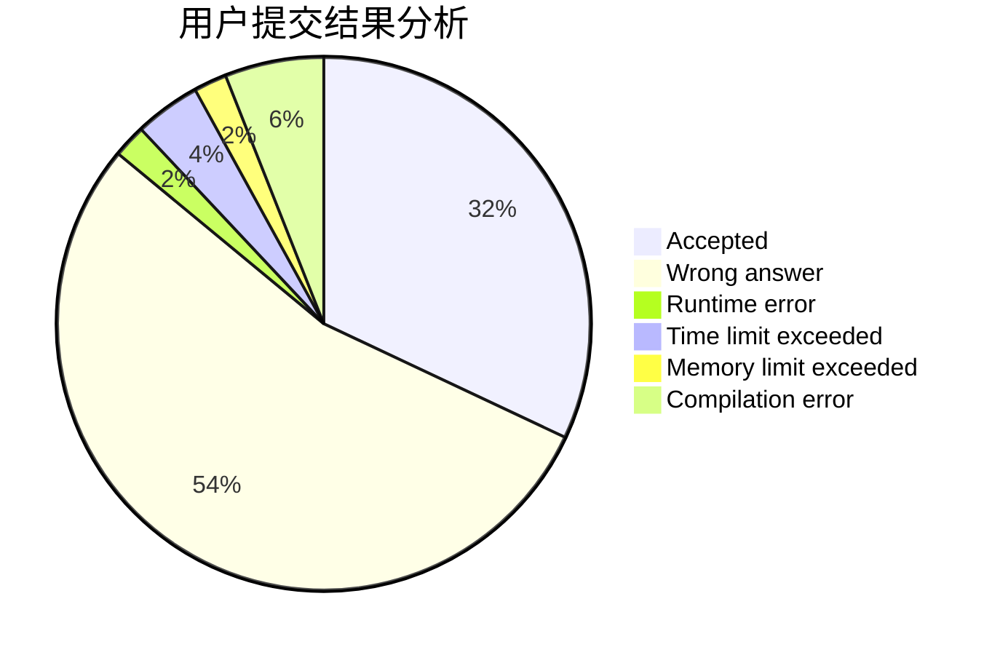
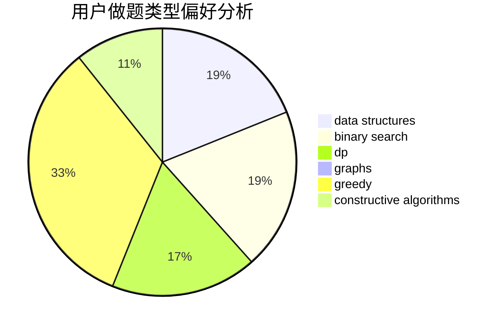

# Jacky_He
<!-- tabs:start -->
#### **用户提交结果分析**

#### **用户做题类型偏好分析**

#### **用户错题知识点分析**

<!-- tabs:end -->
# 推荐题目
[International Olympiad](http://codeforces.com/problemset/problem/662/D)		constructive algorithms,
                        greedy,
                        implementation,
                        math		  
[Jon Snow and his Favourite Number](http://codeforces.com/problemset/problem/768/C)		brute force,
                        dp,
                        implementation,
                        sortings		  
[Robot Vacuum Cleaner](http://codeforces.com/problemset/problem/922/D)		greedy,
                        sortings		  
[Rosetta Problem](http://codeforces.com/problemset/problem/656/D)		*special problem		  
[Ilya and Roads](http://codeforces.com/problemset/problem/313/D)		dp		  
[Analysis of Pathes in Functional Graph](http://codeforces.com/problemset/problem/702/E)		data structures,
                        graphs		  
[File List](http://codeforces.com/problemset/problem/174/B)		dp,
                        greedy,
                        implementation		  
[Birds](http://codeforces.com/problemset/problem/922/E)		dp		  
[Rock-Paper-Scissors Champion](http://codeforces.com/problemset/problem/1085/F)		nan		  
[Mishka and trip](http://codeforces.com/problemset/problem/703/B)		implementation,
                        math		  
<!-- tabs:start -->
#### **data structures**
[Analysis of Pathes in Functional Graph](http://codeforces.com/problemset/problem/702/E)		data structures,
                        graphs		  
[Multicolored Cars](http://codeforces.com/problemset/problem/818/D)		data structures,
                        implementation		  
[Forensic Examination](http://codeforces.com/problemset/problem/666/E)		data structures,
                        string suffix structures		  
[Present](http://codeforces.com/problemset/problem/460/C)		binary search,
                        data structures,
                        greedy		  
[High Cry](https://codeforces.com/contest/876/problem/F)		binary search,
                        bitmasks,
                        combinatorics,
                        data structures,
                        divide and conquer		  
[Bear and Blocks](http://codeforces.com/problemset/problem/573/B)		binary search,
                        data structures,
                        dp,
                        math		  
[Karen and Cards](http://codeforces.com/problemset/problem/815/D)		binary search,
                        combinatorics,
                        data structures,
                        geometry		  
[Developing Game](http://codeforces.com/problemset/problem/377/D)		data structures		  
[New Year and Old Subsequence](http://codeforces.com/problemset/problem/750/E)		data structures,
                        divide and conquer,
                        dp,
                        matrices		  
[Playlist](https://codeforces.com/contest/1483/problem/B)		data structures,
                        dsu,
                        implementation,
                        shortest paths		  
#### **binary search**
[Present](http://codeforces.com/problemset/problem/460/C)		binary search,
                        data structures,
                        greedy		  
[High Cry](https://codeforces.com/contest/876/problem/F)		binary search,
                        bitmasks,
                        combinatorics,
                        data structures,
                        divide and conquer		  
[Bear and Blocks](http://codeforces.com/problemset/problem/573/B)		binary search,
                        data structures,
                        dp,
                        math		  
[Stripe 2](http://codeforces.com/problemset/problem/21/C)		binary search,
                        dp,
                        sortings		  
[Karen and Cards](http://codeforces.com/problemset/problem/815/D)		binary search,
                        combinatorics,
                        data structures,
                        geometry		  
[Thoroughly Bureaucratic Organization](http://codeforces.com/problemset/problem/201/E)		binary search,
                        combinatorics		  
[Increase and Copy](http://codeforces.com/problemset/problem/1426/C)		binary search,
                        constructive algorithms,
                        math		  
[Frets On Fire](http://codeforces.com/problemset/problem/1119/D)		binary search,
                        sortings		  
[Treasure Hunting](http://codeforces.com/problemset/problem/1201/D)		binary search,
                        dp,
                        greedy,
                        implementation		  
[Pair of Topics](http://codeforces.com/problemset/problem/1324/D)		binary search,
                        data structures,
                        sortings,
                        two pointers		  
#### **dp**
[Jon Snow and his Favourite Number](http://codeforces.com/problemset/problem/768/C)		brute force,
                        dp,
                        implementation,
                        sortings		  
[Ilya and Roads](http://codeforces.com/problemset/problem/313/D)		dp		  
[File List](http://codeforces.com/problemset/problem/174/B)		dp,
                        greedy,
                        implementation		  
[Birds](http://codeforces.com/problemset/problem/922/E)		dp		  
[An overnight dance in discotheque](http://codeforces.com/problemset/problem/814/D)		dfs and similar,
                        dp,
                        geometry,
                        greedy,
                        trees		  
[Increase Sequence](http://codeforces.com/problemset/problem/466/D)		combinatorics,
                        dp		  
[Bear and Blocks](http://codeforces.com/problemset/problem/573/B)		binary search,
                        data structures,
                        dp,
                        math		  
[Stripe 2](http://codeforces.com/problemset/problem/21/C)		binary search,
                        dp,
                        sortings		  
[New Year and Old Subsequence](http://codeforces.com/problemset/problem/750/E)		data structures,
                        divide and conquer,
                        dp,
                        matrices		  
[Conference Problem](http://codeforces.com/problemset/problem/1250/D)		dp		  
#### **graph**
[Analysis of Pathes in Functional Graph](http://codeforces.com/problemset/problem/702/E)		data structures,
                        graphs		  
[Garland](http://codeforces.com/problemset/problem/767/C)		dfs and similar,
                        graphs,
                        greedy,
                        trees		  
[Paths and Trees](http://codeforces.com/problemset/problem/545/E)		graphs,
                        greedy,
                        shortest paths		  
[Matching vs  Independent Set](http://codeforces.com/problemset/problem/1198/C)		constructive algorithms,
                        graphs,
                        greedy,
                        sortings		  
[Cow and Snacks](http://codeforces.com/problemset/problem/1209/D)		dfs and similar,
                        dsu,
                        graphs		  
[Minimum Ties](http://codeforces.com/problemset/problem/1487/C)		brute force,
                        constructive algorithms,
                        dfs and similar,
                        graphs,
                        greedy,
                        implementation,
                        math		  
[Chef Monocarp](http://codeforces.com/problemset/problem/1437/C)		dp,
                        flows,
                        graph matchings,
                        greedy,
                        math,
                        sortings		  
[Strange Housing](http://codeforces.com/problemset/problem/1470/D)		constructive algorithms,
                        dfs and similar,
                        graph matchings,
                        graphs,
                        greedy		  
[Longest Simple Cycle](http://codeforces.com/problemset/problem/1476/C)		dp,
                        graphs,
                        greedy		  
[Shortest and Longest LIS](http://codeforces.com/problemset/problem/1304/D)		constructive algorithms,
                        graphs,
                        greedy,
                        two pointers		  
#### **trees**
[An overnight dance in discotheque](http://codeforces.com/problemset/problem/814/D)		dfs and similar,
                        dp,
                        geometry,
                        greedy,
                        trees		  
[Garland](http://codeforces.com/problemset/problem/767/C)		dfs and similar,
                        graphs,
                        greedy,
                        trees		  
[Odd Mineral Resource](http://codeforces.com/problemset/problem/1479/D)		binary search,
                        bitmasks,
                        brute force,
                        data structures,
                        probabilities,
                        trees		  
[Yet Another Card Deck](http://codeforces.com/problemset/problem/1511/C)		brute force,
                        data structures,
                        implementation,
                        trees		  
[Diameter Cuts](http://codeforces.com/problemset/problem/1499/F)		combinatorics,
                        dfs and similar,
                        dp,
                        trees		  
[Fib-tree](http://codeforces.com/problemset/problem/1491/E)		brute force,
                        dfs and similar,
                        divide and conquer,
                        number theory,
                        trees		  
[13th Labour of Heracles](http://codeforces.com/problemset/problem/1466/D)		data structures,
                        greedy,
                        sortings,
                        trees		  
[BFS Trees](http://codeforces.com/problemset/problem/1495/D)		combinatorics,
                        dfs and similar,
                        graphs,
                        math,
                        shortest paths,
                        trees		  
[Sum of Prefix Sums](http://codeforces.com/problemset/problem/1303/G)		data structures,
                        divide and conquer,
                        geometry,
                        trees		  
[Number of Simple Paths](http://codeforces.com/problemset/problem/1454/E)		combinatorics,
                        dfs and similar,
                        graphs,
                        trees		  
#### **divide and conquer**
[High Cry](https://codeforces.com/contest/876/problem/F)		binary search,
                        bitmasks,
                        combinatorics,
                        data structures,
                        divide and conquer		  
[New Year and Old Subsequence](http://codeforces.com/problemset/problem/750/E)		data structures,
                        divide and conquer,
                        dp,
                        matrices		  
[Divide and Summarize](http://codeforces.com/problemset/problem/1461/D)		binary search,
                        brute force,
                        data structures,
                        divide and conquer,
                        implementation,
                        sortings		  
[Song of the Sirens](http://codeforces.com/problemset/problem/1466/G)		combinatorics,
                        divide and conquer,
                        hashing,
                        math,
                        string suffix structures,
                        strings		  
[Permutation Transformation](http://codeforces.com/problemset/problem/1490/D)		dfs and similar,
                        divide and conquer,
                        implementation		  
[Skyline Photo](https://codeforces.com/contest/1483/problem/C)		data structures,
                        divide and conquer,
                        dp		  
[Fib-tree](http://codeforces.com/problemset/problem/1491/E)		brute force,
                        dfs and similar,
                        divide and conquer,
                        number theory,
                        trees		  
[Sum of Prefix Sums](http://codeforces.com/problemset/problem/1303/G)		data structures,
                        divide and conquer,
                        geometry,
                        trees		  
[Dogeforces](http://codeforces.com/problemset/problem/1494/D)		constructive algorithms,
                        data structures,
                        dfs and similar,
                        divide and conquer,
                        dsu,
                        greedy,
                        sortings,
                        trees		  
[Logistical Questions](http://codeforces.com/problemset/problem/566/C)		dfs and similar,
                        divide and conquer,
                        trees		  
#### **greedy**
[International Olympiad](http://codeforces.com/problemset/problem/662/D)		constructive algorithms,
                        greedy,
                        implementation,
                        math		  
[Robot Vacuum Cleaner](http://codeforces.com/problemset/problem/922/D)		greedy,
                        sortings		  
[File List](http://codeforces.com/problemset/problem/174/B)		dp,
                        greedy,
                        implementation		  
[An overnight dance in discotheque](http://codeforces.com/problemset/problem/814/D)		dfs and similar,
                        dp,
                        geometry,
                        greedy,
                        trees		  
[Minimum path](https://codeforces.com/contest/1072/problem/D)		greedy		  
[Palindrome Dance](http://codeforces.com/problemset/problem/1040/A)		greedy		  
[Present](http://codeforces.com/problemset/problem/460/C)		binary search,
                        data structures,
                        greedy		  
[Spring Cleaning](http://codeforces.com/problemset/problem/1346/C)		*special problem,
                        greedy,
                        sortings		  
[Garland](http://codeforces.com/problemset/problem/767/C)		dfs and similar,
                        graphs,
                        greedy,
                        trees		  
[Paths and Trees](http://codeforces.com/problemset/problem/545/E)		graphs,
                        greedy,
                        shortest paths		  
#### **constructive algorithms**
[International Olympiad](http://codeforces.com/problemset/problem/662/D)		constructive algorithms,
                        greedy,
                        implementation,
                        math		  
[Buy a Shovel](http://codeforces.com/problemset/problem/732/A)		brute force,
                        constructive algorithms,
                        implementation,
                        math		  
[Inverse of Rows and Columns](http://codeforces.com/problemset/problem/1157/G)		brute force,
                        constructive algorithms		  
[Increase and Copy](http://codeforces.com/problemset/problem/1426/C)		binary search,
                        constructive algorithms,
                        math		  
[Matching vs  Independent Set](http://codeforces.com/problemset/problem/1198/C)		constructive algorithms,
                        graphs,
                        greedy,
                        sortings		  
[Ternary Sequence](http://codeforces.com/problemset/problem/1401/B)		constructive algorithms,
                        greedy,
                        math		  
[Reverse Binary Strings](http://codeforces.com/problemset/problem/1437/B)		constructive algorithms,
                        greedy		  
[Anti-knapsack](http://codeforces.com/problemset/problem/1493/A)		constructive algorithms,
                        greedy		  
[Pairs](http://codeforces.com/problemset/problem/1463/D)		binary search,
                        constructive algorithms,
                        greedy,
                        two pointers		  
[XOR-gun](https://codeforces.com/contest/1456/problem/B)		bitmasks,
                        brute force,
                        constructive algorithms		  
#### **sortings**
[Jon Snow and his Favourite Number](http://codeforces.com/problemset/problem/768/C)		brute force,
                        dp,
                        implementation,
                        sortings		  
[Robot Vacuum Cleaner](http://codeforces.com/problemset/problem/922/D)		greedy,
                        sortings		  
[Stripe 2](http://codeforces.com/problemset/problem/21/C)		binary search,
                        dp,
                        sortings		  
[Spring Cleaning](http://codeforces.com/problemset/problem/1346/C)		*special problem,
                        greedy,
                        sortings		  
[Frets On Fire](http://codeforces.com/problemset/problem/1119/D)		binary search,
                        sortings		  
[Zero Remainder Array](http://codeforces.com/problemset/problem/1374/D)		math,
                        sortings,
                        two pointers		  
[Pair of Topics](http://codeforces.com/problemset/problem/1324/D)		binary search,
                        data structures,
                        sortings,
                        two pointers		  
[Matching vs  Independent Set](http://codeforces.com/problemset/problem/1198/C)		constructive algorithms,
                        graphs,
                        greedy,
                        sortings		  
[Lunar New Year and Number Division](http://codeforces.com/problemset/problem/1106/C)		greedy,
                        implementation,
                        math,
                        sortings		  
[Diamond Miner](https://codeforces.com/contest/1496/problem/C)		geometry,
                        greedy,
                        math,
                        sortings		  
<!-- tabs:end -->
