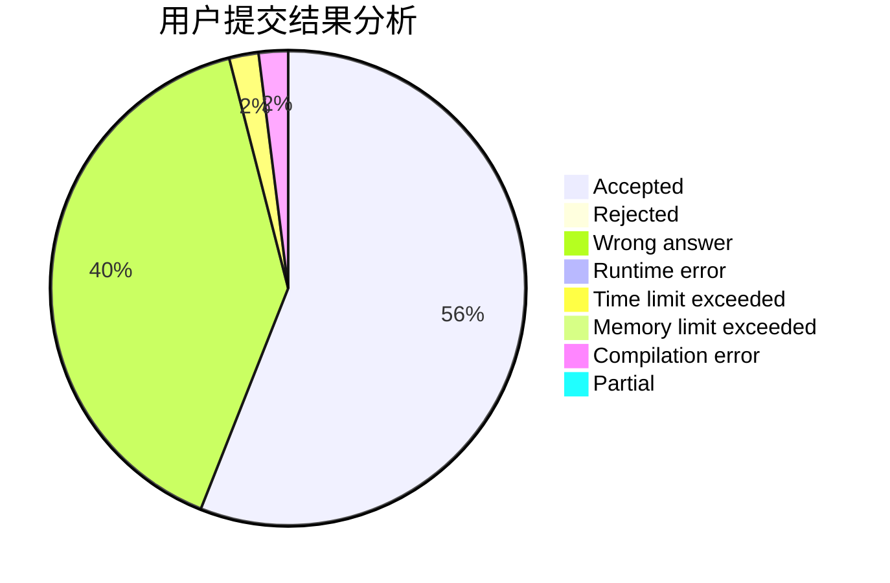
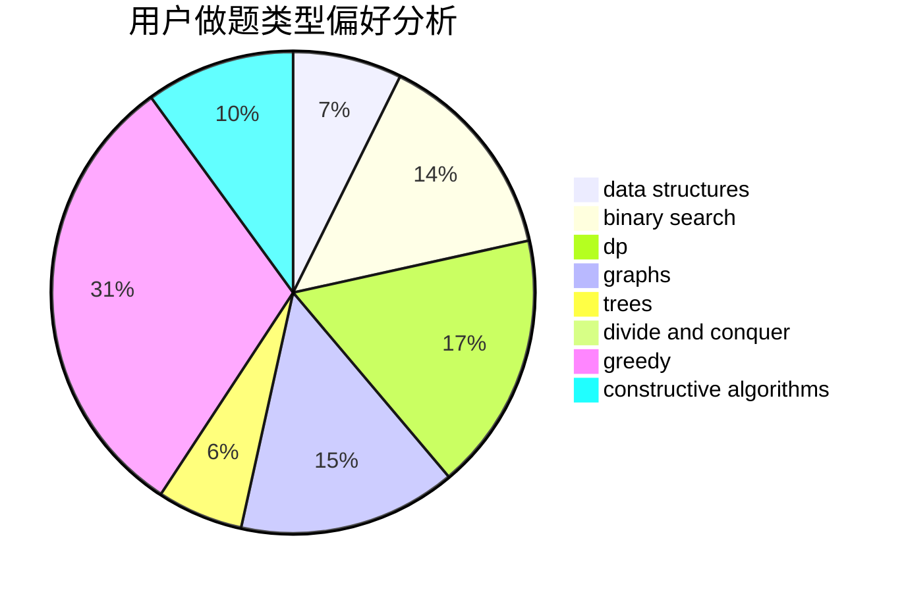
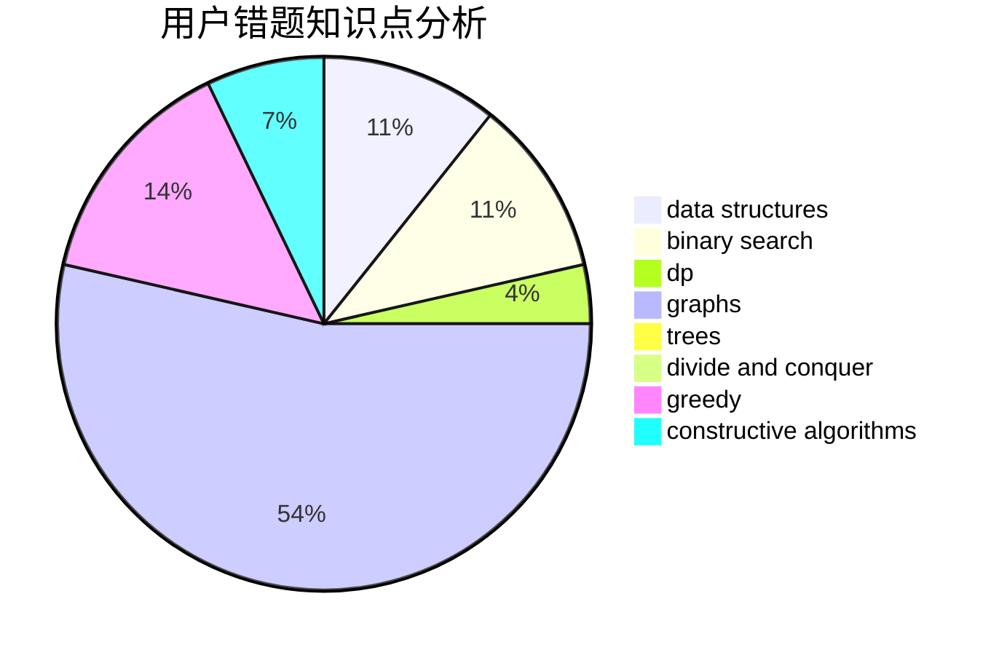

# Jame_Kuma

<!-- tabs:start -->

#### **用户提交结果分析**

#### **用户做题类型偏好分析**

#### **用户错题知识点分析**

<!-- tabs:end -->
# 推荐题目
[11411](https://codeforces.com/contest/1141/problem/1)		dsu,graphs,sortings,trees		  
[813F](https://codeforces.com/contest/813/problem/F)		data structures,
                        dsu,
                        graphs		  
[662D](https://codeforces.com/contest/662/problem/D)		constructive algorithms,
                        greedy,
                        implementation,
                        math		  
[760A](https://codeforces.com/contest/760/problem/A)		implementation,
                        math		  
[723A](https://codeforces.com/contest/723/problem/A)		implementation,
                        math,
                        sortings		  
[1046C](https://codeforces.com/contest/1046/problem/C)		greedy		  
[291B](https://codeforces.com/contest/291/problem/B)		*special problem,
                        implementation,
                        strings		  
[1210D](https://codeforces.com/contest/1210/problem/D)		graphs		  
[946F](https://codeforces.com/contest/946/problem/F)		combinatorics,
                        dp,
                        matrices		  
[438C](https://codeforces.com/contest/438/problem/C)		dsu,graphs,sortings,trees		  
