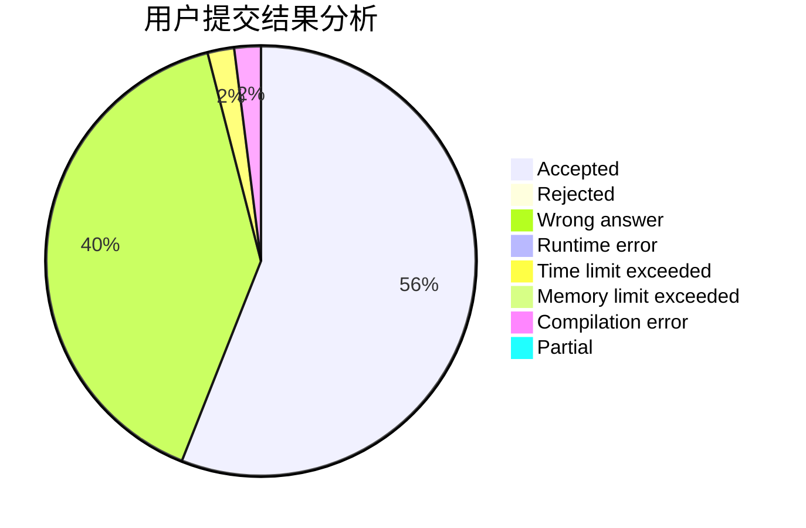
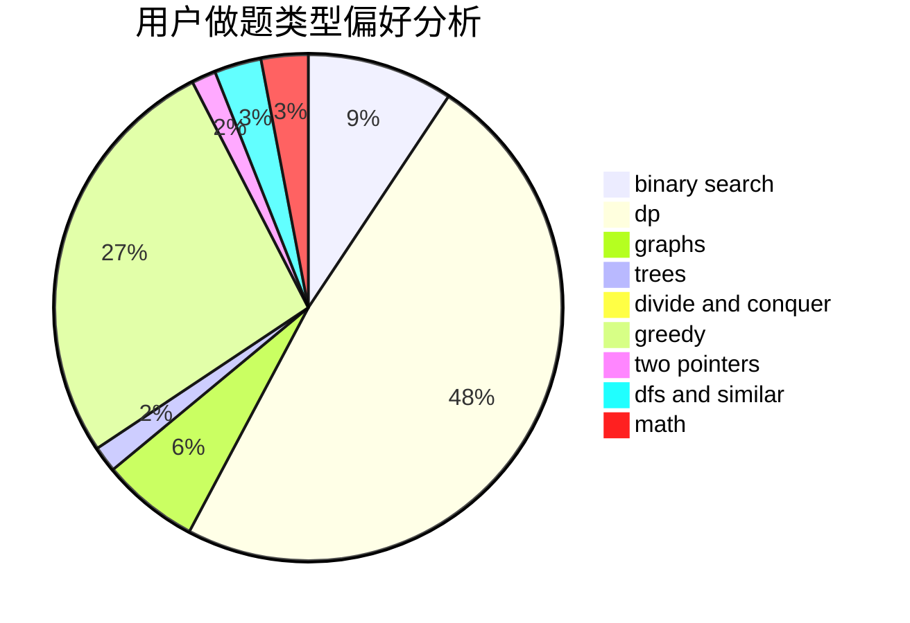

# Jame_Kuma

<!-- tabs:start -->

#### **用户提交结果分析**

#### **用户做题类型偏好分析**

<!-- tabs:end -->
# 推荐题目
[11411](https://codeforces.com/contest/1141/problem/1)
[813F](https://codeforces.com/contest/813/problem/F)
[662D](https://codeforces.com/contest/662/problem/D)
[760A](https://codeforces.com/contest/760/problem/A)
[723A](https://codeforces.com/contest/723/problem/A)
[1046C](https://codeforces.com/contest/1046/problem/C)
[291B](https://codeforces.com/contest/291/problem/B)
[1210D](https://codeforces.com/contest/1210/problem/D)
[946F](https://codeforces.com/contest/946/problem/F)
[438C](https://codeforces.com/contest/438/problem/C)
