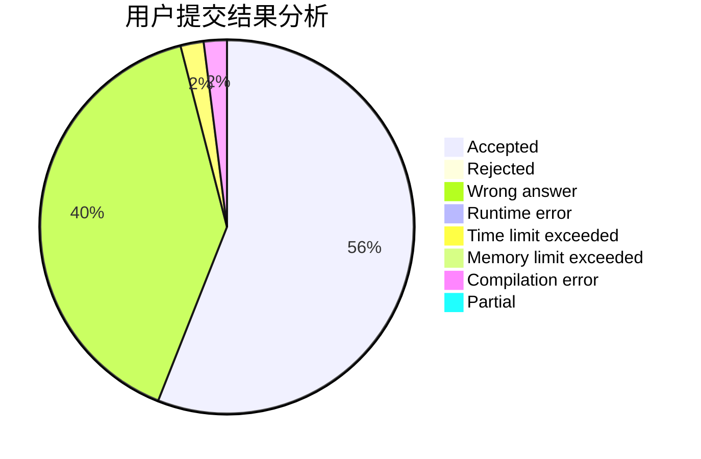
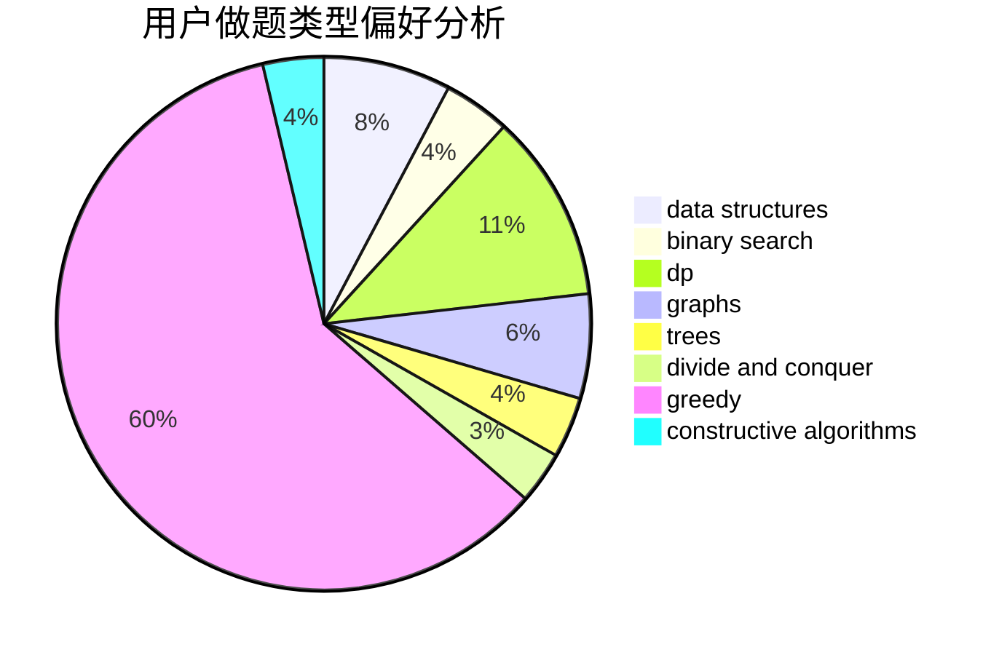
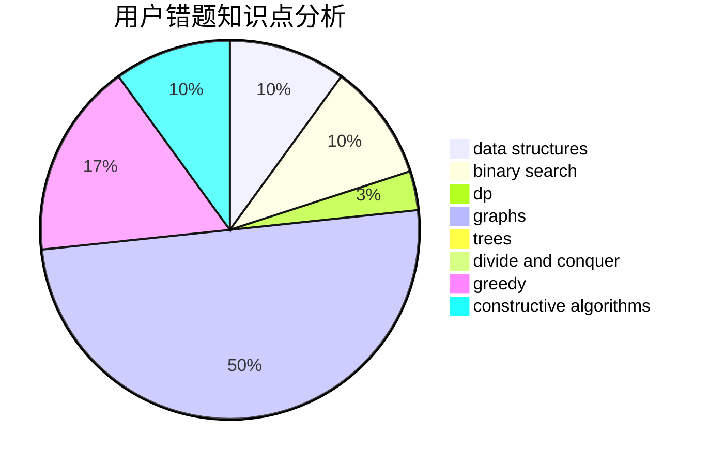

# Jame_Kuma
<!-- tabs:start -->
#### **用户提交结果分析**

#### **用户做题类型偏好分析**

#### **用户错题知识点分析**

<!-- tabs:end -->
# 推荐题目
[Steps to One](http://codeforces.com/problemset/problem/1139/D)		dp,
                        math,
                        number theory,
                        probabilities		  
[Gosha is hunting](http://codeforces.com/problemset/problem/739/E)		brute force,
                        data structures,
                        dp,
                        flows,
                        math,
                        probabilities,
                        sortings		  
[Beautiful fountains rows](http://codeforces.com/problemset/problem/799/F)		data structures		  
[Product Sum](http://codeforces.com/problemset/problem/631/E)		data structures,
                        dp,
                        geometry		  
[Restoring Increasing Sequence](http://codeforces.com/problemset/problem/490/E)		binary search,
                        brute force,
                        greedy,
                        implementation		  
[Computer Game](http://codeforces.com/problemset/problem/37/B)		greedy,
                        implementation		  
[Minimum path](https://codeforces.com/contest/1072/problem/D)		greedy		  
[Primal Sport](http://codeforces.com/problemset/problem/923/A)		math,
                        number theory		  
[Wrong Answer on test 233 (Hard Version)](http://codeforces.com/problemset/problem/1227/F2)		combinatorics,
                        math		  
[Giving Awards](http://codeforces.com/problemset/problem/412/D)		dfs and similar		  
<!-- tabs:start -->
#### **data structures**
[Steps to One](http://codeforces.com/problemset/problem/739/E)		brute force,
                        data structures,
                        dp,
                        flows,
                        math,
                        probabilities,
                        sortings		  
[Gosha is hunting](http://codeforces.com/problemset/problem/799/F)		data structures		  
[Beautiful fountains rows](http://codeforces.com/problemset/problem/631/E)		data structures,
                        dp,
                        geometry		  
[Product Sum](http://codeforces.com/problemset/problem/276/E)		data structures,
                        graphs,
                        trees		  
[Restoring Increasing Sequence](http://codeforces.com/problemset/problem/1163/B2)		data structures,
                        implementation		  
[Computer Game](https://codeforces.com/contest/1262/problem/D2)		data structures,
                        greedy		  
[Minimum path](http://codeforces.com/problemset/problem/1442/B)		combinatorics,
                        data structures,
                        dsu,
                        greedy,
                        implementation		  
[Primal Sport](http://codeforces.com/problemset/problem/549/F)		data structures,
                        divide and conquer		  
[Wrong Answer on test 233 (Hard Version)](http://codeforces.com/problemset/problem/1039/E)		data structures		  
[Giving Awards](http://codeforces.com/problemset/problem/1172/E)		data structures		  
#### **binary search**
[Steps to One](http://codeforces.com/problemset/problem/490/E)		binary search,
                        brute force,
                        greedy,
                        implementation		  
[Gosha is hunting](http://codeforces.com/problemset/problem/1468/L)		binary search,
                        greedy,
                        math,
                        number theory		  
[Beautiful fountains rows](http://codeforces.com/problemset/problem/847/E)		binary search,
                        dp		  
[Product Sum](http://codeforces.com/problemset/problem/1184/B1)		binary search,
                        sortings		  
[Restoring Increasing Sequence](http://codeforces.com/problemset/problem/371/C)		binary search,
                        brute force		  
[Computer Game](http://codeforces.com/problemset/problem/1492/C)		binary search,
                        data structures,
                        dp,
                        greedy,
                        two pointers		  
[Minimum path](http://codeforces.com/problemset/problem/1463/D)		binary search,
                        constructive algorithms,
                        greedy,
                        two pointers		  
[Primal Sport](http://codeforces.com/problemset/problem/1490/G)		binary search,
                        data structures,
                        math		  
[Wrong Answer on test 233 (Hard Version)](http://codeforces.com/problemset/problem/1479/D)		binary search,
                        bitmasks,
                        brute force,
                        data structures,
                        probabilities,
                        trees		  
[Giving Awards](http://codeforces.com/problemset/problem/1436/E)		binary search,
                        data structures,
                        two pointers		  
#### **dp**
[Steps to One](http://codeforces.com/problemset/problem/1139/D)		dp,
                        math,
                        number theory,
                        probabilities		  
[Gosha is hunting](http://codeforces.com/problemset/problem/739/E)		brute force,
                        data structures,
                        dp,
                        flows,
                        math,
                        probabilities,
                        sortings		  
[Beautiful fountains rows](http://codeforces.com/problemset/problem/631/E)		data structures,
                        dp,
                        geometry		  
[Product Sum](http://codeforces.com/problemset/problem/671/A)		dp,
                        geometry,
                        greedy,
                        implementation		  
[Restoring Increasing Sequence](http://codeforces.com/problemset/problem/703/E)		dp,
                        number theory		  
[Computer Game](http://codeforces.com/problemset/problem/1266/H)		dp,
                        graphs,
                        math,
                        matrices,
                        meet-in-the-middle		  
[Minimum path](http://codeforces.com/problemset/problem/847/E)		binary search,
                        dp		  
[Primal Sport](http://codeforces.com/problemset/problem/1187/E)		dfs and similar,
                        dp,
                        trees		  
[Wrong Answer on test 233 (Hard Version)](http://codeforces.com/problemset/problem/261/E)		brute force,
                        dp,
                        two pointers		  
[Giving Awards](http://codeforces.com/problemset/problem/255/C)		brute force,
                        dp		  
#### **graph**
[Steps to One](http://codeforces.com/problemset/problem/276/E)		data structures,
                        graphs,
                        trees		  
[Gosha is hunting](http://codeforces.com/problemset/problem/1266/H)		dp,
                        graphs,
                        math,
                        matrices,
                        meet-in-the-middle		  
[Beautiful fountains rows](http://codeforces.com/problemset/problem/1365/D)		constructive algorithms,
                        dfs and similar,
                        dsu,
                        graphs,
                        greedy,
                        implementation,
                        shortest paths		  
[Product Sum](http://codeforces.com/problemset/problem/1334/D)		constructive algorithms,
                        graphs,
                        greedy,
                        implementation		  
[Restoring Increasing Sequence](http://codeforces.com/problemset/problem/1475/C)		combinatorics,
                        graphs,
                        math		  
[Computer Game](http://codeforces.com/problemset/problem/601/A)		graphs,
                        shortest paths		  
[Minimum path](http://codeforces.com/problemset/problem/1327/B)		brute force,
                        graphs,
                        greedy		  
[Primal Sport](http://codeforces.com/problemset/problem/1394/B)		brute force,
                        dfs and similar,
                        graphs,
                        hashing		  
[Wrong Answer on test 233 (Hard Version)](http://codeforces.com/problemset/problem/1495/C)		constructive algorithms,
                        graphs		  
[Giving Awards](http://codeforces.com/problemset/problem/1487/C)		brute force,
                        constructive algorithms,
                        dfs and similar,
                        graphs,
                        greedy,
                        implementation,
                        math		  
#### **trees**
[Steps to One](http://codeforces.com/problemset/problem/276/E)		data structures,
                        graphs,
                        trees		  
[Gosha is hunting](http://codeforces.com/problemset/problem/1187/E)		dfs and similar,
                        dp,
                        trees		  
[Beautiful fountains rows](http://codeforces.com/problemset/problem/1479/D)		binary search,
                        bitmasks,
                        brute force,
                        data structures,
                        probabilities,
                        trees		  
[Product Sum](http://codeforces.com/problemset/problem/1511/C)		brute force,
                        data structures,
                        implementation,
                        trees		  
[Restoring Increasing Sequence](http://codeforces.com/problemset/problem/1499/F)		combinatorics,
                        dfs and similar,
                        dp,
                        trees		  
[Computer Game](http://codeforces.com/problemset/problem/1491/E)		brute force,
                        dfs and similar,
                        divide and conquer,
                        number theory,
                        trees		  
[Minimum path](http://codeforces.com/problemset/problem/1466/D)		data structures,
                        greedy,
                        sortings,
                        trees		  
[Primal Sport](http://codeforces.com/problemset/problem/1495/D)		combinatorics,
                        dfs and similar,
                        graphs,
                        math,
                        shortest paths,
                        trees		  
[Wrong Answer on test 233 (Hard Version)](http://codeforces.com/problemset/problem/1303/G)		data structures,
                        divide and conquer,
                        geometry,
                        trees		  
[Giving Awards](http://codeforces.com/problemset/problem/1454/E)		combinatorics,
                        dfs and similar,
                        graphs,
                        trees		  
#### **divide and conquer**
[Steps to One](http://codeforces.com/problemset/problem/549/F)		data structures,
                        divide and conquer		  
[Gosha is hunting](http://codeforces.com/problemset/problem/1461/D)		binary search,
                        brute force,
                        data structures,
                        divide and conquer,
                        implementation,
                        sortings		  
[Beautiful fountains rows](http://codeforces.com/problemset/problem/1466/G)		combinatorics,
                        divide and conquer,
                        hashing,
                        math,
                        string suffix structures,
                        strings		  
[Product Sum](http://codeforces.com/problemset/problem/1490/D)		dfs and similar,
                        divide and conquer,
                        implementation		  
[Restoring Increasing Sequence](https://codeforces.com/contest/1483/problem/C)		data structures,
                        divide and conquer,
                        dp		  
[Computer Game](http://codeforces.com/problemset/problem/1491/E)		brute force,
                        dfs and similar,
                        divide and conquer,
                        number theory,
                        trees		  
[Minimum path](http://codeforces.com/problemset/problem/1303/G)		data structures,
                        divide and conquer,
                        geometry,
                        trees		  
[Primal Sport](http://codeforces.com/problemset/problem/1494/D)		constructive algorithms,
                        data structures,
                        dfs and similar,
                        divide and conquer,
                        dsu,
                        greedy,
                        sortings,
                        trees		  
[Wrong Answer on test 233 (Hard Version)](http://codeforces.com/problemset/problem/1482/E)		data structures,
                        divide and conquer,
                        dp		  
[Giving Awards](http://codeforces.com/problemset/problem/566/C)		dfs and similar,
                        divide and conquer,
                        trees		  
#### **greedy**
[Steps to One](http://codeforces.com/problemset/problem/490/E)		binary search,
                        brute force,
                        greedy,
                        implementation		  
[Gosha is hunting](http://codeforces.com/problemset/problem/37/B)		greedy,
                        implementation		  
[Beautiful fountains rows](https://codeforces.com/contest/1072/problem/D)		greedy		  
[Product Sum](http://codeforces.com/problemset/problem/671/A)		dp,
                        geometry,
                        greedy,
                        implementation		  
[Restoring Increasing Sequence](http://codeforces.com/problemset/problem/1183/G)		greedy,
                        implementation,
                        sortings		  
[Computer Game](http://codeforces.com/problemset/problem/1468/L)		binary search,
                        greedy,
                        math,
                        number theory		  
[Minimum path](http://codeforces.com/problemset/problem/870/B)		greedy		  
[Primal Sport](https://codeforces.com/contest/1262/problem/D2)		data structures,
                        greedy		  
[Wrong Answer on test 233 (Hard Version)](http://codeforces.com/problemset/problem/1442/B)		combinatorics,
                        data structures,
                        dsu,
                        greedy,
                        implementation		  
[Giving Awards](http://codeforces.com/problemset/problem/1365/D)		constructive algorithms,
                        dfs and similar,
                        dsu,
                        graphs,
                        greedy,
                        implementation,
                        shortest paths		  
#### **constructive algorithms**
[Steps to One](http://codeforces.com/problemset/problem/622/D)		constructive algorithms		  
[Gosha is hunting](http://codeforces.com/problemset/problem/1365/D)		constructive algorithms,
                        dfs and similar,
                        dsu,
                        graphs,
                        greedy,
                        implementation,
                        shortest paths		  
[Beautiful fountains rows](http://codeforces.com/problemset/problem/1334/D)		constructive algorithms,
                        graphs,
                        greedy,
                        implementation		  
[Product Sum](http://codeforces.com/problemset/problem/1513/A)		constructive algorithms,
                        implementation		  
[Restoring Increasing Sequence](http://codeforces.com/problemset/problem/1495/C)		constructive algorithms,
                        graphs		  
[Computer Game](https://codeforces.com/contest/1206/problem/C)		constructive algorithms,
                        greedy,
                        math		  
[Minimum path](http://codeforces.com/problemset/problem/1493/A)		constructive algorithms,
                        greedy		  
[Primal Sport](http://codeforces.com/problemset/problem/1463/D)		binary search,
                        constructive algorithms,
                        greedy,
                        two pointers		  
[Wrong Answer on test 233 (Hard Version)](https://codeforces.com/contest/1456/problem/B)		bitmasks,
                        brute force,
                        constructive algorithms		  
[Giving Awards](http://codeforces.com/problemset/problem/1492/D)		bitmasks,
                        constructive algorithms,
                        greedy,
                        math		  
#### **sortings**
[Steps to One](http://codeforces.com/problemset/problem/739/E)		brute force,
                        data structures,
                        dp,
                        flows,
                        math,
                        probabilities,
                        sortings		  
[Gosha is hunting](http://codeforces.com/problemset/problem/1183/G)		greedy,
                        implementation,
                        sortings		  
[Beautiful fountains rows](http://codeforces.com/problemset/problem/1184/B1)		binary search,
                        sortings		  
[Product Sum](https://codeforces.com/contest/1496/problem/C)		geometry,
                        greedy,
                        math,
                        sortings		  
[Restoring Increasing Sequence](http://codeforces.com/problemset/problem/1495/A)		geometry,
                        greedy,
                        math,
                        sortings		  
[Computer Game](http://codeforces.com/problemset/problem/1497/A)		brute force,
                        data structures,
                        greedy,
                        sortings		  
[Minimum path](http://codeforces.com/problemset/problem/1427/A)		math,
                        sortings		  
[Primal Sport](http://codeforces.com/problemset/problem/1461/D)		binary search,
                        brute force,
                        data structures,
                        divide and conquer,
                        implementation,
                        sortings		  
[Wrong Answer on test 233 (Hard Version)](http://codeforces.com/problemset/problem/1437/C)		dp,
                        flows,
                        graph matchings,
                        greedy,
                        math,
                        sortings		  
[Giving Awards](http://codeforces.com/problemset/problem/1473/A)		greedy,
                        implementation,
                        math,
                        sortings		  
<!-- tabs:end -->
