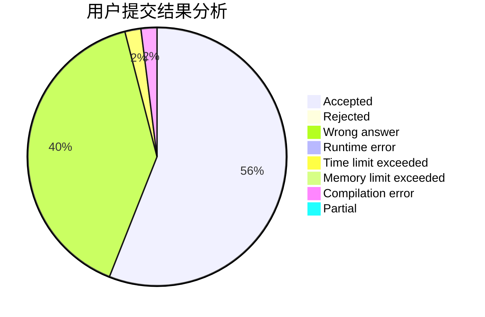
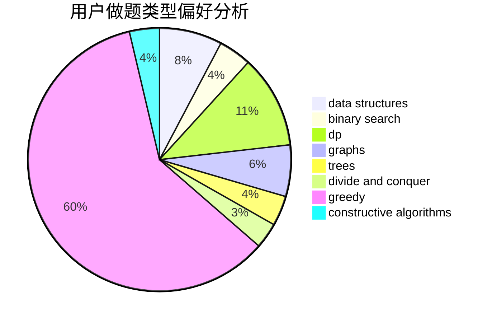
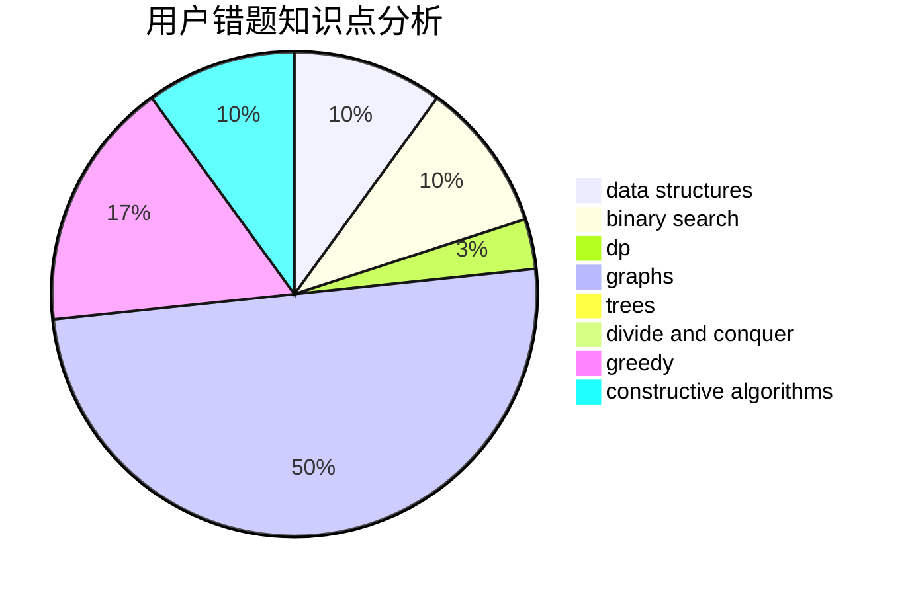

# Jame_Kuma

<!-- tabs:start -->

#### **用户提交结果分析**

#### **用户做题类型偏好分析**

#### **用户错题知识点分析**

<!-- tabs:end -->
# 推荐题目
[1139D](https://codeforces.com/contest/1139/problem/D)		dp,
                        math,
                        number theory,
                        probabilities		  
[799F](https://codeforces.com/contest/799/problem/F)		data structures		  
[631E](https://codeforces.com/contest/631/problem/E)		data structures,
                        dp,
                        geometry		  
[739E](https://codeforces.com/contest/739/problem/E)		brute force,
                        data structures,
                        dp,
                        flows,
                        math,
                        probabilities,
                        sortings		  
[703E](https://codeforces.com/contest/703/problem/E)		dp,
                        number theory		  
[1045H](https://codeforces.com/contest/1045/problem/H)		math		  
[276E](https://codeforces.com/contest/276/problem/E)		data structures,
                        graphs,
                        trees		  
[1206C](https://codeforces.com/contest/1206/problem/C)		dsu,graphs,sortings,trees		  
[923A](https://codeforces.com/contest/923/problem/A)		math,
                        number theory		  
[412D](https://codeforces.com/contest/412/problem/D)		dfs and similar		  
