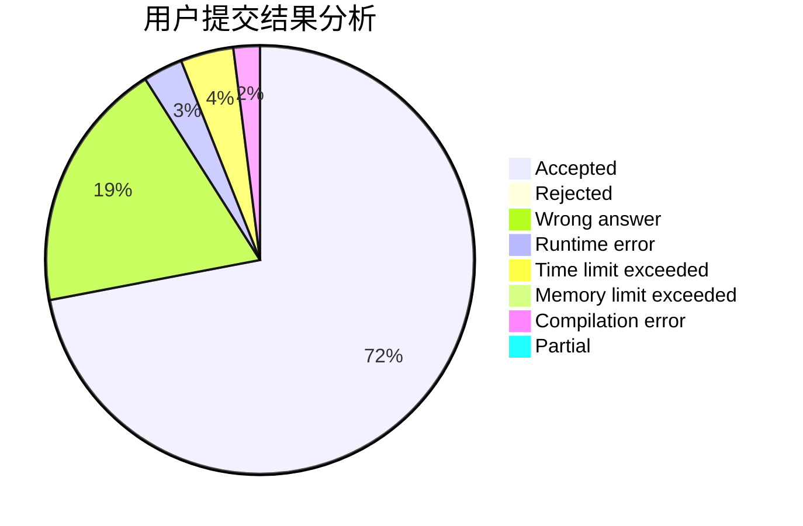
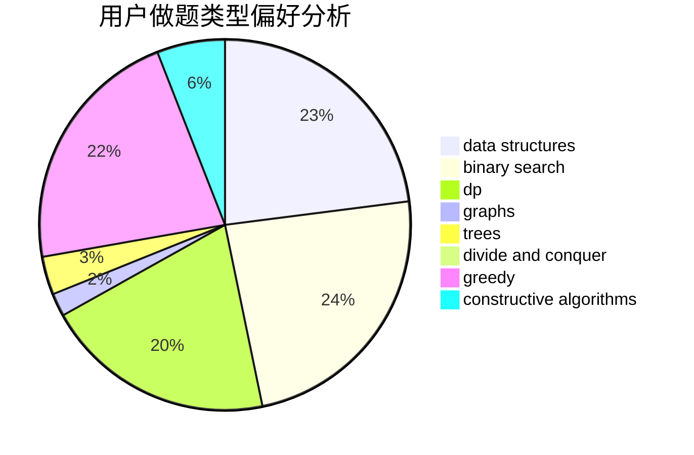
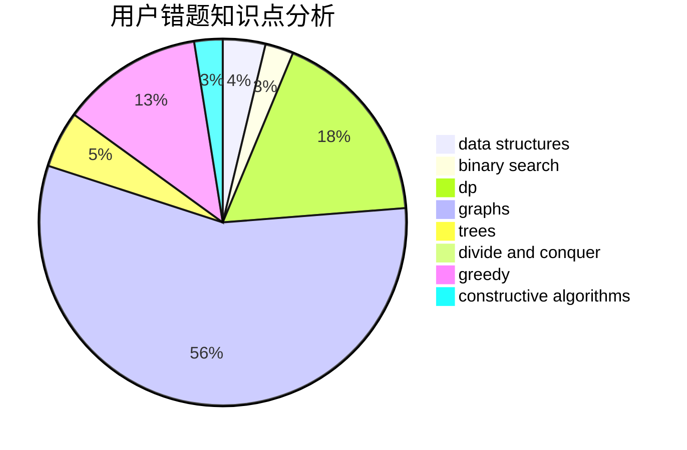

# JasonKouyl
<!-- tabs:start -->
#### **用户提交结果分析**

#### **用户做题类型偏好分析**

#### **用户错题知识点分析**

<!-- tabs:end -->
# 推荐题目
[Not Quick Transformation](http://codeforces.com/problemset/problem/117/D)		divide and conquer,
                        math		  
[Streets and Avenues in Berhattan](http://codeforces.com/problemset/problem/1070/J)		dp		  
[Dreamoon and Notepad](http://codeforces.com/problemset/problem/477/E)		data structures		  
[Neverending competitions](http://codeforces.com/problemset/problem/765/A)		implementation,
                        math		  
[Toy Train](https://codeforces.com/contest/1130/problem/D2)		brute force,
                        greedy		  
[Yui and Mahjong Set](http://codeforces.com/problemset/problem/1336/D)		constructive algorithms,
                        interactive		  
[Producing Snow](http://codeforces.com/problemset/problem/923/B)		binary search,
                        data structures		  
[Generate superposition of all basis states](http://codeforces.com/problemset/problem/1002/A1)		nan		  
[Perfect Security](http://codeforces.com/problemset/problem/923/C)		data structures,
                        greedy,
                        strings,
                        trees		  
[Playlist for Polycarp (hard version)](http://codeforces.com/problemset/problem/1185/G2)		combinatorics,
                        dp		  
<!-- tabs:start -->
#### **data structures**
[Not Quick Transformation](http://codeforces.com/problemset/problem/477/E)		data structures		  
[Streets and Avenues in Berhattan](http://codeforces.com/problemset/problem/923/B)		binary search,
                        data structures		  
[Dreamoon and Notepad](http://codeforces.com/problemset/problem/923/C)		data structures,
                        greedy,
                        strings,
                        trees		  
[Neverending competitions](http://codeforces.com/problemset/problem/1167/E)		binary search,
                        combinatorics,
                        data structures,
                        two pointers		  
[Toy Train](http://codeforces.com/problemset/problem/1379/D)		binary search,
                        brute force,
                        data structures,
                        sortings,
                        two pointers		  
[Yui and Mahjong Set](http://codeforces.com/problemset/problem/679/E)		data structures		  
[Producing Snow](http://codeforces.com/problemset/problem/1290/A)		brute force,
                        data structures,
                        implementation		  
[Generate superposition of all basis states](http://codeforces.com/problemset/problem/1492/C)		binary search,
                        data structures,
                        dp,
                        greedy,
                        two pointers		  
[Perfect Security](http://codeforces.com/problemset/problem/1490/G)		binary search,
                        data structures,
                        math		  
[Playlist for Polycarp (hard version)](http://codeforces.com/problemset/problem/1479/D)		binary search,
                        bitmasks,
                        brute force,
                        data structures,
                        probabilities,
                        trees		  
#### **binary search**
[Not Quick Transformation](http://codeforces.com/problemset/problem/923/B)		binary search,
                        data structures		  
[Streets and Avenues in Berhattan](http://codeforces.com/problemset/problem/1167/E)		binary search,
                        combinatorics,
                        data structures,
                        two pointers		  
[Dreamoon and Notepad](http://codeforces.com/problemset/problem/1379/D)		binary search,
                        brute force,
                        data structures,
                        sortings,
                        two pointers		  
[Neverending competitions](http://codeforces.com/problemset/problem/1492/C)		binary search,
                        data structures,
                        dp,
                        greedy,
                        two pointers		  
[Toy Train](http://codeforces.com/problemset/problem/1463/D)		binary search,
                        constructive algorithms,
                        greedy,
                        two pointers		  
[Yui and Mahjong Set](http://codeforces.com/problemset/problem/1490/G)		binary search,
                        data structures,
                        math		  
[Producing Snow](http://codeforces.com/problemset/problem/1479/D)		binary search,
                        bitmasks,
                        brute force,
                        data structures,
                        probabilities,
                        trees		  
[Generate superposition of all basis states](http://codeforces.com/problemset/problem/1436/E)		binary search,
                        data structures,
                        two pointers		  
[Perfect Security](http://codeforces.com/problemset/problem/1461/D)		binary search,
                        brute force,
                        data structures,
                        divide and conquer,
                        implementation,
                        sortings		  
[Playlist for Polycarp (hard version)](http://codeforces.com/problemset/problem/1493/C)		binary search,
                        brute force,
                        constructive algorithms,
                        greedy,
                        strings		  
#### **dp**
[Not Quick Transformation](http://codeforces.com/problemset/problem/1070/J)		dp		  
[Streets and Avenues in Berhattan](http://codeforces.com/problemset/problem/1185/G2)		combinatorics,
                        dp		  
[Dreamoon and Notepad](https://codeforces.com/contest/1113/problem/C)		dp,
                        implementation		  
[Neverending competitions](http://codeforces.com/problemset/problem/618/D)		dfs and similar,
                        dp,
                        graph matchings,
                        greedy,
                        trees		  
[Toy Train](http://codeforces.com/problemset/problem/1036/C)		combinatorics,
                        dp		  
[Yui and Mahjong Set](http://codeforces.com/problemset/problem/1154/F)		dp,
                        greedy,
                        sortings		  
[Producing Snow](http://codeforces.com/problemset/problem/1363/E)		dfs and similar,
                        dp,
                        greedy,
                        trees		  
[Generate superposition of all basis states](http://codeforces.com/problemset/problem/1492/C)		binary search,
                        data structures,
                        dp,
                        greedy,
                        two pointers		  
[Perfect Security](https://codeforces.com/contest/1457/problem/C)		brute force,
                        dp,
                        implementation		  
[Playlist for Polycarp (hard version)](http://codeforces.com/problemset/problem/1491/C)		brute force,
                        data structures,
                        dp,
                        greedy,
                        implementation		  
#### **graph**
[Not Quick Transformation](http://codeforces.com/problemset/problem/107/A)		dfs and similar,
                        graphs		  
[Streets and Avenues in Berhattan](http://codeforces.com/problemset/problem/618/D)		dfs and similar,
                        dp,
                        graph matchings,
                        greedy,
                        trees		  
[Dreamoon and Notepad](https://codeforces.com/contest/1382/problem/E)		constructive algorithms,
                        graph matchings,
                        greedy,
                        implementation,
                        sortings,
                        two pointers		  
[Neverending competitions](http://codeforces.com/problemset/problem/1487/C)		brute force,
                        constructive algorithms,
                        dfs and similar,
                        graphs,
                        greedy,
                        implementation,
                        math		  
[Toy Train](http://codeforces.com/problemset/problem/1437/C)		dp,
                        flows,
                        graph matchings,
                        greedy,
                        math,
                        sortings		  
[Yui and Mahjong Set](http://codeforces.com/problemset/problem/1470/D)		constructive algorithms,
                        dfs and similar,
                        graph matchings,
                        graphs,
                        greedy		  
[Producing Snow](http://codeforces.com/problemset/problem/1476/C)		dp,
                        graphs,
                        greedy		  
[Generate superposition of all basis states](http://codeforces.com/problemset/problem/1304/D)		constructive algorithms,
                        graphs,
                        greedy,
                        two pointers		  
[Perfect Security](http://codeforces.com/problemset/problem/1475/C)		combinatorics,
                        graphs,
                        math		  
[Playlist for Polycarp (hard version)](http://codeforces.com/problemset/problem/553/E)		dp,
                        fft,
                        graphs,
                        math,
                        probabilities		  
#### **trees**
[Not Quick Transformation](http://codeforces.com/problemset/problem/923/C)		data structures,
                        greedy,
                        strings,
                        trees		  
[Streets and Avenues in Berhattan](http://codeforces.com/problemset/problem/618/D)		dfs and similar,
                        dp,
                        graph matchings,
                        greedy,
                        trees		  
[Dreamoon and Notepad](http://codeforces.com/problemset/problem/573/C)		constructive algorithms,
                        dfs and similar,
                        trees		  
[Neverending competitions](http://codeforces.com/problemset/problem/1363/E)		dfs and similar,
                        dp,
                        greedy,
                        trees		  
[Toy Train](http://codeforces.com/problemset/problem/1479/D)		binary search,
                        bitmasks,
                        brute force,
                        data structures,
                        probabilities,
                        trees		  
[Yui and Mahjong Set](http://codeforces.com/problemset/problem/1511/C)		brute force,
                        data structures,
                        implementation,
                        trees		  
[Producing Snow](http://codeforces.com/problemset/problem/1499/F)		combinatorics,
                        dfs and similar,
                        dp,
                        trees		  
[Generate superposition of all basis states](http://codeforces.com/problemset/problem/1491/E)		brute force,
                        dfs and similar,
                        divide and conquer,
                        number theory,
                        trees		  
[Perfect Security](http://codeforces.com/problemset/problem/1466/D)		data structures,
                        greedy,
                        sortings,
                        trees		  
[Playlist for Polycarp (hard version)](http://codeforces.com/problemset/problem/1495/D)		combinatorics,
                        dfs and similar,
                        graphs,
                        math,
                        shortest paths,
                        trees		  
#### **divide and conquer**
[Not Quick Transformation](http://codeforces.com/problemset/problem/117/D)		divide and conquer,
                        math		  
[Streets and Avenues in Berhattan](http://codeforces.com/problemset/problem/1461/D)		binary search,
                        brute force,
                        data structures,
                        divide and conquer,
                        implementation,
                        sortings		  
[Dreamoon and Notepad](http://codeforces.com/problemset/problem/1466/G)		combinatorics,
                        divide and conquer,
                        hashing,
                        math,
                        string suffix structures,
                        strings		  
[Neverending competitions](http://codeforces.com/problemset/problem/1490/D)		dfs and similar,
                        divide and conquer,
                        implementation		  
[Toy Train](https://codeforces.com/contest/1483/problem/C)		data structures,
                        divide and conquer,
                        dp		  
[Yui and Mahjong Set](http://codeforces.com/problemset/problem/1491/E)		brute force,
                        dfs and similar,
                        divide and conquer,
                        number theory,
                        trees		  
[Producing Snow](http://codeforces.com/problemset/problem/1303/G)		data structures,
                        divide and conquer,
                        geometry,
                        trees		  
[Generate superposition of all basis states](http://codeforces.com/problemset/problem/1494/D)		constructive algorithms,
                        data structures,
                        dfs and similar,
                        divide and conquer,
                        dsu,
                        greedy,
                        sortings,
                        trees		  
[Perfect Security](http://codeforces.com/problemset/problem/1482/E)		data structures,
                        divide and conquer,
                        dp		  
[Playlist for Polycarp (hard version)](http://codeforces.com/problemset/problem/566/C)		dfs and similar,
                        divide and conquer,
                        trees		  
#### **greedy**
[Not Quick Transformation](https://codeforces.com/contest/1130/problem/D2)		brute force,
                        greedy		  
[Streets and Avenues in Berhattan](http://codeforces.com/problemset/problem/923/C)		data structures,
                        greedy,
                        strings,
                        trees		  
[Dreamoon and Notepad](http://codeforces.com/problemset/problem/618/D)		dfs and similar,
                        dp,
                        graph matchings,
                        greedy,
                        trees		  
[Neverending competitions](http://codeforces.com/problemset/problem/1004/B)		constructive algorithms,
                        greedy,
                        implementation,
                        math		  
[Toy Train](http://codeforces.com/problemset/problem/462/B)		greedy		  
[Yui and Mahjong Set](http://codeforces.com/problemset/problem/1154/F)		dp,
                        greedy,
                        sortings		  
[Producing Snow](https://codeforces.com/contest/1382/problem/E)		constructive algorithms,
                        graph matchings,
                        greedy,
                        implementation,
                        sortings,
                        two pointers		  
[Generate superposition of all basis states](https://codeforces.com/contest/1255/problem/D)		constructive algorithms,
                        greedy,
                        implementation		  
[Perfect Security](http://codeforces.com/problemset/problem/1363/E)		dfs and similar,
                        dp,
                        greedy,
                        trees		  
[Playlist for Polycarp (hard version)](http://codeforces.com/problemset/problem/1492/C)		binary search,
                        data structures,
                        dp,
                        greedy,
                        two pointers		  
#### **constructive algorithms**
[Not Quick Transformation](http://codeforces.com/problemset/problem/1336/D)		constructive algorithms,
                        interactive		  
[Streets and Avenues in Berhattan](http://codeforces.com/problemset/problem/1004/B)		constructive algorithms,
                        greedy,
                        implementation,
                        math		  
[Dreamoon and Notepad](https://codeforces.com/contest/1382/problem/E)		constructive algorithms,
                        graph matchings,
                        greedy,
                        implementation,
                        sortings,
                        two pointers		  
[Neverending competitions](https://codeforces.com/contest/1504/problem/D)		constructive algorithms,
                        games,
                        interactive		  
[Toy Train](http://codeforces.com/problemset/problem/1513/E)		combinatorics,
                        constructive algorithms,
                        math,
                        sortings		  
[Yui and Mahjong Set](http://codeforces.com/problemset/problem/1316/B)		brute force,
                        constructive algorithms,
                        implementation,
                        sortings,
                        strings		  
[Producing Snow](http://codeforces.com/problemset/problem/573/C)		constructive algorithms,
                        dfs and similar,
                        trees		  
[Generate superposition of all basis states](http://codeforces.com/problemset/problem/1366/D)		constructive algorithms,
                        math,
                        number theory		  
[Perfect Security](https://codeforces.com/contest/1255/problem/D)		constructive algorithms,
                        greedy,
                        implementation		  
[Playlist for Polycarp (hard version)](http://codeforces.com/problemset/problem/1493/A)		constructive algorithms,
                        greedy		  
#### **sortings**
[Not Quick Transformation](http://codeforces.com/problemset/problem/1379/D)		binary search,
                        brute force,
                        data structures,
                        sortings,
                        two pointers		  
[Streets and Avenues in Berhattan](http://codeforces.com/problemset/problem/1154/F)		dp,
                        greedy,
                        sortings		  
[Dreamoon and Notepad](https://codeforces.com/contest/1382/problem/E)		constructive algorithms,
                        graph matchings,
                        greedy,
                        implementation,
                        sortings,
                        two pointers		  
[Neverending competitions](http://codeforces.com/problemset/problem/1513/E)		combinatorics,
                        constructive algorithms,
                        math,
                        sortings		  
[Toy Train](http://codeforces.com/problemset/problem/1316/B)		brute force,
                        constructive algorithms,
                        implementation,
                        sortings,
                        strings		  
[Yui and Mahjong Set](https://codeforces.com/contest/1496/problem/C)		geometry,
                        greedy,
                        math,
                        sortings		  
[Producing Snow](http://codeforces.com/problemset/problem/1495/A)		geometry,
                        greedy,
                        math,
                        sortings		  
[Generate superposition of all basis states](http://codeforces.com/problemset/problem/1497/A)		brute force,
                        data structures,
                        greedy,
                        sortings		  
[Perfect Security](http://codeforces.com/problemset/problem/1427/A)		math,
                        sortings		  
[Playlist for Polycarp (hard version)](http://codeforces.com/problemset/problem/1461/D)		binary search,
                        brute force,
                        data structures,
                        divide and conquer,
                        implementation,
                        sortings		  
<!-- tabs:end -->
