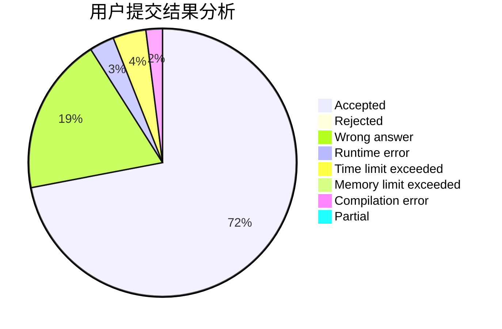
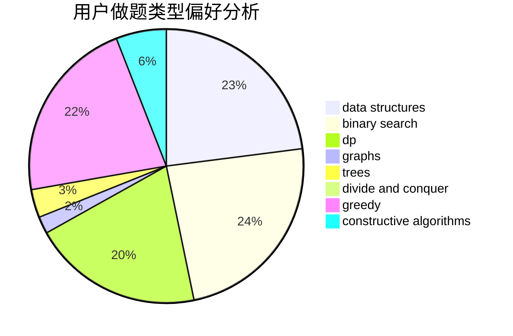
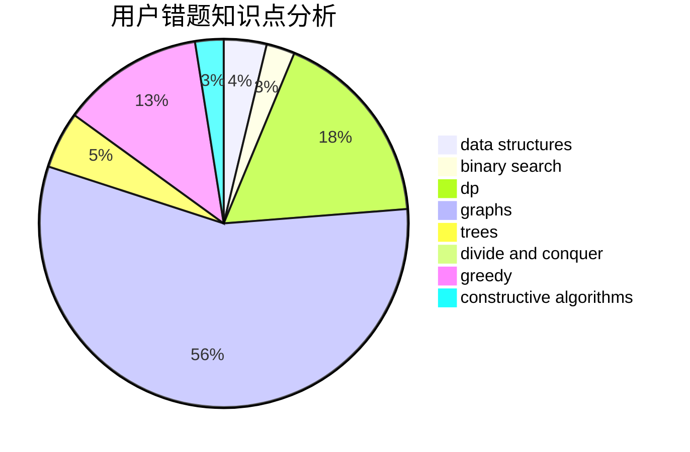

# JasonKouyl

<!-- tabs:start -->

#### **用户提交结果分析**

#### **用户做题类型偏好分析**

#### **用户错题知识点分析**

<!-- tabs:end -->
# 推荐题目
[923B](https://codeforces.com/contest/923/problem/B)		binary search,
                        data structures		  
[1154F](https://codeforces.com/contest/1154/problem/F)		dp,
                        greedy,
                        sortings		  
[818A](https://codeforces.com/contest/818/problem/A)		implementation,
                        math		  
[679E](https://codeforces.com/contest/679/problem/E)		data structures		  
[1070J](https://codeforces.com/contest/1070/problem/J)		dp		  
[765A](https://codeforces.com/contest/765/problem/A)		implementation,
                        math		  
[1510E](https://codeforces.com/contest/1510/problem/E)		nan		  
[618D](https://codeforces.com/contest/618/problem/D)		dfs and similar,
                        dp,
                        graph matchings,
                        greedy,
                        trees		  
[1130D2](https://codeforces.com/contest/1130D/problem/2)		dsu,graphs,sortings,trees		  
[1513E](https://codeforces.com/contest/1513/problem/E)		combinatorics,
                        constructive algorithms,
                        math,
                        sortings		  
