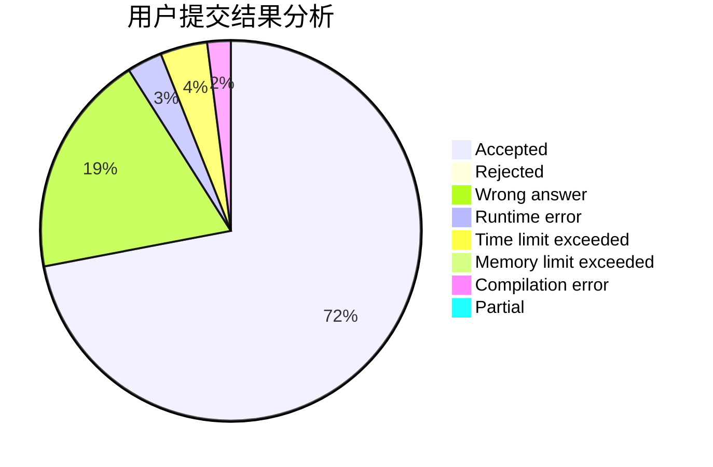
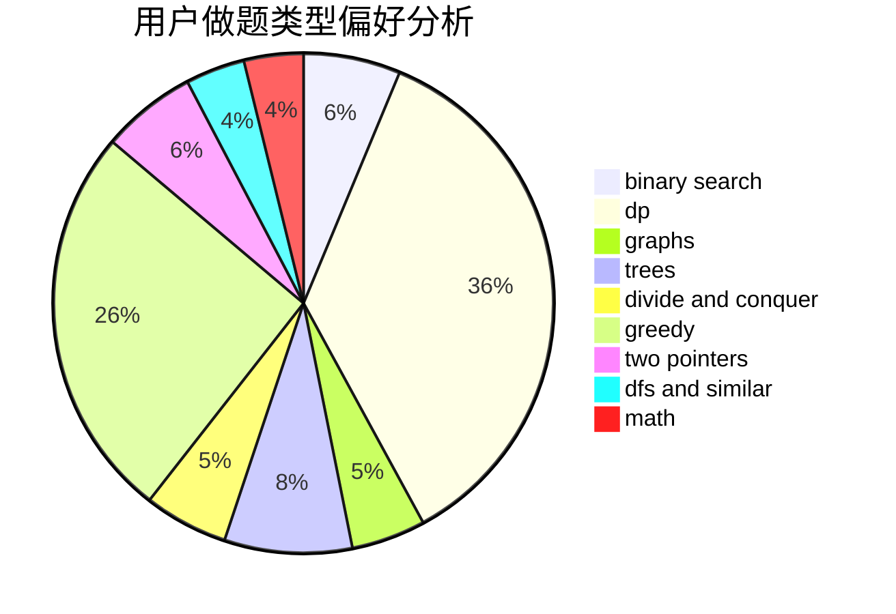

# JasonKouyl

<!-- tabs:start -->

#### **用户提交结果分析**

#### **用户做题类型偏好分析**

<!-- tabs:end -->
# 推荐题目
[946G](https://codeforces.com/contest/946/problem/G)
[1156F](https://codeforces.com/contest/1156/problem/F)
[837G](https://codeforces.com/contest/837/problem/G)
[703C](https://codeforces.com/contest/703/problem/C)
[1070M](https://codeforces.com/contest/1070/problem/M)
[784D](https://codeforces.com/contest/784/problem/D)
[165A](https://codeforces.com/contest/165/problem/A)
[639B](https://codeforces.com/contest/639/problem/B)
[1132E](https://codeforces.com/contest/1132/problem/E)
[173E](https://codeforces.com/contest/173/problem/E)
