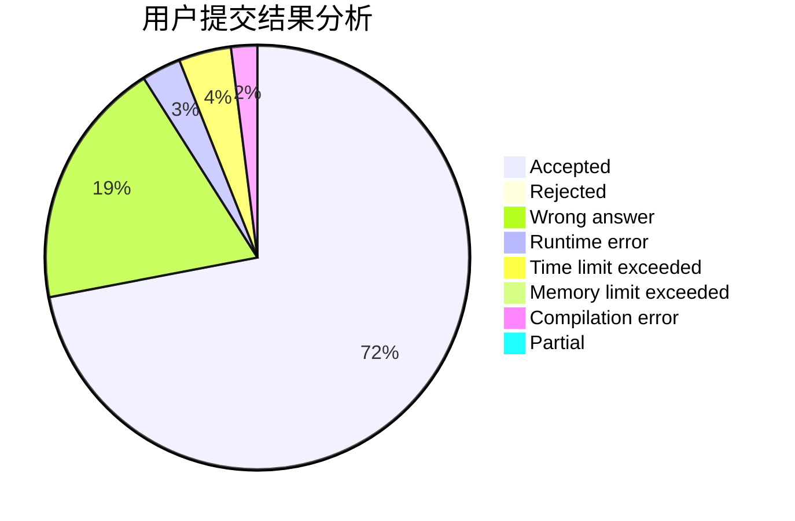
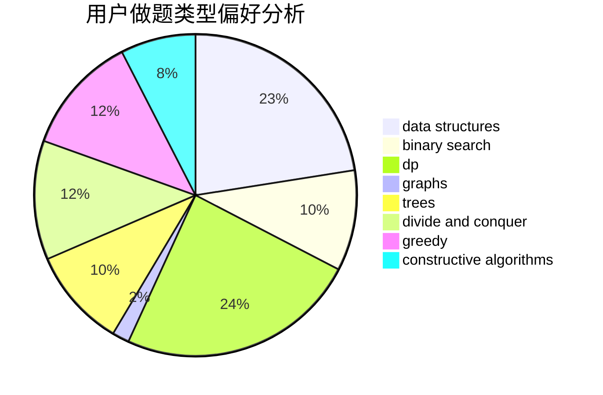
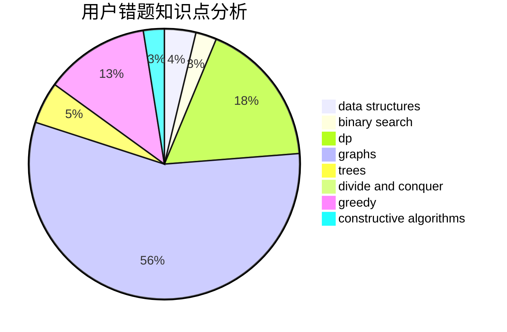

# JasonKouyl

<!-- tabs:start -->

#### **用户提交结果分析**

#### **用户做题类型偏好分析**

#### **用户错题知识点分析**

<!-- tabs:end -->
# 推荐题目
[946G](https://codeforces.com/contest/946/problem/G)		data structures,
                        dp		  
[1156F](https://codeforces.com/contest/1156/problem/F)		dp,
                        math,
                        probabilities		  
[837G](https://codeforces.com/contest/837/problem/G)		data structures		  
[703C](https://codeforces.com/contest/703/problem/C)		geometry,
                        implementation		  
[1070M](https://codeforces.com/contest/1070/problem/M)		constructive algorithms,
                        divide and conquer,
                        geometry		  
[784D](https://codeforces.com/contest/784/problem/D)		*special problem,
                        implementation		  
[165A](https://codeforces.com/contest/165/problem/A)		implementation		  
[639B](https://codeforces.com/contest/639/problem/B)		constructive algorithms,
                        graphs,
                        trees		  
[1132E](https://codeforces.com/contest/1132/problem/E)		dfs and similar,
                        dp,
                        greedy		  
[173E](https://codeforces.com/contest/173/problem/E)		data structures,
                        sortings		  
