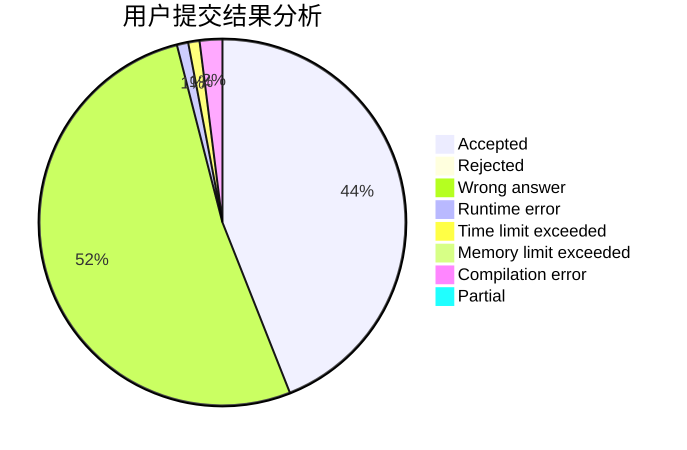
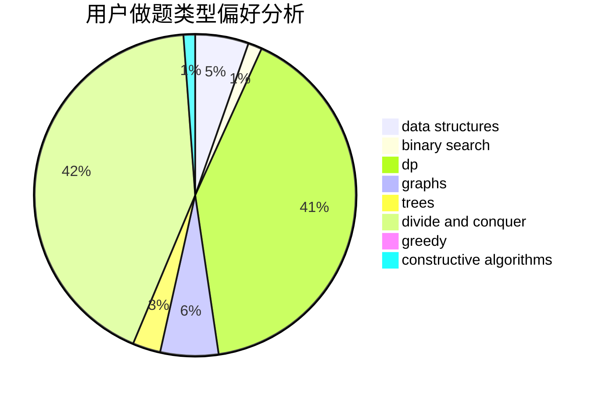

# JasonZhan

<!-- tabs:start -->

#### **用户提交结果分析**

#### **用户做题类型偏好分析**

#### **用户错题知识点分析**

<!-- tabs:end -->
# 推荐题目
[171H](https://codeforces.com/contest/171/problem/H)		*special problem,
                        implementation		  
[8E](https://codeforces.com/contest/8/problem/E)		dp,
                        graphs		  
[263A](https://codeforces.com/contest/263/problem/A)		implementation		  
[1148H](https://codeforces.com/contest/1148/problem/H)		data structures		  
[54A](https://codeforces.com/contest/54/problem/A)		implementation		  
[1149A](https://codeforces.com/contest/1149/problem/A)		constructive algorithms,
                        greedy,
                        math,
                        number theory		  
[1005E1](https://codeforces.com/contest/1005E/problem/1)		sortings		  
[306B](https://codeforces.com/contest/306/problem/B)		data structures,
                        greedy,
                        sortings		  
[923E](https://codeforces.com/contest/923/problem/E)		fft,
                        math,
                        matrices		  
[451D](https://codeforces.com/contest/451/problem/D)		math		  
