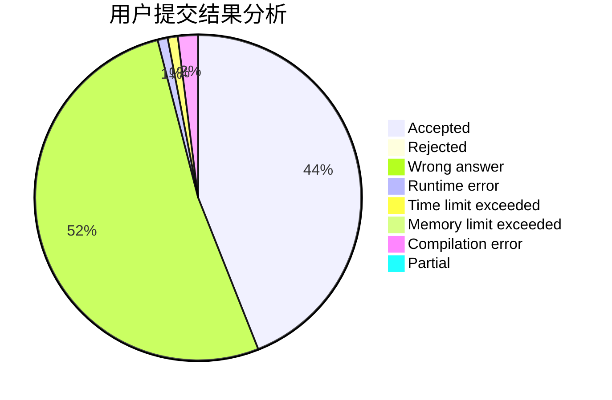
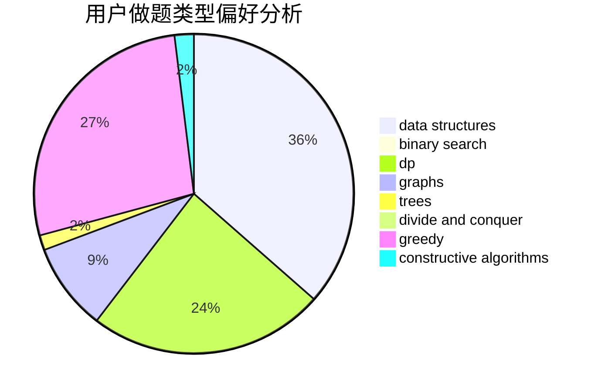
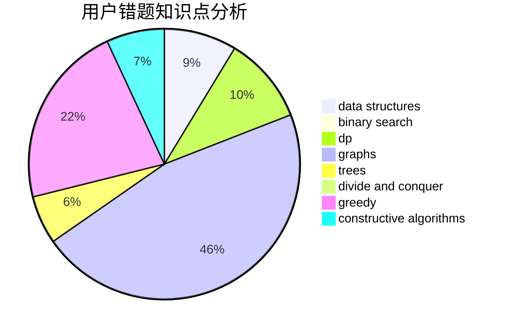

# JasonZhan

<!-- tabs:start -->

#### **用户提交结果分析**

#### **用户做题类型偏好分析**

#### **用户错题知识点分析**

<!-- tabs:end -->
# 推荐题目
[19A](https://codeforces.com/contest/19/problem/A)		implementation		  
[916C](https://codeforces.com/contest/916/problem/C)		constructive algorithms,
                        graphs,
                        shortest paths		  
[27D](https://codeforces.com/contest/27/problem/D)		2-sat,
                        dfs and similar,
                        dsu,
                        graphs		  
[1150C](https://codeforces.com/contest/1150/problem/C)		dsu,graphs,sortings,trees		  
[575A](https://codeforces.com/contest/575/problem/A)		data structures,
                        math,
                        matrices		  
[1150D](https://codeforces.com/contest/1150/problem/D)		dsu,graphs,sortings,trees		  
[1006A](https://codeforces.com/contest/1006/problem/A)		implementation		  
[327D](https://codeforces.com/contest/327/problem/D)		constructive algorithms,
                        dfs and similar,
                        graphs		  
[947C](https://codeforces.com/contest/947/problem/C)		dsu,graphs,sortings,trees		  
[472F](https://codeforces.com/contest/472/problem/F)		constructive algorithms,
                        math,
                        matrices		  
