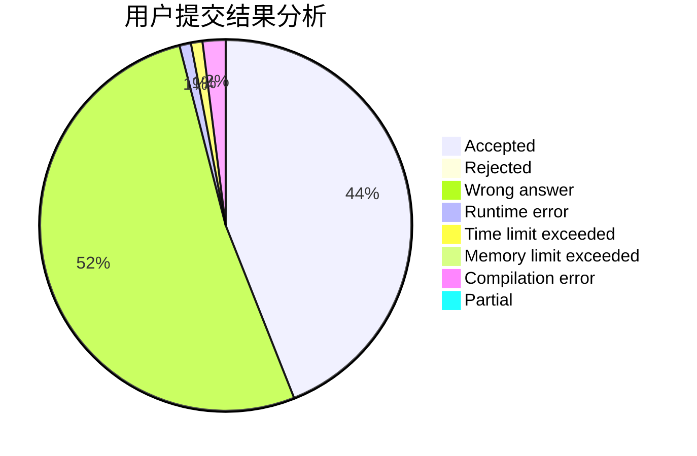
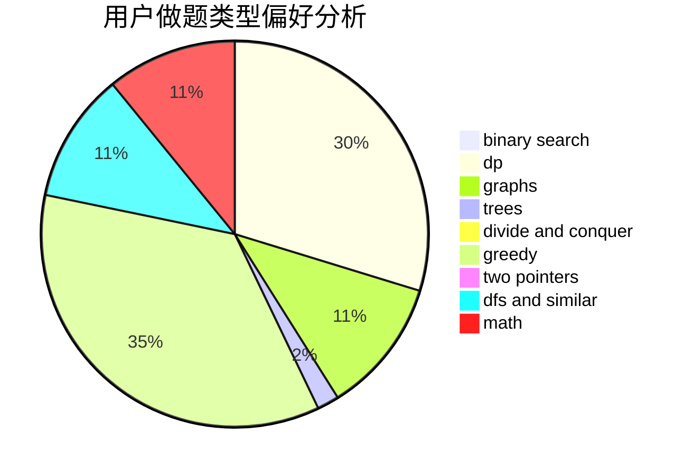

# JasonZhan

<!-- tabs:start -->

#### **用户提交结果分析**

#### **用户做题类型偏好分析**

<!-- tabs:end -->
# 推荐题目
[19A](https://codeforces.com/contest/19/problem/A)
[916C](https://codeforces.com/contest/916/problem/C)
[27D](https://codeforces.com/contest/27/problem/D)
[1150C](https://codeforces.com/contest/1150/problem/C)
[575A](https://codeforces.com/contest/575/problem/A)
[1150D](https://codeforces.com/contest/1150/problem/D)
[1006A](https://codeforces.com/contest/1006/problem/A)
[327D](https://codeforces.com/contest/327/problem/D)
[947C](https://codeforces.com/contest/947/problem/C)
[472F](https://codeforces.com/contest/472/problem/F)
