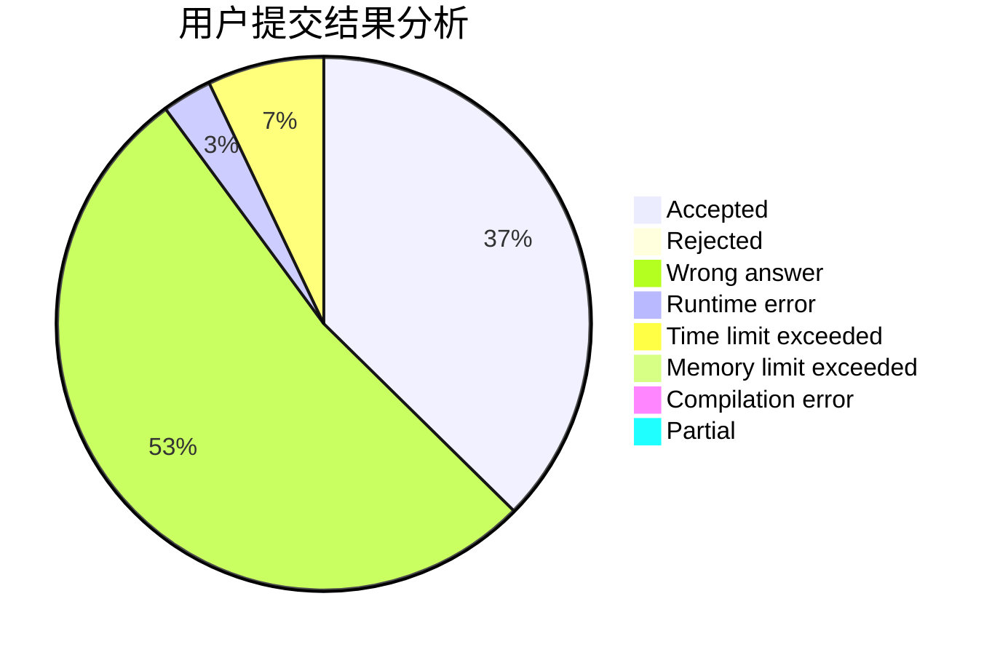
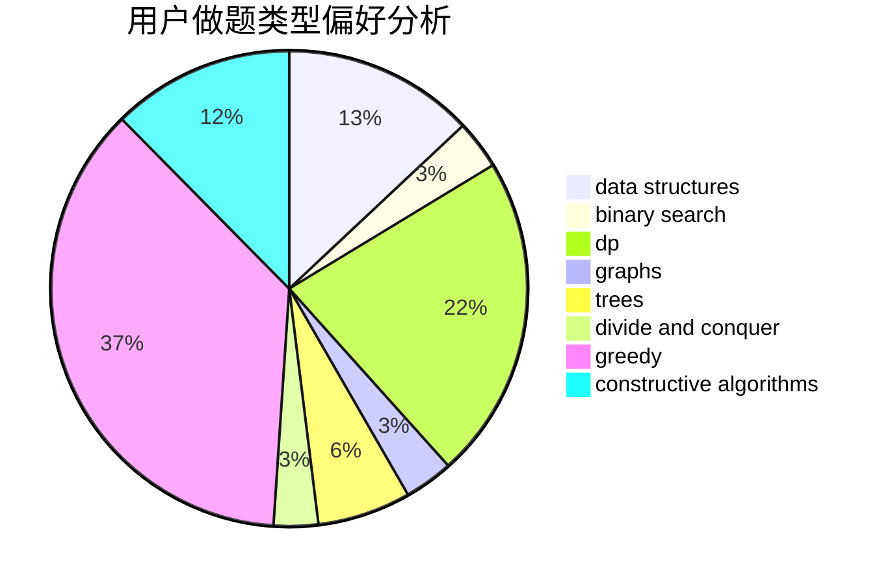

# Jay142753869

<!-- tabs:start -->

#### **用户提交结果分析**

#### **用户做题类型偏好分析**

#### **用户错题知识点分析**

<!-- tabs:end -->
# 推荐题目
[1437G](https://codeforces.com/contest/1437/problem/G)		data structures,
                        string suffix structures,
                        strings,
                        trees		  
[560E](https://codeforces.com/contest/560/problem/E)		dsu,graphs,sortings,trees		  
[828C](https://codeforces.com/contest/828/problem/C)		dsu,graphs,sortings,trees		  
[279A](https://codeforces.com/contest/279/problem/A)		brute force,
                        geometry,
                        implementation		  
[198B](https://codeforces.com/contest/198/problem/B)		shortest paths		  
[254A](https://codeforces.com/contest/254/problem/A)		constructive algorithms,
                        sortings		  
[1391D](https://codeforces.com/contest/1391/problem/D)		bitmasks,
                        brute force,
                        constructive algorithms,
                        dp,
                        greedy,
                        implementation		  
[1281B](https://codeforces.com/contest/1281/problem/B)		greedy		  
[34D](https://codeforces.com/contest/34/problem/D)		dfs and similar,
                        graphs		  
[411A](https://codeforces.com/contest/411/problem/A)		*special problem,
                        implementation		  
