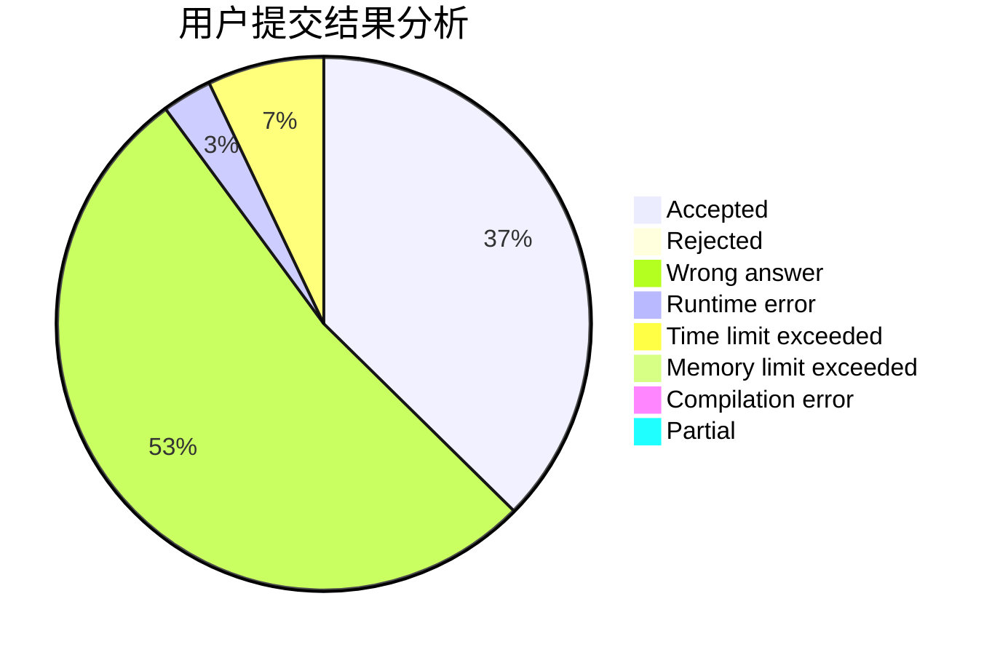
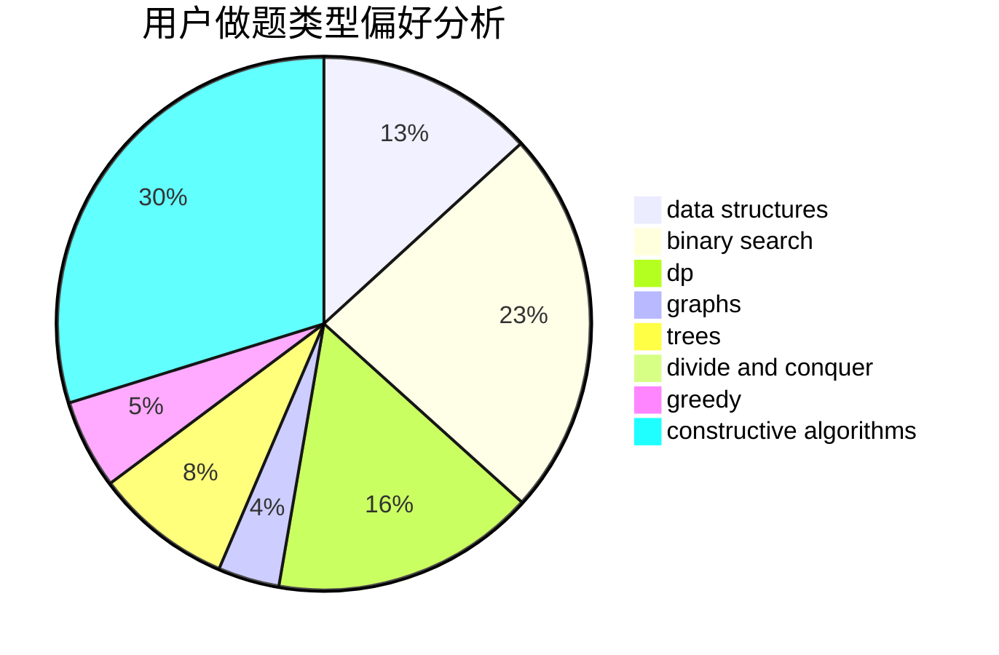

# Jay142753869

<!-- tabs:start -->

#### **用户提交结果分析**

#### **用户做题类型偏好分析**

#### **用户错题知识点分析**

<!-- tabs:end -->
# 推荐题目
[1428G1](https://codeforces.com/contest/1428G/problem/1)		dp,
                        greedy		  
[53E](https://codeforces.com/contest/53/problem/E)		bitmasks,
                        dp		  
[810C](https://codeforces.com/contest/810/problem/C)		dsu,graphs,sortings,trees		  
[260C](https://codeforces.com/contest/260/problem/C)		constructive algorithms,
                        greedy,
                        implementation		  
[171B](https://codeforces.com/contest/171/problem/B)		*special problem,
                        combinatorics		  
[232B](https://codeforces.com/contest/232/problem/B)		bitmasks,
                        combinatorics,
                        dp,
                        math		  
[1381B](https://codeforces.com/contest/1381/problem/B)		dp		  
[1271F](https://codeforces.com/contest/1271/problem/F)		brute force		  
[319D](https://codeforces.com/contest/319/problem/D)		greedy,
                        hashing,
                        string suffix structures,
                        strings		  
[380C](https://codeforces.com/contest/380/problem/C)		data structures,
                        schedules		  
