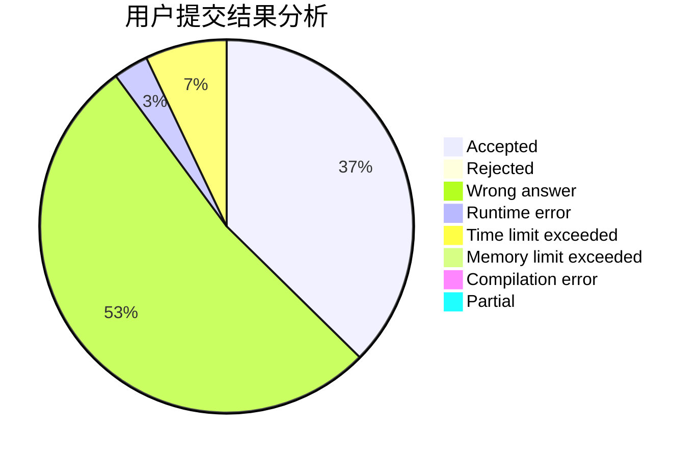
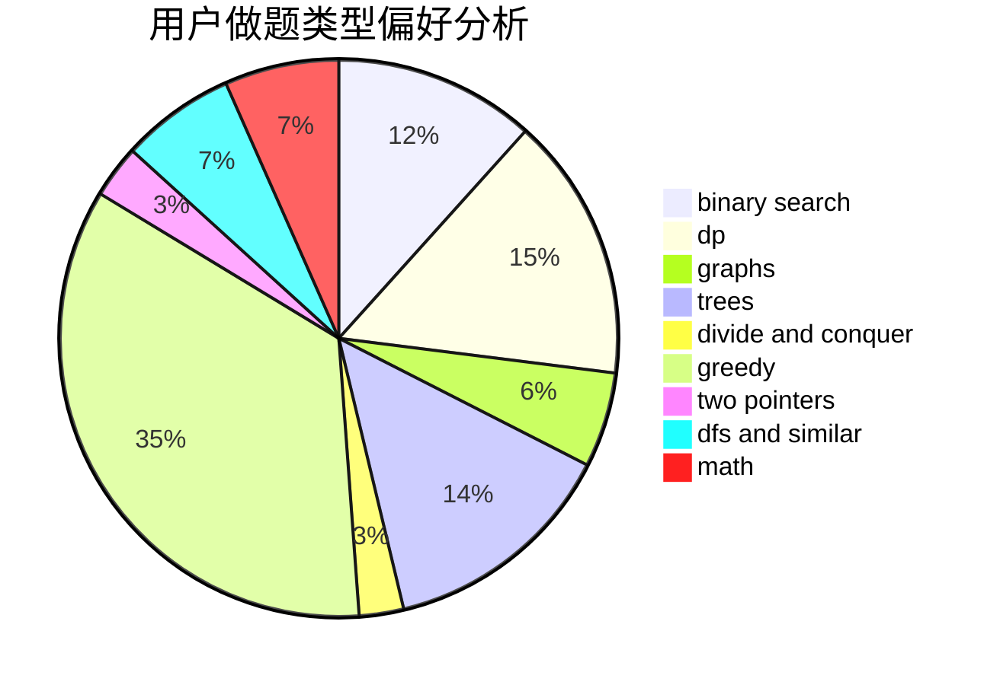

# Jay142753869

<!-- tabs:start -->

#### **用户提交结果分析**

#### **用户做题类型偏好分析**

<!-- tabs:end -->
# 推荐题目
[1437G](https://codeforces.com/contest/1437/problem/G)
[560E](https://codeforces.com/contest/560/problem/E)
[828C](https://codeforces.com/contest/828/problem/C)
[279A](https://codeforces.com/contest/279/problem/A)
[198B](https://codeforces.com/contest/198/problem/B)
[254A](https://codeforces.com/contest/254/problem/A)
[1391D](https://codeforces.com/contest/1391/problem/D)
[1281B](https://codeforces.com/contest/1281/problem/B)
[34D](https://codeforces.com/contest/34/problem/D)
[411A](https://codeforces.com/contest/411/problem/A)
