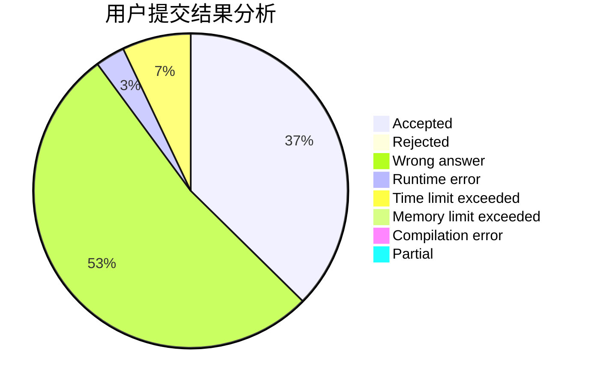
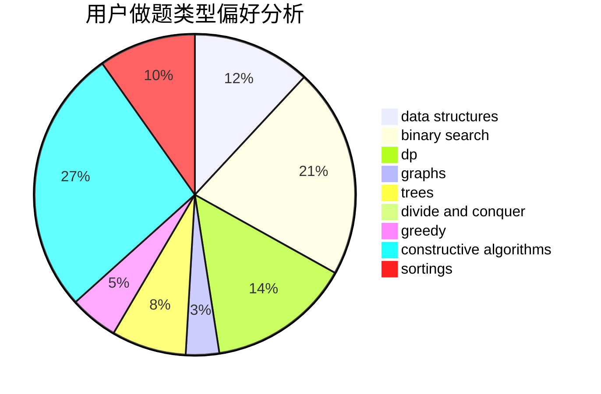

# Jay142753869
<!-- tabs:start -->
#### **用户提交结果分析**

#### **用户做题类型偏好分析**

#### **用户错题知识点分析**

<!-- tabs:end -->
# 推荐题目
[1305B](http://codeforces.com/problemset/problem/1305/B)		constructive algorithms,
                        greedy,
                        strings,
                        two pointers		  
[1247B1](https://codeforces.com/contest/1247/problem/B1)		implementation		  
[1432C](https://codeforces.com/contest/1432/problem/C)		math		  
[53E](http://codeforces.com/problemset/problem/53/E)		bitmasks,
                        dp		  
[810C](https://codeforces.com/contest/810/problem/C)		implementation,
                        math,
                        sortings		  
[1180B](http://codeforces.com/problemset/problem/1180/B)		greedy,
                        implementation		  
[1311C](http://codeforces.com/problemset/problem/1311/C)		brute force		  
[1190E](http://codeforces.com/problemset/problem/1190/E)		binary search,
                        greedy		  
[173B](http://codeforces.com/problemset/problem/173/B)		dfs and similar,
                        shortest paths		  
[171B](http://codeforces.com/problemset/problem/171/B)		*special problem,
                        combinatorics		  
<!-- tabs:start -->
#### **data structures**
[1336F](http://codeforces.com/problemset/problem/1336/F)		data structures,
                        divide and conquer,
                        graphs,
                        trees		  
[524E](http://codeforces.com/problemset/problem/524/E)		data structures,
                        sortings		  
[746F](http://codeforces.com/problemset/problem/746/F)		data structures,
                        greedy,
                        two pointers		  
[1010E](http://codeforces.com/problemset/problem/1010/E)		data structures		  
[1342D](http://codeforces.com/problemset/problem/1342/D)		binary search,
                        constructive algorithms,
                        data structures,
                        greedy,
                        sortings,
                        two pointers		  
[380C](http://codeforces.com/problemset/problem/380/C)		data structures,
                        schedules		  
[519E](http://codeforces.com/problemset/problem/519/E)		binary search,
                        data structures,
                        dfs and similar,
                        dp,
                        trees		  
[1276C](http://codeforces.com/problemset/problem/1276/C)		brute force,
                        combinatorics,
                        constructive algorithms,
                        data structures,
                        greedy,
                        math		  
[283A](http://codeforces.com/problemset/problem/283/A)		constructive algorithms,
                        data structures,
                        implementation		  
[620E](http://codeforces.com/problemset/problem/620/E)		bitmasks,
                        data structures,
                        trees		  
#### **binary search**
[1190E](http://codeforces.com/problemset/problem/1190/E)		binary search,
                        greedy		  
[85E](http://codeforces.com/problemset/problem/85/E)		binary search,
                        dsu,
                        geometry,
                        graphs,
                        sortings		  
[348A](http://codeforces.com/problemset/problem/348/A)		binary search,
                        math,
                        sortings		  
[1010A](http://codeforces.com/problemset/problem/1010/A)		binary search,
                        math		  
[180E](http://codeforces.com/problemset/problem/180/E)		binary search,
                        dp,
                        two pointers		  
[1342D](http://codeforces.com/problemset/problem/1342/D)		binary search,
                        constructive algorithms,
                        data structures,
                        greedy,
                        sortings,
                        two pointers		  
[519E](http://codeforces.com/problemset/problem/519/E)		binary search,
                        data structures,
                        dfs and similar,
                        dp,
                        trees		  
[360B](http://codeforces.com/problemset/problem/360/B)		binary search,
                        dp		  
[1492C](http://codeforces.com/problemset/problem/1492/C)		binary search,
                        data structures,
                        dp,
                        greedy,
                        two pointers		  
[1463D](http://codeforces.com/problemset/problem/1463/D)		binary search,
                        constructive algorithms,
                        greedy,
                        two pointers		  
#### **dp**
[53E](http://codeforces.com/problemset/problem/53/E)		bitmasks,
                        dp		  
[232B](http://codeforces.com/problemset/problem/232/B)		bitmasks,
                        combinatorics,
                        dp,
                        math		  
[1428G2](http://codeforces.com/problemset/problem/1428/G2)		dp,
                        greedy		  
[1279E](http://codeforces.com/problemset/problem/1279/E)		combinatorics,
                        dp		  
[1188D](http://codeforces.com/problemset/problem/1188/D)		dp		  
[180E](http://codeforces.com/problemset/problem/180/E)		binary search,
                        dp,
                        two pointers		  
[1105C](http://codeforces.com/problemset/problem/1105/C)		combinatorics,
                        dp,
                        math		  
[519E](http://codeforces.com/problemset/problem/519/E)		binary search,
                        data structures,
                        dfs and similar,
                        dp,
                        trees		  
[360B](http://codeforces.com/problemset/problem/360/B)		binary search,
                        dp		  
[11D](http://codeforces.com/problemset/problem/11/D)		bitmasks,
                        dp,
                        graphs		  
#### **graph**
[1336F](http://codeforces.com/problemset/problem/1336/F)		data structures,
                        divide and conquer,
                        graphs,
                        trees		  
[85E](http://codeforces.com/problemset/problem/85/E)		binary search,
                        dsu,
                        geometry,
                        graphs,
                        sortings		  
[819E](http://codeforces.com/problemset/problem/819/E)		constructive algorithms,
                        graphs		  
[11D](http://codeforces.com/problemset/problem/11/D)		bitmasks,
                        dp,
                        graphs		  
[1095F](http://codeforces.com/problemset/problem/1095/F)		dsu,
                        graphs,
                        greedy		  
[1487C](http://codeforces.com/problemset/problem/1487/C)		brute force,
                        constructive algorithms,
                        dfs and similar,
                        graphs,
                        greedy,
                        implementation,
                        math		  
[1437C](http://codeforces.com/problemset/problem/1437/C)		dp,
                        flows,
                        graph matchings,
                        greedy,
                        math,
                        sortings		  
[1470D](http://codeforces.com/problemset/problem/1470/D)		constructive algorithms,
                        dfs and similar,
                        graph matchings,
                        graphs,
                        greedy		  
[1476C](http://codeforces.com/problemset/problem/1476/C)		dp,
                        graphs,
                        greedy		  
[1304D](http://codeforces.com/problemset/problem/1304/D)		constructive algorithms,
                        graphs,
                        greedy,
                        two pointers		  
#### **trees**
[1336F](http://codeforces.com/problemset/problem/1336/F)		data structures,
                        divide and conquer,
                        graphs,
                        trees		  
[519E](http://codeforces.com/problemset/problem/519/E)		binary search,
                        data structures,
                        dfs and similar,
                        dp,
                        trees		  
[620E](http://codeforces.com/problemset/problem/620/E)		bitmasks,
                        data structures,
                        trees		  
[1479D](http://codeforces.com/problemset/problem/1479/D)		binary search,
                        bitmasks,
                        brute force,
                        data structures,
                        probabilities,
                        trees		  
[1511C](http://codeforces.com/problemset/problem/1511/C)		brute force,
                        data structures,
                        implementation,
                        trees		  
[1499F](http://codeforces.com/problemset/problem/1499/F)		combinatorics,
                        dfs and similar,
                        dp,
                        trees		  
[1491E](http://codeforces.com/problemset/problem/1491/E)		brute force,
                        dfs and similar,
                        divide and conquer,
                        number theory,
                        trees		  
[1466D](http://codeforces.com/problemset/problem/1466/D)		data structures,
                        greedy,
                        sortings,
                        trees		  
[1495D](http://codeforces.com/problemset/problem/1495/D)		combinatorics,
                        dfs and similar,
                        graphs,
                        math,
                        shortest paths,
                        trees		  
[1303G](http://codeforces.com/problemset/problem/1303/G)		data structures,
                        divide and conquer,
                        geometry,
                        trees		  
#### **divide and conquer**
[1336F](http://codeforces.com/problemset/problem/1336/F)		data structures,
                        divide and conquer,
                        graphs,
                        trees		  
[1461D](http://codeforces.com/problemset/problem/1461/D)		binary search,
                        brute force,
                        data structures,
                        divide and conquer,
                        implementation,
                        sortings		  
[1466G](http://codeforces.com/problemset/problem/1466/G)		combinatorics,
                        divide and conquer,
                        hashing,
                        math,
                        string suffix structures,
                        strings		  
[1490D](http://codeforces.com/problemset/problem/1490/D)		dfs and similar,
                        divide and conquer,
                        implementation		  
[1483C](https://codeforces.com/contest/1483/problem/C)		data structures,
                        divide and conquer,
                        dp		  
[1491E](http://codeforces.com/problemset/problem/1491/E)		brute force,
                        dfs and similar,
                        divide and conquer,
                        number theory,
                        trees		  
[1303G](http://codeforces.com/problemset/problem/1303/G)		data structures,
                        divide and conquer,
                        geometry,
                        trees		  
[1494D](http://codeforces.com/problemset/problem/1494/D)		constructive algorithms,
                        data structures,
                        dfs and similar,
                        divide and conquer,
                        dsu,
                        greedy,
                        sortings,
                        trees		  
[1482E](http://codeforces.com/problemset/problem/1482/E)		data structures,
                        divide and conquer,
                        dp		  
[566C](http://codeforces.com/problemset/problem/566/C)		dfs and similar,
                        divide and conquer,
                        trees		  
#### **greedy**
[1305B](http://codeforces.com/problemset/problem/1305/B)		constructive algorithms,
                        greedy,
                        strings,
                        two pointers		  
[1180B](http://codeforces.com/problemset/problem/1180/B)		greedy,
                        implementation		  
[1190E](http://codeforces.com/problemset/problem/1190/E)		binary search,
                        greedy		  
[1428G2](http://codeforces.com/problemset/problem/1428/G2)		dp,
                        greedy		  
[260C](http://codeforces.com/problemset/problem/260/C)		constructive algorithms,
                        greedy,
                        implementation		  
[746F](http://codeforces.com/problemset/problem/746/F)		data structures,
                        greedy,
                        two pointers		  
[319D](http://codeforces.com/problemset/problem/319/D)		greedy,
                        hashing,
                        string suffix structures,
                        strings		  
[1118D1](http://codeforces.com/problemset/problem/1118/D1)		brute force,
                        greedy		  
[1342D](http://codeforces.com/problemset/problem/1342/D)		binary search,
                        constructive algorithms,
                        data structures,
                        greedy,
                        sortings,
                        two pointers		  
[521B](https://codeforces.com/contest/521/problem/B)		games,
                        greedy,
                        implementation		  
#### **constructive algorithms**
[1305B](http://codeforces.com/problemset/problem/1305/B)		constructive algorithms,
                        greedy,
                        strings,
                        two pointers		  
[260C](http://codeforces.com/problemset/problem/260/C)		constructive algorithms,
                        greedy,
                        implementation		  
[912B](http://codeforces.com/problemset/problem/912/B)		bitmasks,
                        constructive algorithms,
                        number theory		  
[815B](http://codeforces.com/problemset/problem/815/B)		brute force,
                        combinatorics,
                        constructive algorithms,
                        math		  
[819E](http://codeforces.com/problemset/problem/819/E)		constructive algorithms,
                        graphs		  
[1004D](http://codeforces.com/problemset/problem/1004/D)		brute force,
                        constructive algorithms,
                        implementation		  
[1342D](http://codeforces.com/problemset/problem/1342/D)		binary search,
                        constructive algorithms,
                        data structures,
                        greedy,
                        sortings,
                        two pointers		  
[1276C](http://codeforces.com/problemset/problem/1276/C)		brute force,
                        combinatorics,
                        constructive algorithms,
                        data structures,
                        greedy,
                        math		  
[283A](http://codeforces.com/problemset/problem/283/A)		constructive algorithms,
                        data structures,
                        implementation		  
[1503A](http://codeforces.com/problemset/problem/1503/A)		constructive algorithms,
                        greedy		  
#### **sortings**
[810C](https://codeforces.com/contest/810/problem/C)		implementation,
                        math,
                        sortings		  
[524E](http://codeforces.com/problemset/problem/524/E)		data structures,
                        sortings		  
[85E](http://codeforces.com/problemset/problem/85/E)		binary search,
                        dsu,
                        geometry,
                        graphs,
                        sortings		  
[348A](http://codeforces.com/problemset/problem/348/A)		binary search,
                        math,
                        sortings		  
[1342D](http://codeforces.com/problemset/problem/1342/D)		binary search,
                        constructive algorithms,
                        data structures,
                        greedy,
                        sortings,
                        two pointers		  
[1496C](https://codeforces.com/contest/1496/problem/C)		geometry,
                        greedy,
                        math,
                        sortings		  
[1495A](http://codeforces.com/problemset/problem/1495/A)		geometry,
                        greedy,
                        math,
                        sortings		  
[1497A](http://codeforces.com/problemset/problem/1497/A)		brute force,
                        data structures,
                        greedy,
                        sortings		  
[1427A](http://codeforces.com/problemset/problem/1427/A)		math,
                        sortings		  
[1461D](http://codeforces.com/problemset/problem/1461/D)		binary search,
                        brute force,
                        data structures,
                        divide and conquer,
                        implementation,
                        sortings		  
<!-- tabs:end -->
