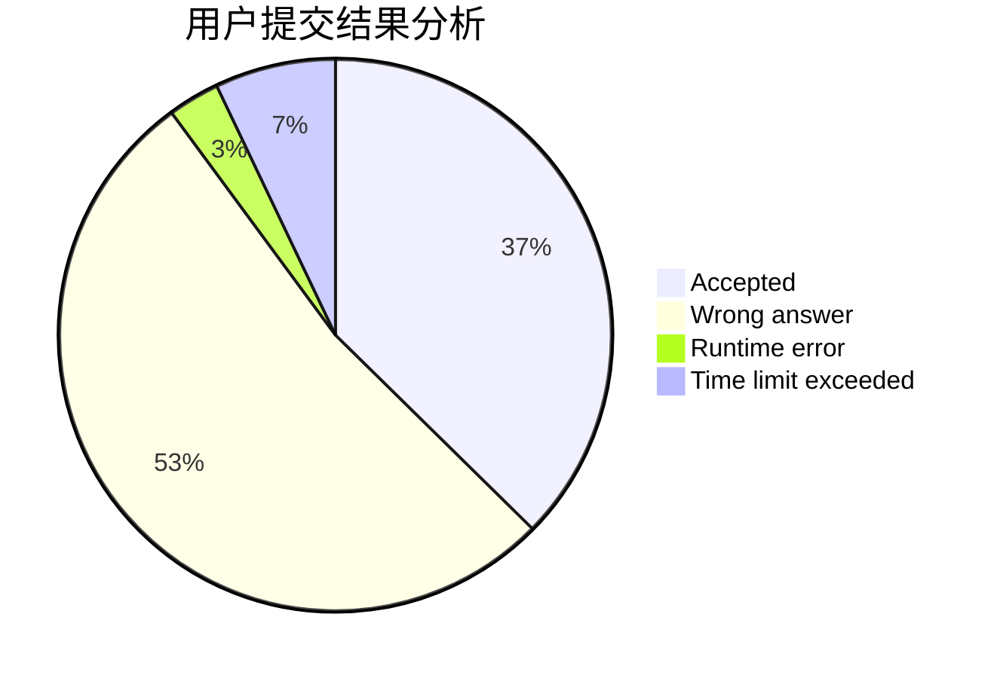
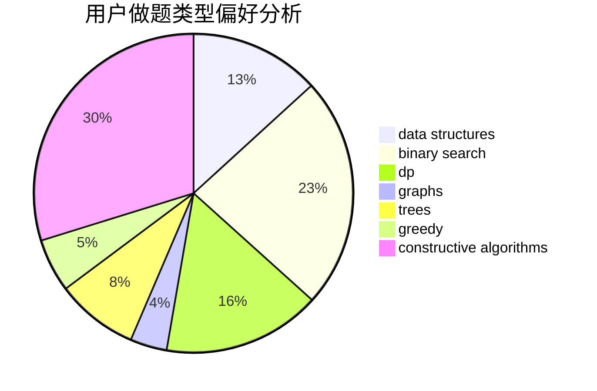

# Jay142753869
<!-- tabs:start -->
#### **用户提交结果分析**

#### **用户做题类型偏好分析**

#### **用户错题知识点分析**

<!-- tabs:end -->
# 推荐题目
[Kuroni and Simple Strings](http://codeforces.com/problemset/problem/1305/B)		constructive algorithms,
                        greedy,
                        strings,
                        two pointers		  
[TV Subscriptions (Easy Version)](https://codeforces.com/contest/1247/problem/B1)		implementation		  
[Equalize Prices Again](https://codeforces.com/contest/1432/problem/C)		math		  
[Dead Ends](http://codeforces.com/problemset/problem/53/E)		bitmasks,
                        dp		  
[Do you want a date?](https://codeforces.com/contest/810/problem/C)		implementation,
                        math,
                        sortings		  
[Nick and Array](http://codeforces.com/problemset/problem/1180/B)		greedy,
                        implementation		  
[Perform the Combo](http://codeforces.com/problemset/problem/1311/C)		brute force		  
[Tokitsukaze and Explosion](http://codeforces.com/problemset/problem/1190/E)		binary search,
                        greedy		  
[Chamber of Secrets](http://codeforces.com/problemset/problem/173/B)		dfs and similar,
                        shortest paths		  
[Star](http://codeforces.com/problemset/problem/171/B)		*special problem,
                        combinatorics		  
<!-- tabs:start -->
#### **data structures**
[Journey](http://codeforces.com/problemset/problem/1336/F)		data structures,
                        divide and conquer,
                        graphs,
                        trees		  
[Rooks and Rectangles](http://codeforces.com/problemset/problem/524/E)		data structures,
                        sortings		  
[Music in Car](http://codeforces.com/problemset/problem/746/F)		data structures,
                        greedy,
                        two pointers		  
[Store](http://codeforces.com/problemset/problem/1010/E)		data structures		  
[Multiple Testcases](http://codeforces.com/problemset/problem/1342/D)		binary search,
                        constructive algorithms,
                        data structures,
                        greedy,
                        sortings,
                        two pointers		  
[Sereja and Brackets](http://codeforces.com/problemset/problem/380/C)		data structures,
                        schedules		  
[A and B and Lecture Rooms](http://codeforces.com/problemset/problem/519/E)		binary search,
                        data structures,
                        dfs and similar,
                        dp,
                        trees		  
[Beautiful Rectangle](http://codeforces.com/problemset/problem/1276/C)		brute force,
                        combinatorics,
                        constructive algorithms,
                        data structures,
                        greedy,
                        math		  
[Cows and Sequence](http://codeforces.com/problemset/problem/283/A)		constructive algorithms,
                        data structures,
                        implementation		  
[New Year Tree](http://codeforces.com/problemset/problem/620/E)		bitmasks,
                        data structures,
                        trees		  
#### **binary search**
[Tokitsukaze and Explosion](http://codeforces.com/problemset/problem/1190/E)		binary search,
                        greedy		  
[Guard Towers](http://codeforces.com/problemset/problem/85/E)		binary search,
                        dsu,
                        geometry,
                        graphs,
                        sortings		  
[Mafia](http://codeforces.com/problemset/problem/348/A)		binary search,
                        math,
                        sortings		  
[Fly](http://codeforces.com/problemset/problem/1010/A)		binary search,
                        math		  
[Cubes](http://codeforces.com/problemset/problem/180/E)		binary search,
                        dp,
                        two pointers		  
[Multiple Testcases](http://codeforces.com/problemset/problem/1342/D)		binary search,
                        constructive algorithms,
                        data structures,
                        greedy,
                        sortings,
                        two pointers		  
[A and B and Lecture Rooms](http://codeforces.com/problemset/problem/519/E)		binary search,
                        data structures,
                        dfs and similar,
                        dp,
                        trees		  
[Levko and Array](http://codeforces.com/problemset/problem/360/B)		binary search,
                        dp		  
[Maximum width](http://codeforces.com/problemset/problem/1492/C)		binary search,
                        data structures,
                        dp,
                        greedy,
                        two pointers		  
[Pairs](http://codeforces.com/problemset/problem/1463/D)		binary search,
                        constructive algorithms,
                        greedy,
                        two pointers		  
#### **dp**
[Dead Ends](http://codeforces.com/problemset/problem/53/E)		bitmasks,
                        dp		  
[Table](http://codeforces.com/problemset/problem/232/B)		bitmasks,
                        combinatorics,
                        dp,
                        math		  
[Lucky Numbers (Hard Version)](http://codeforces.com/problemset/problem/1428/G2)		dp,
                        greedy		  
[New Year Permutations](http://codeforces.com/problemset/problem/1279/E)		combinatorics,
                        dp		  
[Make Equal](http://codeforces.com/problemset/problem/1188/D)		dp		  
[Cubes](http://codeforces.com/problemset/problem/180/E)		binary search,
                        dp,
                        two pointers		  
[Ayoub and Lost Array](http://codeforces.com/problemset/problem/1105/C)		combinatorics,
                        dp,
                        math		  
[A and B and Lecture Rooms](http://codeforces.com/problemset/problem/519/E)		binary search,
                        data structures,
                        dfs and similar,
                        dp,
                        trees		  
[Levko and Array](http://codeforces.com/problemset/problem/360/B)		binary search,
                        dp		  
[A Simple Task](http://codeforces.com/problemset/problem/11/D)		bitmasks,
                        dp,
                        graphs		  
#### **graph**
[Journey](http://codeforces.com/problemset/problem/1336/F)		data structures,
                        divide and conquer,
                        graphs,
                        trees		  
[Guard Towers](http://codeforces.com/problemset/problem/85/E)		binary search,
                        dsu,
                        geometry,
                        graphs,
                        sortings		  
[Mister B and Flight to the Moon](http://codeforces.com/problemset/problem/819/E)		constructive algorithms,
                        graphs		  
[A Simple Task](http://codeforces.com/problemset/problem/11/D)		bitmasks,
                        dp,
                        graphs		  
[Make It Connected](http://codeforces.com/problemset/problem/1095/F)		dsu,
                        graphs,
                        greedy		  
[Minimum Ties](http://codeforces.com/problemset/problem/1487/C)		brute force,
                        constructive algorithms,
                        dfs and similar,
                        graphs,
                        greedy,
                        implementation,
                        math		  
[Chef Monocarp](http://codeforces.com/problemset/problem/1437/C)		dp,
                        flows,
                        graph matchings,
                        greedy,
                        math,
                        sortings		  
[Strange Housing](http://codeforces.com/problemset/problem/1470/D)		constructive algorithms,
                        dfs and similar,
                        graph matchings,
                        graphs,
                        greedy		  
[Longest Simple Cycle](http://codeforces.com/problemset/problem/1476/C)		dp,
                        graphs,
                        greedy		  
[Shortest and Longest LIS](http://codeforces.com/problemset/problem/1304/D)		constructive algorithms,
                        graphs,
                        greedy,
                        two pointers		  
#### **trees**
[Journey](http://codeforces.com/problemset/problem/1336/F)		data structures,
                        divide and conquer,
                        graphs,
                        trees		  
[A and B and Lecture Rooms](http://codeforces.com/problemset/problem/519/E)		binary search,
                        data structures,
                        dfs and similar,
                        dp,
                        trees		  
[New Year Tree](http://codeforces.com/problemset/problem/620/E)		bitmasks,
                        data structures,
                        trees		  
[Odd Mineral Resource](http://codeforces.com/problemset/problem/1479/D)		binary search,
                        bitmasks,
                        brute force,
                        data structures,
                        probabilities,
                        trees		  
[Yet Another Card Deck](http://codeforces.com/problemset/problem/1511/C)		brute force,
                        data structures,
                        implementation,
                        trees		  
[Diameter Cuts](http://codeforces.com/problemset/problem/1499/F)		combinatorics,
                        dfs and similar,
                        dp,
                        trees		  
[Fib-tree](http://codeforces.com/problemset/problem/1491/E)		brute force,
                        dfs and similar,
                        divide and conquer,
                        number theory,
                        trees		  
[13th Labour of Heracles](http://codeforces.com/problemset/problem/1466/D)		data structures,
                        greedy,
                        sortings,
                        trees		  
[BFS Trees](http://codeforces.com/problemset/problem/1495/D)		combinatorics,
                        dfs and similar,
                        graphs,
                        math,
                        shortest paths,
                        trees		  
[Sum of Prefix Sums](http://codeforces.com/problemset/problem/1303/G)		data structures,
                        divide and conquer,
                        geometry,
                        trees		  
#### **divide and conquer**
[Journey](http://codeforces.com/problemset/problem/1336/F)		data structures,
                        divide and conquer,
                        graphs,
                        trees		  
[Divide and Summarize](http://codeforces.com/problemset/problem/1461/D)		binary search,
                        brute force,
                        data structures,
                        divide and conquer,
                        implementation,
                        sortings		  
[Song of the Sirens](http://codeforces.com/problemset/problem/1466/G)		combinatorics,
                        divide and conquer,
                        hashing,
                        math,
                        string suffix structures,
                        strings		  
[Permutation Transformation](http://codeforces.com/problemset/problem/1490/D)		dfs and similar,
                        divide and conquer,
                        implementation		  
[Skyline Photo](https://codeforces.com/contest/1483/problem/C)		data structures,
                        divide and conquer,
                        dp		  
[Fib-tree](http://codeforces.com/problemset/problem/1491/E)		brute force,
                        dfs and similar,
                        divide and conquer,
                        number theory,
                        trees		  
[Sum of Prefix Sums](http://codeforces.com/problemset/problem/1303/G)		data structures,
                        divide and conquer,
                        geometry,
                        trees		  
[Dogeforces](http://codeforces.com/problemset/problem/1494/D)		constructive algorithms,
                        data structures,
                        dfs and similar,
                        divide and conquer,
                        dsu,
                        greedy,
                        sortings,
                        trees		  
[Logistical Questions](http://codeforces.com/problemset/problem/566/C)		dfs and similar,
                        divide and conquer,
                        trees		  
[Fruit Sequences](http://codeforces.com/problemset/problem/1428/F)		binary search,
                        data structures,
                        divide and conquer,
                        dp,
                        two pointers		  
#### **greedy**
[Kuroni and Simple Strings](http://codeforces.com/problemset/problem/1305/B)		constructive algorithms,
                        greedy,
                        strings,
                        two pointers		  
[Nick and Array](http://codeforces.com/problemset/problem/1180/B)		greedy,
                        implementation		  
[Tokitsukaze and Explosion](http://codeforces.com/problemset/problem/1190/E)		binary search,
                        greedy		  
[Lucky Numbers (Hard Version)](http://codeforces.com/problemset/problem/1428/G2)		dp,
                        greedy		  
[Balls and Boxes](http://codeforces.com/problemset/problem/260/C)		constructive algorithms,
                        greedy,
                        implementation		  
[Music in Car](http://codeforces.com/problemset/problem/746/F)		data structures,
                        greedy,
                        two pointers		  
[Have You Ever Heard About the Word?](http://codeforces.com/problemset/problem/319/D)		greedy,
                        hashing,
                        string suffix structures,
                        strings		  
[Coffee and Coursework (Easy version)](http://codeforces.com/problemset/problem/1118/D1)		brute force,
                        greedy		  
[Multiple Testcases](http://codeforces.com/problemset/problem/1342/D)		binary search,
                        constructive algorithms,
                        data structures,
                        greedy,
                        sortings,
                        two pointers		  
[Cubes](https://codeforces.com/contest/521/problem/B)		games,
                        greedy,
                        implementation		  
#### **constructive algorithms**
[Kuroni and Simple Strings](http://codeforces.com/problemset/problem/1305/B)		constructive algorithms,
                        greedy,
                        strings,
                        two pointers		  
[Balls and Boxes](http://codeforces.com/problemset/problem/260/C)		constructive algorithms,
                        greedy,
                        implementation		  
[New Year's Eve](http://codeforces.com/problemset/problem/912/B)		bitmasks,
                        constructive algorithms,
                        number theory		  
[Karen and Test](http://codeforces.com/problemset/problem/815/B)		brute force,
                        combinatorics,
                        constructive algorithms,
                        math		  
[Mister B and Flight to the Moon](http://codeforces.com/problemset/problem/819/E)		constructive algorithms,
                        graphs		  
[Sonya and Matrix](http://codeforces.com/problemset/problem/1004/D)		brute force,
                        constructive algorithms,
                        implementation		  
[Multiple Testcases](http://codeforces.com/problemset/problem/1342/D)		binary search,
                        constructive algorithms,
                        data structures,
                        greedy,
                        sortings,
                        two pointers		  
[Beautiful Rectangle](http://codeforces.com/problemset/problem/1276/C)		brute force,
                        combinatorics,
                        constructive algorithms,
                        data structures,
                        greedy,
                        math		  
[Cows and Sequence](http://codeforces.com/problemset/problem/283/A)		constructive algorithms,
                        data structures,
                        implementation		  
[Balance the Bits](http://codeforces.com/problemset/problem/1503/A)		constructive algorithms,
                        greedy		  
#### **sortings**
[Do you want a date?](https://codeforces.com/contest/810/problem/C)		implementation,
                        math,
                        sortings		  
[Rooks and Rectangles](http://codeforces.com/problemset/problem/524/E)		data structures,
                        sortings		  
[Guard Towers](http://codeforces.com/problemset/problem/85/E)		binary search,
                        dsu,
                        geometry,
                        graphs,
                        sortings		  
[Mafia](http://codeforces.com/problemset/problem/348/A)		binary search,
                        math,
                        sortings		  
[Multiple Testcases](http://codeforces.com/problemset/problem/1342/D)		binary search,
                        constructive algorithms,
                        data structures,
                        greedy,
                        sortings,
                        two pointers		  
[Diamond Miner](https://codeforces.com/contest/1496/problem/C)		geometry,
                        greedy,
                        math,
                        sortings		  
[Meximization](http://codeforces.com/problemset/problem/1497/A)		brute force,
                        data structures,
                        greedy,
                        sortings		  
[Avoiding Zero](http://codeforces.com/problemset/problem/1427/A)		math,
                        sortings		  
[Divide and Summarize](http://codeforces.com/problemset/problem/1461/D)		binary search,
                        brute force,
                        data structures,
                        divide and conquer,
                        implementation,
                        sortings		  
[Chef Monocarp](http://codeforces.com/problemset/problem/1437/C)		dp,
                        flows,
                        graph matchings,
                        greedy,
                        math,
                        sortings		  
<!-- tabs:end -->
