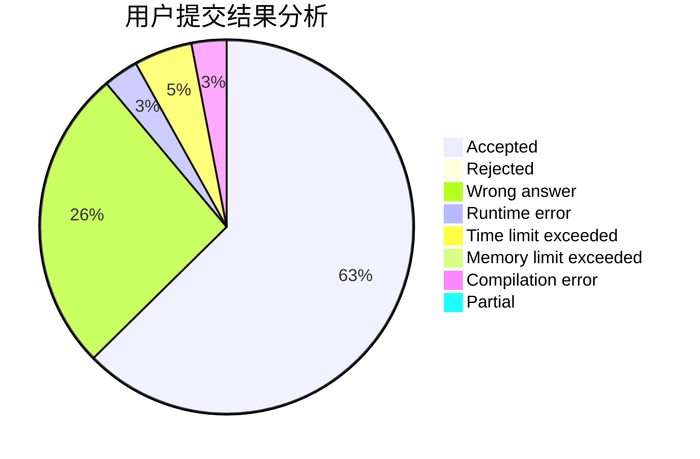
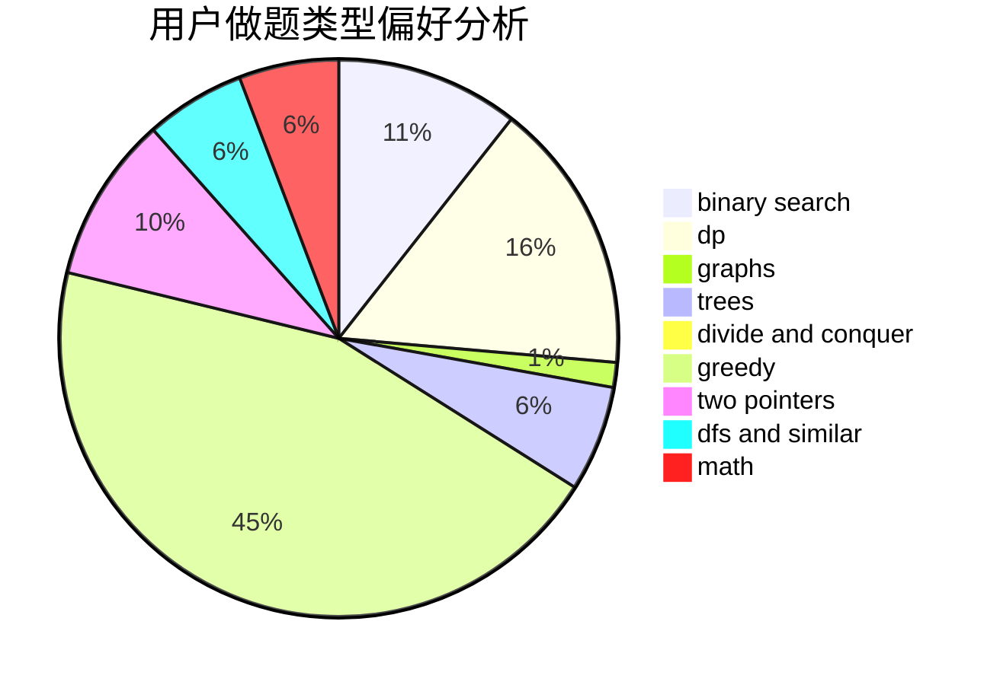

# Jayshao

<!-- tabs:start -->

#### **用户提交结果分析**

#### **用户做题类型偏好分析**

<!-- tabs:end -->
# 推荐题目
[878C](https://codeforces.com/contest/878/problem/C)
[1300E](https://codeforces.com/contest/1300/problem/E)
[1250B](https://codeforces.com/contest/1250/problem/B)
[947D](https://codeforces.com/contest/947/problem/D)
[632C](https://codeforces.com/contest/632/problem/C)
[265D](https://codeforces.com/contest/265/problem/D)
[6702](https://codeforces.com/contest/670/problem/2)
[73B](https://codeforces.com/contest/73/problem/B)
[323B](https://codeforces.com/contest/323/problem/B)
[1277D](https://codeforces.com/contest/1277/problem/D)
