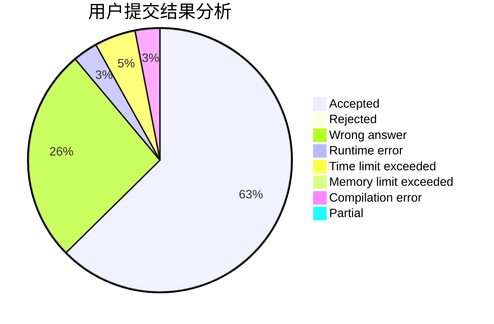
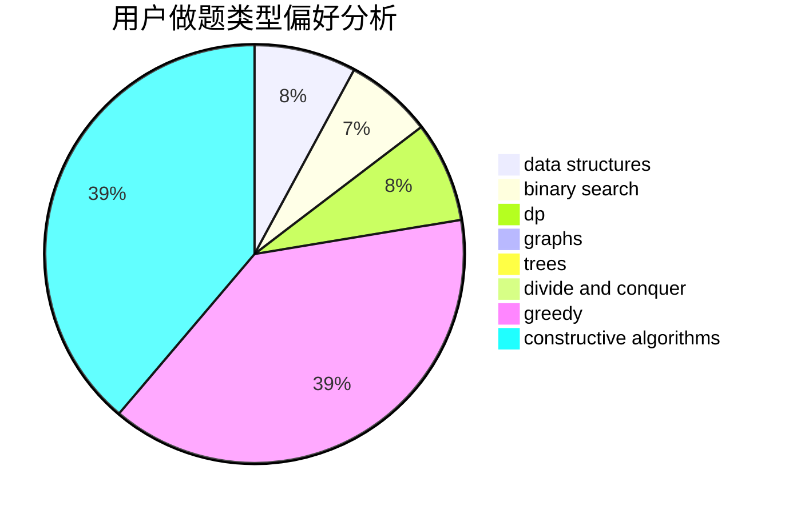
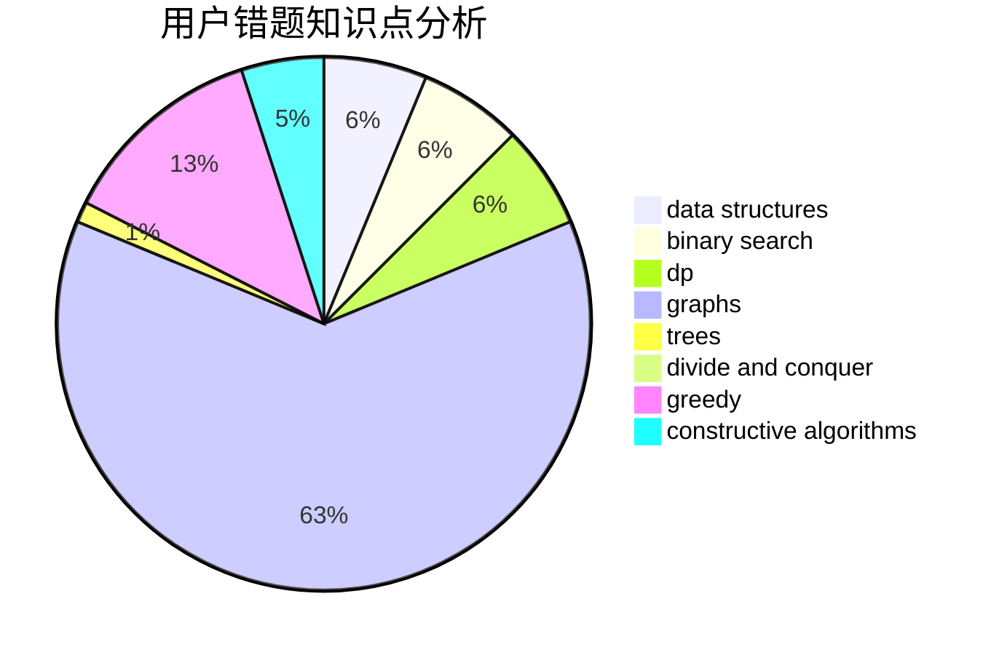

# Jayshao

<!-- tabs:start -->

#### **用户提交结果分析**

#### **用户做题类型偏好分析**

#### **用户错题知识点分析**

<!-- tabs:end -->
# 推荐题目
[878C](https://codeforces.com/contest/878/problem/C)		data structures,
                        graphs		  
[1300E](https://codeforces.com/contest/1300/problem/E)		dsu,graphs,sortings,trees		  
[1250B](https://codeforces.com/contest/1250/problem/B)		brute force,
                        constructive algorithms,
                        greedy,
                        math		  
[947D](https://codeforces.com/contest/947/problem/D)		dsu,graphs,sortings,trees		  
[632C](https://codeforces.com/contest/632/problem/C)		sortings,
                        strings		  
[265D](https://codeforces.com/contest/265/problem/D)		dsu,graphs,sortings,trees		  
[6702](https://codeforces.com/contest/670/problem/2)		dsu,graphs,sortings,trees		  
[73B](https://codeforces.com/contest/73/problem/B)		binary search,
                        greedy,
                        sortings		  
[323B](https://codeforces.com/contest/323/problem/B)		constructive algorithms,
                        graphs		  
[1277D](https://codeforces.com/contest/1277/problem/D)		data structures,
                        hashing,
                        implementation,
                        math		  
