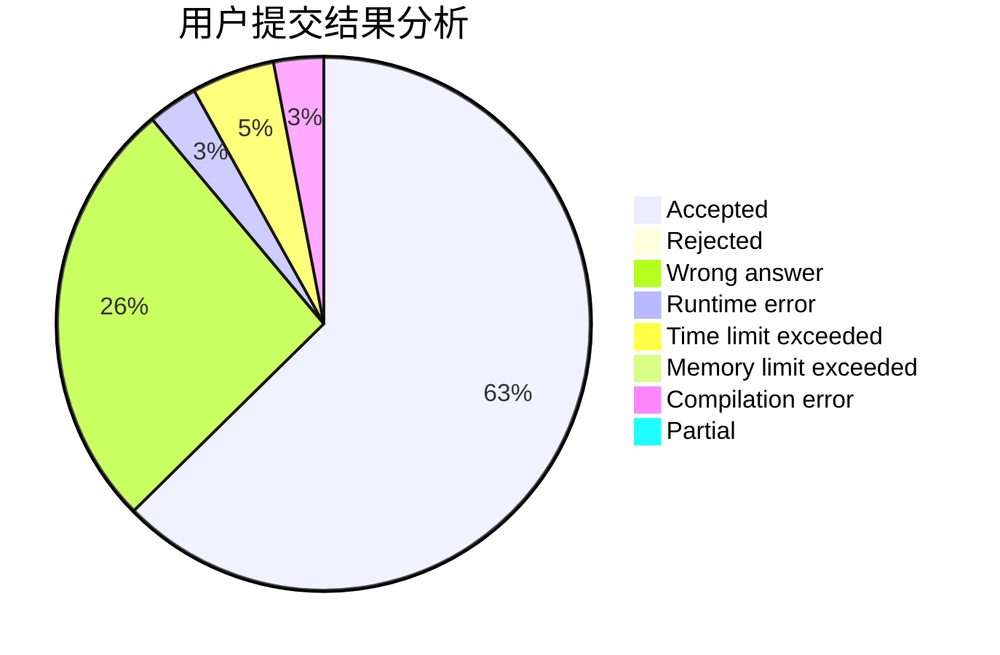
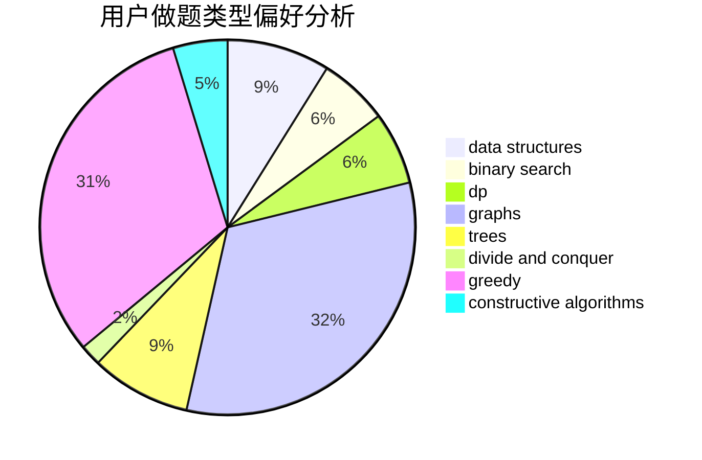
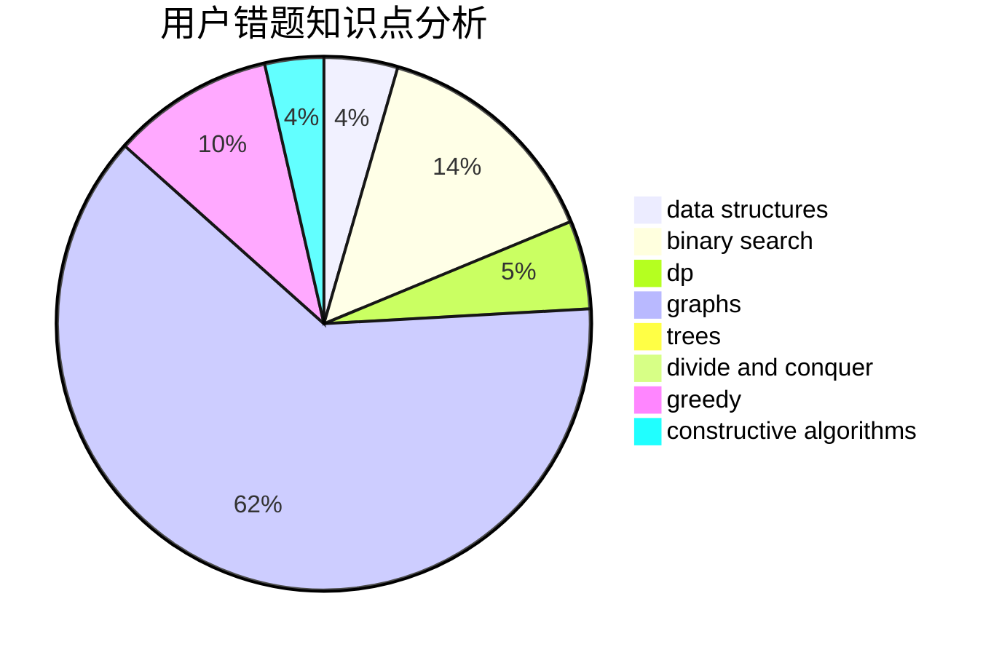

# Jayshao

<!-- tabs:start -->

#### **用户提交结果分析**

#### **用户做题类型偏好分析**

#### **用户错题知识点分析**

<!-- tabs:end -->
# 推荐题目
[860C](https://codeforces.com/contest/860/problem/C)		dsu,graphs,sortings,trees		  
[1294C](https://codeforces.com/contest/1294/problem/C)		greedy,
                        math,
                        number theory		  
[1244G](https://codeforces.com/contest/1244/problem/G)		constructive algorithms,
                        greedy,
                        math		  
[924A](https://codeforces.com/contest/924/problem/A)		greedy,
                        implementation		  
[612F](https://codeforces.com/contest/612/problem/F)		dp		  
[244C](https://codeforces.com/contest/244/problem/C)		dsu,graphs,sortings,trees		  
[641E](https://codeforces.com/contest/641/problem/E)		data structures		  
[722F](https://codeforces.com/contest/722/problem/F)		chinese remainder theorem,
                        data structures,
                        implementation,
                        number theory,
                        two pointers		  
[303E](https://codeforces.com/contest/303/problem/E)		dp,
                        math,
                        probabilities		  
[1268C](https://codeforces.com/contest/1268/problem/C)		binary search,
                        data structures		  
