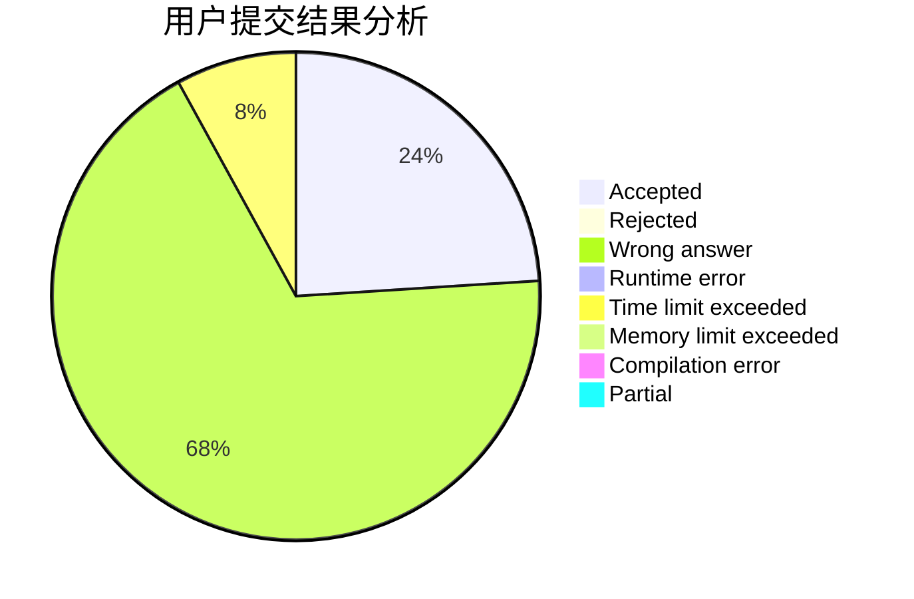
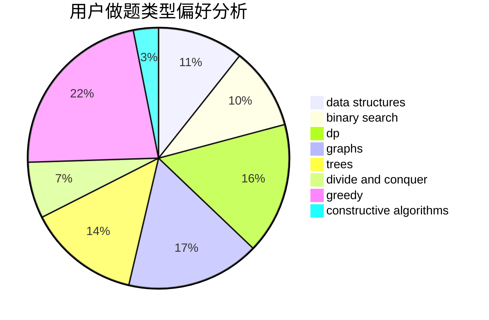

# JeRyOIer

<!-- tabs:start -->

#### **用户提交结果分析**

#### **用户做题类型偏好分析**

#### **用户错题知识点分析**

<!-- tabs:end -->
# 推荐题目
[1437G](https://codeforces.com/contest/1437/problem/G)		data structures,
                        string suffix structures,
                        strings,
                        trees		  
[1452B](https://codeforces.com/contest/1452/problem/B)		binary search,
                        greedy,
                        math,
                        sortings		  
[1253D](https://codeforces.com/contest/1253/problem/D)		constructive algorithms,
                        dfs and similar,
                        dsu,
                        graphs,
                        greedy,
                        sortings		  
[1176E](https://codeforces.com/contest/1176/problem/E)		dfs and similar,
                        dsu,
                        graphs,
                        shortest paths,
                        trees		  
[1088E](https://codeforces.com/contest/1088/problem/E)		dp,
                        greedy,
                        math,
                        trees		  
[733D](https://codeforces.com/contest/733/problem/D)		data structures,
                        hashing		  
[1100E](https://codeforces.com/contest/1100/problem/E)		binary search,
                        dfs and similar,
                        graphs		  
[841C](https://codeforces.com/contest/841/problem/C)		dsu,graphs,sortings,trees		  
[551C](https://codeforces.com/contest/551/problem/C)		binary search,
                        greedy		  
[603E](https://codeforces.com/contest/603/problem/E)		data structures,
                        divide and conquer,
                        dsu,
                        math,
                        trees		  
