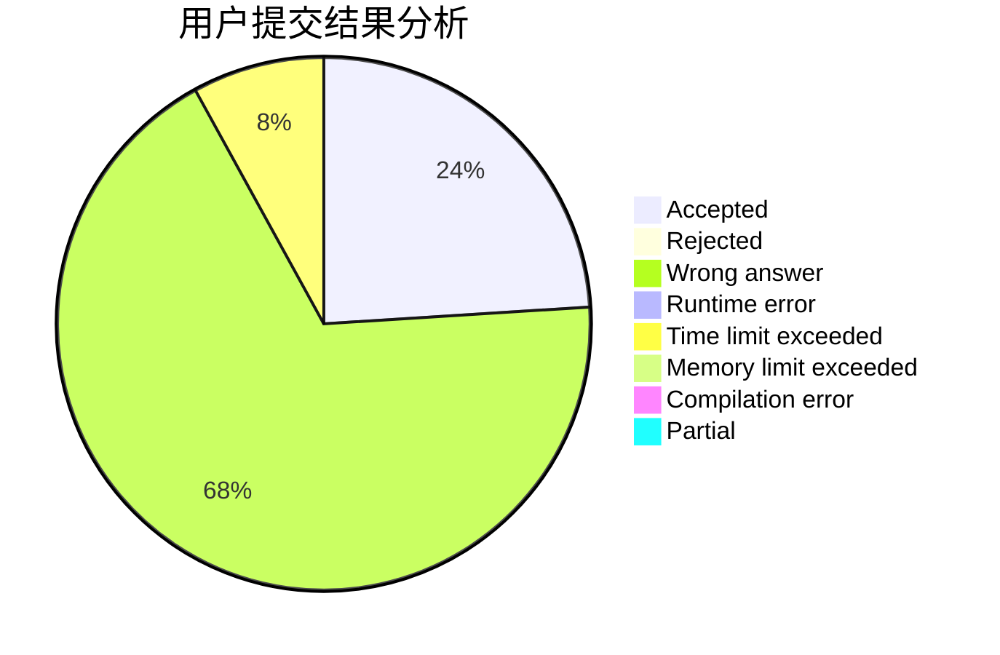
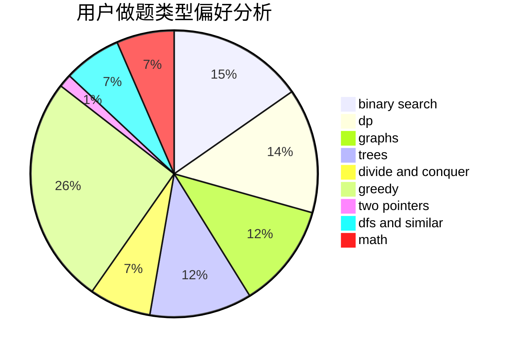

# JeRyOIer

<!-- tabs:start -->

#### **用户提交结果分析**

#### **用户做题类型偏好分析**

<!-- tabs:end -->
# 推荐题目
[1437G](https://codeforces.com/contest/1437/problem/G)
[1452B](https://codeforces.com/contest/1452/problem/B)
[1253D](https://codeforces.com/contest/1253/problem/D)
[1176E](https://codeforces.com/contest/1176/problem/E)
[1088E](https://codeforces.com/contest/1088/problem/E)
[733D](https://codeforces.com/contest/733/problem/D)
[1100E](https://codeforces.com/contest/1100/problem/E)
[841C](https://codeforces.com/contest/841/problem/C)
[551C](https://codeforces.com/contest/551/problem/C)
[603E](https://codeforces.com/contest/603/problem/E)
