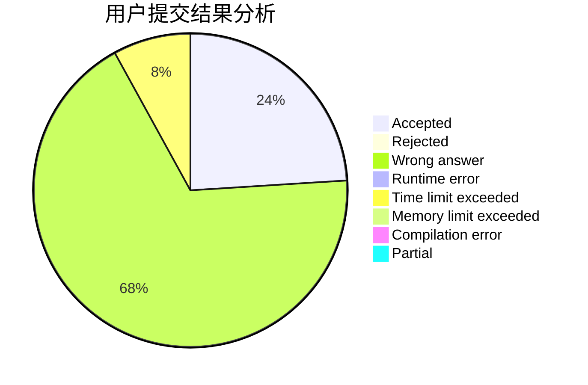
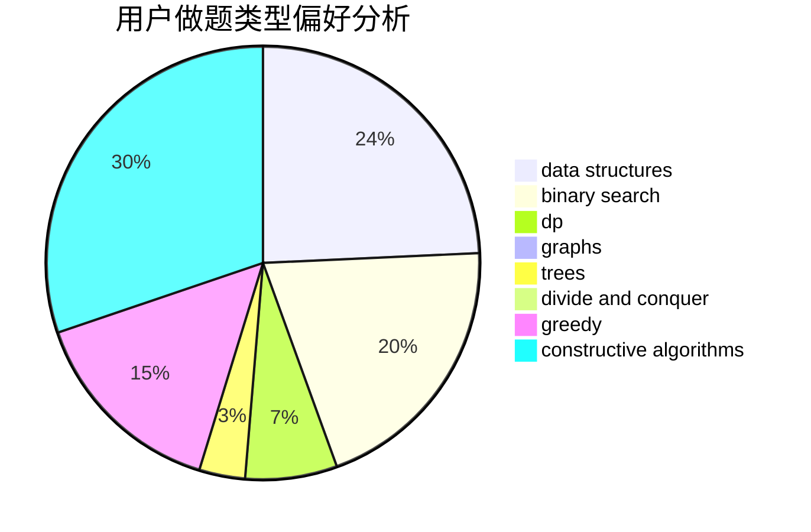

# JeRyOIer

<!-- tabs:start -->

#### **用户提交结果分析**

#### **用户做题类型偏好分析**

#### **用户错题知识点分析**

<!-- tabs:end -->
# 推荐题目
[1428G1](https://codeforces.com/contest/1428G/problem/1)		dp,
                        greedy		  
[1442C](https://codeforces.com/contest/1442/problem/C)		dfs and similar,
                        graphs,
                        greedy,
                        shortest paths		  
[1249E](https://codeforces.com/contest/1249/problem/E)		dp,
                        shortest paths		  
[1174C](https://codeforces.com/contest/1174/problem/C)		constructive algorithms,
                        number theory		  
[1088B](https://codeforces.com/contest/1088/problem/B)		implementation,
                        sortings		  
[715B](https://codeforces.com/contest/715/problem/B)		binary search,
                        constructive algorithms,
                        graphs,
                        shortest paths		  
[1100B](https://codeforces.com/contest/1100/problem/B)		data structures,
                        implementation		  
[821D](https://codeforces.com/contest/821/problem/D)		dfs and similar,
                        graphs,
                        shortest paths		  
[527C](https://codeforces.com/contest/527/problem/C)		binary search,
                        data structures,
                        implementation		  
[582D](https://codeforces.com/contest/582/problem/D)		dp,
                        math,
                        number theory		  
