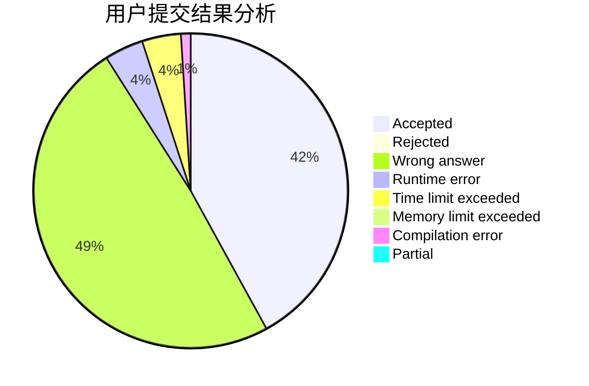
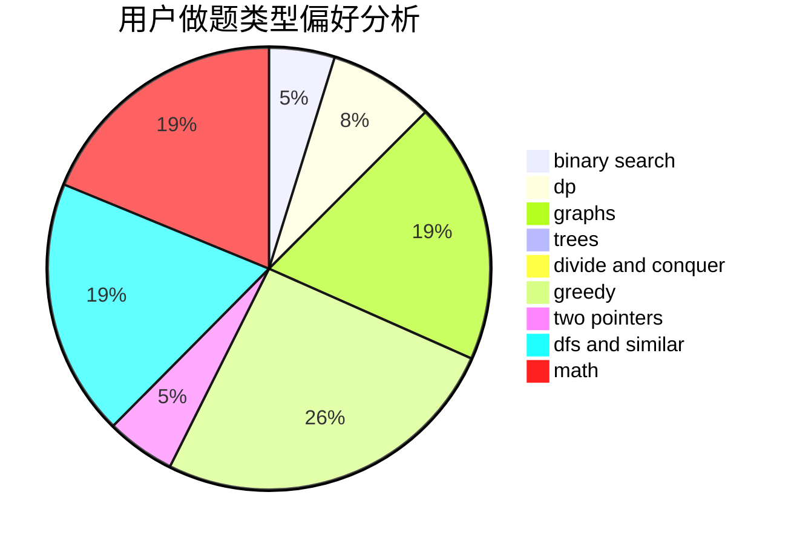

# JeovaSantusUnus

<!-- tabs:start -->

#### **用户提交结果分析**

#### **用户做题类型偏好分析**

<!-- tabs:end -->
# 推荐题目
[1194F](https://codeforces.com/contest/1194/problem/F)
[1164K](https://codeforces.com/contest/1164/problem/K)
[736A](https://codeforces.com/contest/736/problem/A)
[652D](https://codeforces.com/contest/652/problem/D)
[300B](https://codeforces.com/contest/300/problem/B)
[1180C](https://codeforces.com/contest/1180/problem/C)
[424B](https://codeforces.com/contest/424/problem/B)
[947E](https://codeforces.com/contest/947/problem/E)
[59B](https://codeforces.com/contest/59/problem/B)
[1501F](https://codeforces.com/contest/1501/problem/F)
